# Action Items Data Model Handoff

## 1. Purpose

This document describes the approved data model for **Action Items** in the hospital committee platform.

In this platform, an `Action Item` is not merely a generic task. It is a structured accountability object created by a hospital committee to ensure that decisions, risks, issues, findings, adverse events, meeting discussions, RCA recommendations, PDCA actions, or audit observations result in concrete follow-up.

The model is designed to support both simple and complex workflows:

- Simple committee task: “Dr. Silva will update the ICU sedation protocol by Friday.”
- Complex corrective action: “Implement a new VTE prophylaxis checklist across surgical units, assign multiple contributors, upload evidence, review completion, and perform effectiveness monitoring after 90 days.”

The architecture intentionally separates the core `Action Item` from assignments, updates, evidence, follow-ups, related records, reviews, checklist steps, dependencies, templates, and custom fields.

This allows the application to begin with basic task management while preserving a clean path toward more advanced hospital quality, safety, compliance, and committee workflows.

---

## 2. Core Architectural Decision

The central design decision is:

> `action_items` stores the action that must happen. Related tables store everything that happens around that action.

The model avoids placing all behavior into one large `action_items` table. Instead, concepts with their own lifecycle, multiplicity, permissions, or audit requirements are represented as separate tables.

This prevents the system from evolving into a fragile schema full of nullable columns such as:

```sql
issue_id uuid,
risk_id uuid,
incident_id uuid,
rca_id uuid,
evidence_url text,
reviewer_id uuid,
review_status text,
follow_up_note text,
checklist jsonb,
custom_fields jsonb
```

That approach looks simpler at first, but it becomes difficult to audit, query, secure, and extend.

The chosen architecture is more relational and domain-driven. The central table remains stable, while complexity is added through related tables only when needed.

---

## 3. Design Principles

### 3.1 Simple Action Items Must Stay Simple

A committee should be able to create a basic action item with only:

- Title
- Description
- Motive
- Deadline
- Responsible owner
- Status
- Urgency

The user interface should not force committees to fill complex CAPA-style fields for every task.

### 3.2 Complex Action Items Must Be Supported Without Rebuilding the Schema

More advanced action items may require:

- Multiple participants
- Formal reviewers
- Evidence uploads
- Follow-up dates
- Effectiveness checks
- Risk reassessment
- Links to multiple source records
- Subtasks or checklist items
- Custom committee-specific fields
- Status history
- Audit trail

The schema supports this without needing to alter the central table every time a new committee workflow appears.

### 3.3 Auditability Is Mandatory

Hospital committee work often needs accountability. The system should answer:

- Who created the action item?
- Who was responsible?
- Who changed the deadline?
- When was the status changed?
- Was it completed late?
- Was evidence uploaded?
- Who reviewed the evidence?
- Was the completion accepted or rejected?
- What follow-up occurred after completion?

For this reason, status changes, updates, evidence, and reviews are modeled as separate records instead of being overwritten in-place.

### 3.4 `Overdue` Should Be Derived, Not Stored

`Overdue` should not be a stored status.

It should be derived from:

```text
current time > due date
AND current status is not terminal
```

This avoids contradictory states such as:

```text
status = completed
is_overdue = true
```

The system can still report that an action item was completed after the deadline, but that should be calculated using `completed_at` and `due_at`.

### 3.5 Current State and History Are Different Things

The current status belongs in `action_items.status_id`.

The historical record belongs in `action_item_status_history`.

This gives efficient querying for current dashboards while preserving an audit trail for workflow analysis.

### 3.6 Assignments Are Not the Same as Ownership

The minimum requirement says each action item has a responsible committee member. However, real hospital workflows often need multiple roles:

- Owner
- Contributor
- Reviewer
- Approver
- Observer

For this reason, assignments are stored in `action_item_assignments` rather than as a single `responsible_member_id` column on `action_items`.

The system can still enforce exactly one active owner per action item.

---

## 4. Domain Overview

At a high level, the model contains the following domains:

| Domain | Tables | Purpose |
|---|---|---|
| Core action item | `action_items` | Stores the primary task/action |
| Status and urgency | `action_item_statuses`, `action_item_urgency_levels` | Configurable workflow labels and urgency levels |
| Accountability | `action_item_assignments` | Tracks owners, contributors, reviewers, observers |
| Audit trail | `action_item_status_history`, `action_item_updates` | Tracks changes and activity over time |
| Relationship model | `action_item_related_records` | Links action items to issues, risks, meetings, RCA, forms, incidents, etc. |
| Follow-up | `action_item_follow_ups` | Scheduled progress checks, committee reviews, effectiveness checks |
| Evidence | `action_item_evidence` | Stores proof of completion or implementation |
| Review | `action_item_reviews` | Allows formal review and approval workflows |
| Subtasks | `action_item_checklist_items` | Internal steps for complex action items |
| Dependencies | `action_item_dependencies` | Models action items that block or depend on others |
| Customization | `action_item_custom_field_definitions`, `action_item_custom_field_values` | Committee-specific fields |
| Reusability | `action_item_templates`, `action_item_template_checklist_items`, `action_item_template_follow_ups` | Reusable action item patterns |
| Reminders | `action_item_reminder_rules` | Reminder and escalation configuration |

---

## 5. Entity Relationship Diagram

```mermaid
erDiagram
    committees ||--o{ action_items : owns
    action_items ||--o{ action_item_assignments : has
    action_items ||--o{ action_item_status_history : tracks
    action_items ||--o{ action_item_updates : has
    action_items ||--o{ action_item_follow_ups : has
    action_items ||--o{ action_item_evidence : has
    action_items ||--o{ action_item_reviews : has
    action_items ||--o{ action_item_checklist_items : has
    action_items ||--o{ action_item_related_records : links
    action_items ||--o{ action_item_dependencies : depends_on
    action_items ||--o{ action_item_custom_field_values : has

    action_item_statuses ||--o{ action_items : current_status
    action_item_urgency_levels ||--o{ action_items : urgency

    committee_members ||--o{ action_item_assignments : assigned_to
    committee_members ||--o{ action_item_updates : authored
    committee_members ||--o{ action_item_follow_ups : performed_by
    committee_members ||--o{ action_item_reviews : reviewed_by

    action_item_custom_field_definitions ||--o{ action_item_custom_field_values : defines
    action_item_templates ||--o{ action_item_template_checklist_items : has
    action_item_templates ||--o{ action_item_template_follow_ups : has
```



---

## 6. Core Table: `action_items`

### Responsibility

The `action_items` table stores the primary action that needs to be performed.

It should answer:

- What needs to be done?
- Why does it need to be done?
- Which committee owns it?
- What is the current status?
- What is the urgency?
- When is it due?
- Is it completed, cancelled, archived, or deleted?

It should not store all comments, evidence, review events, checklist steps, or full relationship history.

### Suggested Schema

```sql
create table action_items (
  id uuid primary key default gen_random_uuid(),

  organization_id uuid not null references organizations(id) on delete cascade,
  hospital_id uuid references hospitals(id) on delete cascade,
  committee_id uuid not null references committees(id) on delete cascade,

  title text not null,
  description text,
  motive text,

  status_id uuid not null references action_item_statuses(id),
  urgency_id uuid references action_item_urgency_levels(id),

  due_at timestamptz,
  starts_at timestamptz,
  completed_at timestamptz,
  cancelled_at timestamptz,

  progress_percent integer not null default 0
    check (progress_percent >= 0 and progress_percent <= 100),

  created_by_member_id uuid references committee_members(id),
  completed_by_member_id uuid references committee_members(id),
  cancelled_by_member_id uuid references committee_members(id),

  source_type text check (
    source_type in (
      'manual',
      'meeting',
      'issue',
      'risk',
      'incident',
      'audit',
      'form_submission',
      'rca',
      'pdca',
      'external'
    )
  ),

  is_confidential boolean not null default false,
  is_archived boolean not null default false,

  metadata jsonb not null default '{}'::jsonb,

  created_at timestamptz not null default now(),
  updated_at timestamptz not null default now(),
  deleted_at timestamptz
);
```

### Important Notes

- `due_at` is the deadline.
- `completed_at` should be set when the action item reaches a terminal completed status.
- `cancelled_at` should be set when the action item is cancelled.
- `deleted_at` supports soft deletion.
- `metadata` should be used sparingly for non-query-critical metadata.
- Committee-specific structured fields should use the custom field tables, not `metadata`, if they need validation or reporting.

---

## 7. Status Model

### Responsibility

The `action_item_statuses` table allows each organization or committee to configure its own workflow labels while still mapping statuses to normalized categories.

This avoids hardcoding all statuses as a Postgres enum.

### Why Not Use a Fixed Enum?

Different committees may want different workflows.

A simple committee may use:

```text
Open
In Progress
Completed
Cancelled
```

A quality or patient safety committee may use:

```text
Open
Assigned
In Progress
Blocked
Waiting for Evidence
Waiting for Review
Completed
Effectiveness Check Pending
Closed
Cancelled
```

A configurable lookup table gives flexibility while retaining analytics through a normalized `category` column.

### Suggested Schema

```sql
create table action_item_statuses (
  id uuid primary key default gen_random_uuid(),

  organization_id uuid references organizations(id) on delete cascade,
  committee_id uuid references committees(id) on delete cascade,

  key text not null,
  label text not null,

  category text not null check (
    category in (
      'draft',
      'open',
      'in_progress',
      'blocked',
      'waiting_review',
      'completed',
      'cancelled'
    )
  ),

  description text,

  is_initial boolean not null default false,
  is_terminal boolean not null default false,
  requires_comment boolean not null default false,
  requires_evidence boolean not null default false,
  requires_review boolean not null default false,

  sort_order integer not null default 0,
  color text,

  created_at timestamptz not null default now(),
  updated_at timestamptz not null default now()
);
```

### Normalized Status Categories

| Category | Meaning |
|---|---|
| `draft` | Action item exists but is not yet active |
| `open` | Created and pending action |
| `in_progress` | Work has started |
| `blocked` | Cannot progress due to dependency or barrier |
| `waiting_review` | Work is done or paused awaiting review |
| `completed` | Successfully completed |
| `cancelled` | Cancelled and no longer active |

### Example Mapping

| Committee Label | Category |
|---|---|
| Open | `open` |
| Assigned | `open` |
| Doing | `in_progress` |
| Awaiting Pharmacy Review | `waiting_review` |
| Awaiting CCIH Approval | `waiting_review` |
| Implemented | `completed` |
| Closed | `completed` |
| Cancelled | `cancelled` |

---

## 8. Urgency Model

### Responsibility

The `action_item_urgency_levels` table defines configurable urgency levels.

Urgency should not be confused with deadline. An action item can be high urgency with a long timeline or low urgency with a near deadline.

### Suggested Schema

```sql
create table action_item_urgency_levels (
  id uuid primary key default gen_random_uuid(),

  organization_id uuid references organizations(id) on delete cascade,
  committee_id uuid references committees(id) on delete cascade,

  key text not null,
  label text not null,

  rank integer not null,
  description text,

  default_due_interval interval,
  escalation_interval interval,

  color text,

  created_at timestamptz not null default now(),
  updated_at timestamptz not null default now()
);
```

### Example Urgency Levels

| Label | Rank | Meaning |
|---|---:|---|
| Low | 1 | Routine action |
| Normal | 2 | Standard committee action |
| High | 3 | Requires active monitoring |
| Critical | 4 | Patient safety, regulatory, or institutional priority |

---

## 9. Assignments: `action_item_assignments`

### Responsibility

This table stores who is involved in the action item and in what role.

The platform should display a simple “responsible person” in the UI, but the database should support richer workflows.

### Supported Roles

- `owner`: primary responsible person
- `contributor`: helps execute the action
- `reviewer`: reviews completion or evidence
- `approver`: formally approves the action
- `observer`: follows the action without responsibility

### Suggested Schema

```sql
create table action_item_assignments (
  id uuid primary key default gen_random_uuid(),

  action_item_id uuid not null references action_items(id) on delete cascade,
  committee_member_id uuid not null references committee_members(id),

  role text not null check (
    role in (
      'owner',
      'contributor',
      'reviewer',
      'approver',
      'observer'
    )
  ),

  assigned_by_member_id uuid references committee_members(id),

  assigned_at timestamptz not null default now(),
  accepted_at timestamptz,
  declined_at timestamptz,
  completed_at timestamptz,

  note text,

  created_at timestamptz not null default now(),
  updated_at timestamptz not null default now(),

  unique (action_item_id, committee_member_id, role)
);
```

### Enforcing One Active Owner

```sql
create unique index one_owner_per_action_item
on action_item_assignments (action_item_id)
where role = 'owner' and completed_at is null;
```

This preserves the product rule that an action item has one responsible member while allowing contributors, reviewers, approvers, and observers.

---

## 10. Related Records: `action_item_related_records`

### Responsibility

Action items may originate from or relate to many different platform records.

Examples:

- Issue
- Risk
- Incident
- RCA
- PDCA cycle
- Meeting
- Meeting decision
- Form submission
- Audit finding

A relationship table is preferable to adding many nullable foreign keys directly to `action_items`.

### Suggested Schema

```sql
create table action_item_related_records (
  id uuid primary key default gen_random_uuid(),

  action_item_id uuid not null references action_items(id) on delete cascade,

  relationship_type text not null check (
    relationship_type in (
      'created_from',
      'addresses',
      'mitigates',
      'prevents',
      'corrects',
      'investigates',
      'documents',
      'follows_up'
    )
  ),

  issue_id uuid references issues(id) on delete cascade,
  risk_id uuid references risks(id) on delete cascade,
  incident_id uuid references incidents(id) on delete cascade,
  rca_id uuid references root_cause_analyses(id) on delete cascade,
  pdca_cycle_id uuid references pdca_cycles(id) on delete cascade,
  meeting_id uuid references committee_meetings(id) on delete cascade,
  meeting_decision_id uuid references committee_meeting_decisions(id) on delete cascade,
  form_submission_id uuid references form_submissions(id) on delete cascade,
  audit_finding_id uuid references audit_findings(id) on delete cascade,

  created_by_member_id uuid references committee_members(id),

  created_at timestamptz not null default now(),

  check (
    num_nonnulls(
      issue_id,
      risk_id,
      incident_id,
      rca_id,
      pdca_cycle_id,
      meeting_id,
      meeting_decision_id,
      form_submission_id,
      audit_finding_id
    ) = 1
  )
);
```

### Example

An action item named “Revise central line dressing protocol” could have these relationships:

| Relationship Type | Related Record |
|---|---|
| `created_from` | Infection control meeting decision |
| `addresses` | Central line dressing compliance issue |
| `mitigates` | CLABSI risk |
| `follows_up` | RCA recommendation |

---

## 11. Updates: `action_item_updates`

### Responsibility

This table stores the activity feed for an action item.

It captures notes, progress reports, blockers, system events, deadline changes, evidence uploads, review requests, and other timeline entries.

This should not be confused with formal status history. Status history is structured around state transitions. Updates are the broader narrative timeline.

### Suggested Schema

```sql
create table action_item_updates (
  id uuid primary key default gen_random_uuid(),

  action_item_id uuid not null references action_items(id) on delete cascade,

  author_member_id uuid references committee_members(id),

  update_type text not null check (
    update_type in (
      'note',
      'progress',
      'blocker',
      'deadline_change',
      'assignment_change',
      'status_change',
      'evidence_uploaded',
      'review_requested',
      'review_completed',
      'follow_up_completed',
      'system'
    )
  ),

  body text,

  progress_percent integer check (
    progress_percent >= 0 and progress_percent <= 100
  ),

  old_value jsonb,
  new_value jsonb,

  is_internal boolean not null default false,

  created_at timestamptz not null default now()
);
```

### Example Timeline

```text
Jan 03 - Action item created by M&M Committee
Jan 04 - Assigned to Dr. Silva
Jan 08 - Dr. Silva added progress update
Jan 12 - Deadline changed
Jan 20 - Evidence uploaded
Jan 22 - Reviewer requested changes
Jan 30 - Action item completed
Mar 30 - Effectiveness check performed
```

---

## 12. Status History: `action_item_status_history`

### Responsibility

This table stores every status transition.

It enables auditability and reporting around workflow movement.

### Suggested Schema

```sql
create table action_item_status_history (
  id uuid primary key default gen_random_uuid(),

  action_item_id uuid not null references action_items(id) on delete cascade,

  from_status_id uuid references action_item_statuses(id),
  to_status_id uuid not null references action_item_statuses(id),

  changed_by_member_id uuid references committee_members(id),

  comment text,
  metadata jsonb not null default '{}'::jsonb,

  changed_at timestamptz not null default now()
);
```

### Questions This Enables

- Who moved the action item to completed?
- Was the action item ever blocked?
- How long did it remain waiting for review?
- How many times was it reopened?
- Which committee has the longest average completion time?

---

## 13. Follow-Ups: `action_item_follow_ups`

### Responsibility

This table stores scheduled or completed follow-up events.

A follow-up is not just a comment. It is a structured control point.

Examples:

- Progress check
- Committee review
- Evidence review
- Effectiveness check
- Deadline review
- Risk reassessment

### Suggested Schema

```sql
create table action_item_follow_ups (
  id uuid primary key default gen_random_uuid(),

  action_item_id uuid not null references action_items(id) on delete cascade,

  follow_up_type text not null check (
    follow_up_type in (
      'progress_check',
      'committee_review',
      'evidence_review',
      'effectiveness_check',
      'deadline_review',
      'risk_reassessment',
      'custom'
    )
  ),

  title text,
  description text,

  scheduled_for timestamptz,
  due_at timestamptz,

  completed_at timestamptz,
  completed_by_member_id uuid references committee_members(id),

  outcome text check (
    outcome in (
      'pending',
      'satisfactory',
      'partially_satisfactory',
      'unsatisfactory',
      'needs_more_information',
      'not_applicable'
    )
  ) default 'pending',

  notes text,

  next_follow_up_at timestamptz,

  created_by_member_id uuid references committee_members(id),

  created_at timestamptz not null default now(),
  updated_at timestamptz not null default now()
);
```

### Example

Action item: “Implement surgical timeout checklist audit”

Follow-ups:

1. Progress check in 15 days
2. Committee review in 30 days
3. Evidence review at completion
4. Effectiveness check after 90 days
5. Risk reassessment after 180 days

---

## 14. Evidence: `action_item_evidence`

### Responsibility

Hospital committees frequently need evidence that an action was completed.

Evidence may include:

- Updated protocol PDF
- Training attendance list
- Audit result
- Meeting minutes
- Email approval
- External link
- Spreadsheet
- Image
- Regulatory document

File binaries should be stored in Supabase Storage or an equivalent object store. The database stores metadata and review state.

### Suggested Schema

```sql
create table action_item_evidence (
  id uuid primary key default gen_random_uuid(),

  action_item_id uuid not null references action_items(id) on delete cascade,

  uploaded_by_member_id uuid references committee_members(id),

  title text not null,
  description text,

  evidence_type text not null check (
    evidence_type in (
      'document',
      'image',
      'spreadsheet',
      'protocol',
      'training_record',
      'audit_result',
      'meeting_minutes',
      'email',
      'external_link',
      'other'
    )
  ),

  storage_bucket text,
  storage_path text,
  external_url text,

  review_status text not null default 'not_reviewed' check (
    review_status in (
      'not_reviewed',
      'approved',
      'rejected',
      'changes_requested'
    )
  ),

  reviewed_by_member_id uuid references committee_members(id),
  reviewed_at timestamptz,
  review_comment text,

  created_at timestamptz not null default now(),
  updated_at timestamptz not null default now(),

  check (
    storage_path is not null or external_url is not null
  )
);
```

### Implementation Note

If using Supabase Storage, keep storage permissions aligned with the database row-level security model.

For example, a user should only be able to access an evidence file if they can access the associated `action_item`.

---

## 15. Reviews: `action_item_reviews`

### Responsibility

The review table separates “the owner says this is done” from “the committee accepts this as done.”

This is important in hospital quality and safety workflows.

### Suggested Schema

```sql
create table action_item_reviews (
  id uuid primary key default gen_random_uuid(),

  action_item_id uuid not null references action_items(id) on delete cascade,

  reviewer_member_id uuid not null references committee_members(id),

  requested_by_member_id uuid references committee_members(id),

  review_type text not null check (
    review_type in (
      'completion_review',
      'evidence_review',
      'clinical_review',
      'administrative_review',
      'risk_review',
      'custom'
    )
  ),

  status text not null default 'pending' check (
    status in (
      'pending',
      'approved',
      'rejected',
      'changes_requested',
      'cancelled'
    )
  ),

  requested_at timestamptz not null default now(),
  reviewed_at timestamptz,

  comment text,

  created_at timestamptz not null default now(),
  updated_at timestamptz not null default now()
);
```

### Example Workflow

```text
In Progress
→ Waiting for Review
→ Completed
```

Or:

```text
In Progress
→ Waiting for Review
→ Changes Requested
→ In Progress
→ Waiting for Review
→ Completed
```

---

## 16. Checklist Items: `action_item_checklist_items`

### Responsibility

This table stores internal steps for complex action items.

These are lightweight subtasks inside a single action item.

If a subtask needs its own full lifecycle, evidence, owner, reviews, and follow-ups, it should become its own `action_item` instead.

### Suggested Schema

```sql
create table action_item_checklist_items (
  id uuid primary key default gen_random_uuid(),

  action_item_id uuid not null references action_items(id) on delete cascade,

  title text not null,
  description text,

  assigned_to_member_id uuid references committee_members(id),

  status text not null default 'open' check (
    status in (
      'open',
      'in_progress',
      'blocked',
      'completed',
      'cancelled'
    )
  ),

  due_at timestamptz,
  completed_at timestamptz,
  completed_by_member_id uuid references committee_members(id),

  sort_order integer not null default 0,

  created_at timestamptz not null default now(),
  updated_at timestamptz not null default now()
);
```

### Example

Action item: “Implement sepsis screening workflow”

Checklist:

1. Draft protocol
2. Review with ICU team
3. Validate with emergency department
4. Train nurses
5. Add form to EHR
6. Audit first 30 cases

---

## 17. Dependencies: `action_item_dependencies`

### Responsibility

This table models action items that depend on or block other action items.

### Suggested Schema

```sql
create table action_item_dependencies (
  id uuid primary key default gen_random_uuid(),

  action_item_id uuid not null references action_items(id) on delete cascade,
  depends_on_action_item_id uuid not null references action_items(id) on delete cascade,

  dependency_type text not null default 'blocks' check (
    dependency_type in (
      'blocks',
      'requires',
      'related_to'
    )
  ),

  created_by_member_id uuid references committee_members(id),

  created_at timestamptz not null default now(),

  check (action_item_id <> depends_on_action_item_id),

  unique (action_item_id, depends_on_action_item_id)
);
```

### Example

```text
Action Item B: Train nursing staff
requires
Action Item A: Finalize protocol
```

---

## 18. Custom Fields

### Responsibility

Custom fields allow committees to define structured fields without changing the core schema.

This is necessary because different committees will have different metadata requirements.

Examples:

| Committee | Custom Fields |
|---|---|
| Infection Control | Pathogen, Unit, Bundle, Isolation Type |
| Transfusion Committee | Blood Component, Reaction Type, Hemovigilance Notification Required |
| Pharmacy Committee | Medication Class, High-Alert Medication, Formulary Impact |
| M&M Committee | Preventability, Contributing Factor, Severity, RCA Category |

### Field Definition Table

```sql
create table action_item_custom_field_definitions (
  id uuid primary key default gen_random_uuid(),

  organization_id uuid not null references organizations(id) on delete cascade,
  committee_id uuid references committees(id) on delete cascade,

  field_key text not null,
  label text not null,
  description text,

  field_type text not null check (
    field_type in (
      'text',
      'long_text',
      'number',
      'boolean',
      'date',
      'datetime',
      'select',
      'multi_select',
      'user',
      'committee_member',
      'url',
      'json'
    )
  ),

  config jsonb not null default '{}'::jsonb,

  is_required boolean not null default false,
  is_active boolean not null default true,

  sort_order integer not null default 0,

  created_at timestamptz not null default now(),
  updated_at timestamptz not null default now(),

  unique (committee_id, field_key)
);
```

### Field Value Table

```sql
create table action_item_custom_field_values (
  id uuid primary key default gen_random_uuid(),

  action_item_id uuid not null references action_items(id) on delete cascade,
  field_definition_id uuid not null references action_item_custom_field_definitions(id) on delete cascade,

  value_jsonb jsonb not null,

  created_at timestamptz not null default now(),
  updated_at timestamptz not null default now(),

  unique (action_item_id, field_definition_id)
);
```

### Example Select Field Config

```json
{
  "options": [
    { "value": "clinical_protocol", "label": "Clinical Protocol" },
    { "value": "training", "label": "Training" },
    { "value": "audit", "label": "Audit" },
    { "value": "equipment", "label": "Equipment" }
  ]
}
```

### Example Field Value

```json
{
  "value": "training"
}
```

---

## 19. Templates

### Responsibility

Templates allow committees to reuse common action item structures.

Examples:

- RCA corrective action
- Protocol revision
- Staff training
- Audit follow-up
- Risk mitigation
- Regulatory compliance action

### Template Table

```sql
create table action_item_templates (
  id uuid primary key default gen_random_uuid(),

  organization_id uuid not null references organizations(id) on delete cascade,
  committee_id uuid references committees(id) on delete cascade,

  name text not null,
  description text,

  default_title text,
  default_description text,
  default_motive text,

  default_urgency_id uuid references action_item_urgency_levels(id),
  default_due_interval interval,

  requires_evidence boolean not null default false,
  requires_review boolean not null default false,
  requires_effectiveness_check boolean not null default false,

  metadata jsonb not null default '{}'::jsonb,

  is_active boolean not null default true,

  created_at timestamptz not null default now(),
  updated_at timestamptz not null default now()
);
```

### Template Checklist Items

```sql
create table action_item_template_checklist_items (
  id uuid primary key default gen_random_uuid(),

  template_id uuid not null references action_item_templates(id) on delete cascade,

  title text not null,
  description text,

  default_due_offset interval,

  sort_order integer not null default 0,

  created_at timestamptz not null default now()
);
```

### Template Follow-Ups

```sql
create table action_item_template_follow_ups (
  id uuid primary key default gen_random_uuid(),

  template_id uuid not null references action_item_templates(id) on delete cascade,

  follow_up_type text not null,
  title text,
  description text,

  due_offset interval not null,

  sort_order integer not null default 0,

  created_at timestamptz not null default now()
);
```

---

## 20. Reminder Rules

### Responsibility

Reminder rules define when the system should notify users about deadlines, overdue action items, recurring follow-ups, and escalation events.

Notification delivery itself should be handled by a separate notification/job system. This table only stores reminder configuration.

### Suggested Schema

```sql
create table action_item_reminder_rules (
  id uuid primary key default gen_random_uuid(),

  action_item_id uuid not null references action_items(id) on delete cascade,

  reminder_type text not null check (
    reminder_type in (
      'before_deadline',
      'on_deadline',
      'after_deadline',
      'recurring_until_completed'
    )
  ),

  offset_interval interval,
  recurrence_interval interval,

  notify_owner boolean not null default true,
  notify_reviewers boolean not null default false,
  notify_committee_coordinators boolean not null default false,

  is_active boolean not null default true,
  last_sent_at timestamptz,

  created_at timestamptz not null default now(),
  updated_at timestamptz not null default now()
);
```

---

## 21. Recommended Dashboard Views

### 21.1 Open Action Items View

```sql
create view open_action_items as
select
  ai.*,
  s.label as status_label,
  s.category as status_category,
  u.label as urgency_label,
  u.rank as urgency_rank,
  case
    when ai.due_at is not null
     and ai.due_at < now()
     and s.is_terminal = false
    then true
    else false
  end as is_overdue
from action_items ai
join action_item_statuses s on s.id = ai.status_id
left join action_item_urgency_levels u on u.id = ai.urgency_id
where ai.deleted_at is null
  and ai.is_archived = false
  and s.is_terminal = false;
```

### 21.2 Action Item Dashboard View

```sql
create view action_item_dashboard as
select
  ai.id,
  ai.organization_id,
  ai.hospital_id,
  ai.committee_id,
  ai.title,
  ai.due_at,
  ai.progress_percent,

  s.label as status_label,
  s.category as status_category,
  s.is_terminal,

  u.label as urgency_label,
  u.rank as urgency_rank,

  owner.committee_member_id as owner_member_id,

  case
    when ai.due_at is not null
     and ai.due_at < now()
     and s.is_terminal = false
    then true
    else false
  end as is_overdue,

  ai.created_at,
  ai.updated_at

from action_items ai
join action_item_statuses s on s.id = ai.status_id
left join action_item_urgency_levels u on u.id = ai.urgency_id
left join action_item_assignments owner
  on owner.action_item_id = ai.id
 and owner.role = 'owner'
 and owner.completed_at is null
where ai.deleted_at is null;
```

---

## 22. Recommended Indexes

```sql
create index idx_action_items_committee_status_due
on action_items (committee_id, status_id, due_at)
where deleted_at is null;

create index idx_action_items_hospital_due
on action_items (hospital_id, due_at)
where deleted_at is null;

create index idx_action_items_organization_created
on action_items (organization_id, created_at desc)
where deleted_at is null;

create index idx_action_item_assignments_member
on action_item_assignments (committee_member_id, role);

create index idx_action_item_assignments_action
on action_item_assignments (action_item_id);

create index idx_action_item_updates_action_created
on action_item_updates (action_item_id, created_at desc);

create index idx_action_item_follow_ups_action_due
on action_item_follow_ups (action_item_id, due_at);

create index idx_action_item_related_records_issue
on action_item_related_records (issue_id)
where issue_id is not null;

create index idx_action_item_related_records_risk
on action_item_related_records (risk_id)
where risk_id is not null;
```

### Full-Text Search

```sql
alter table action_items
add column search_vector tsvector generated always as (
  to_tsvector(
    'simple',
    coalesce(title, '') || ' ' ||
    coalesce(description, '') || ' ' ||
    coalesce(motive, '')
  )
) stored;

create index idx_action_items_search
on action_items using gin (search_vector);
```

---

## 23. Status Transition Handling

The frontend should not directly update `action_items.status_id` for important workflow transitions.

Instead, status transitions should preferably go through an RPC/database function.

### Recommended Function

```sql
transition_action_item_status(
  p_action_item_id uuid,
  p_to_status_id uuid,
  p_comment text
)
```

### Function Responsibilities

The function should:

1. Check user permission.
2. Validate the transition.
3. Require a comment if the destination status requires a comment.
4. Require evidence if the destination status requires evidence.
5. Require review if the destination status requires review.
6. Update `action_items.status_id`.
7. Insert into `action_item_status_history`.
8. Insert into `action_item_updates`.
9. Set `completed_at` if the new status category is `completed`.
10. Set `cancelled_at` if the new status category is `cancelled`.
11. Trigger or enqueue notifications if necessary.

### Why RPC Is Preferred

Without an RPC, different frontend screens may update status inconsistently.

Using a database function ensures that audit records, status history, timestamps, and notifications are always handled consistently.

---

## 24. Row-Level Security Considerations

The RLS model should be based on the hospital committee hierarchy:

```text
organization → hospital → committee → committee_members
```

A user should be able to access an action item if they have valid access to the associated committee or a higher-level administrative role.

### Recommended Helper Functions

Instead of repeating complex RLS logic in every policy, create security helper functions:

```sql
can_access_committee(user_id uuid, committee_id uuid)
can_manage_committee(user_id uuid, committee_id uuid)
can_update_action_item(user_id uuid, action_item_id uuid)
can_review_action_item(user_id uuid, action_item_id uuid)
```

### Example Read Policy

```sql
create policy "Can read action item"
on action_items
for select
using (
  can_access_committee(auth.uid(), committee_id)
);
```

### Example Update Policy

```sql
create policy "Can update action item"
on action_items
for update
using (
  can_update_action_item(auth.uid(), id)
);
```

### Access Rules to Consider

Users who may read an action item:

- Committee members
- Committee coordinators
- Hospital administrators
- Organization administrators
- Assigned reviewers or contributors, depending on product rules

Users who may update an action item:

- Committee coordinators
- Hospital administrators
- Organization administrators
- Assigned owner
- Assigned contributors, if allowed

Users who may review an action item:

- Assigned reviewers
- Committee coordinators
- Users with specific review permissions

---

## 25. MVP Implementation Recommendation

Although the full model is approved, the development team does not need to implement every table immediately.

### Phase 1: Minimum Useful Action Item System

Implement:

```text
action_items
action_item_statuses
action_item_urgency_levels
action_item_assignments
action_item_updates
action_item_status_history
action_item_related_records
```

This provides:

- Core action item creation
- Deadline
- Status
- Urgency
- One responsible owner
- Contributors/reviewers if needed
- Basic activity feed
- Audit trail for status changes
- Link to issue, risk, meeting, or form submission

### Phase 2: Follow-Up and Evidence

Implement:

```text
action_item_follow_ups
action_item_evidence
```

This provides:

- Scheduled follow-up
- Committee review dates
- Evidence upload
- Proof of completion
- Evidence review state

This phase is likely to become necessary quickly because hospital committees usually need documented proof and structured follow-up.

### Phase 3: Advanced Workflow

Implement:

```text
action_item_reviews
action_item_checklist_items
action_item_dependencies
action_item_templates
```

This provides:

- Formal approval workflows
- Complex action item decomposition
- Dependencies between action items
- Reusable templates

### Phase 4: Customization and Automation

Implement:

```text
action_item_custom_field_definitions
action_item_custom_field_values
action_item_reminder_rules
```

This provides:

- Committee-specific metadata
- Configurable action item forms
- Reminder rules
- Escalation support

---

## 26. Recommended User Interface Mapping

### Basic Creation Form

The first version of the creation form should include:

- Title
- Description
- Motive
- Deadline
- Responsible owner
- Urgency
- Related issue or risk, optional

Advanced fields can be hidden behind expandable sections.

### Suggested UI Sections

```text
Basic Information
- Title
- Description
- Motive

Responsibility
- Owner
- Contributors
- Reviewers

Planning
- Deadline
- Urgency
- Checklist

Relationships
- Related issue
- Related risk
- Related meeting
- Related form submission

Follow-up
- Follow-up date
- Follow-up type
- Effectiveness check

Evidence
- Required evidence
- Uploaded evidence

Activity
- Updates
- Status history
```

### Action Item Detail Page

Recommended layout:

```text
Header
- Title
- Status badge
- Urgency badge
- Deadline
- Owner
- Overdue indicator

Main content
- Description
- Motive
- Related records
- Checklist
- Evidence
- Follow-ups

Right sidebar
- Owner
- Contributors
- Reviewers
- Created by
- Created at
- Last updated

Timeline
- Updates
- Status changes
- Evidence uploads
- Review decisions
```

---

## 27. Example: Simple Action Item

### Scenario

The ICU committee creates a simple task to update a protocol.

```text
Title:
Update ICU sedation protocol

Description:
Review the current ICU sedation protocol and propose changes based on the committee discussion.

Motive:
The committee identified inconsistent sedation interruption practices across ICU shifts.

Deadline:
2026-08-15

Responsible:
Dr. Silva

Status:
Open

Urgency:
Normal
```

### Tables Used

```text
action_items
action_item_assignments
action_item_status_history
```

No evidence, follow-up, custom fields, checklist, or formal review is required.

---

## 28. Example: Complex Action Item

### Scenario

The infection control committee creates a complex action item after identifying delayed antibiotic prophylaxis before surgical incision.

```text
Title:
Implement surgical antibiotic prophylaxis audit

Description:
Create and implement a monthly audit process to evaluate timing and appropriateness of surgical antibiotic prophylaxis.

Motive:
The infection control committee identified recurrent cases of delayed antibiotic administration before incision.

Deadline:
2026-10-01

Urgency:
High

Owner:
Pharmacy representative

Contributors:
Surgical coordinator
Nursing educator
Infection control nurse

Related records:
- Risk: Surgical site infection
- Issue: Delayed antibiotic administration
- Meeting decision: CCIH meeting July 2026

Checklist:
1. Define audit criteria
2. Validate criteria with surgery department
3. Create audit form
4. Train auditors
5. Run first audit cycle
6. Present results to committee

Evidence:
- Audit form
- Training attendance
- First audit report

Follow-ups:
- Progress check in 30 days
- Evidence review at completion
- Effectiveness check after 90 days
```

### Tables Used

```text
action_items
action_item_assignments
action_item_related_records
action_item_checklist_items
action_item_evidence
action_item_follow_ups
action_item_reviews
action_item_updates
action_item_status_history
```

This demonstrates why the architecture is split. A simple action item remains simple, while a complex action item can grow into a structured hospital quality workflow.

---

## 29. Important Implementation Guidance

### 29.1 Do Not Store Everything in JSONB

JSONB is useful for flexible metadata, but it should not replace relational tables for core workflow concepts.

Use relational tables for:

- Assignments
- Status history
- Updates
- Evidence
- Reviews
- Follow-ups
- Related records

Use JSONB for:

- Non-critical metadata
- Rarely queried configuration
- Custom field values when paired with field definitions

### 29.2 Do Not Store `overdue` Directly

Calculate it from `due_at` and current status.

### 29.3 Do Not Delete Records Hardly by Default

Use `deleted_at` for soft deletion, especially for action items, because they may be referenced by meeting minutes, reports, risk assessments, or RCA documentation.

### 29.4 Use Database Functions for Critical Transitions

Status changes, completion, cancellation, review submission, and evidence approval should ideally go through server-side/RPC functions.

### 29.5 Keep the UI Progressive

Do not expose all model complexity to users at once.

The UI should start with a simple action item form and reveal complexity only when needed.

### 29.6 Treat Action Items as Audit-Relevant Records

Even if the first release is not intended to be a regulatory compliance system, hospital committee workflows frequently become audit-relevant. The data model should preserve history and accountability from the start.

---

## 30. Final Architecture Summary

The approved architecture models `Action Items` as workflow-capable accountability objects.

The core table is:

```text
action_items
```

Responsibility is modeled through:

```text
action_item_assignments
```

Workflow and auditability are modeled through:

```text
action_item_statuses
action_item_status_history
action_item_updates
```

Follow-up and proof are modeled through:

```text
action_item_follow_ups
action_item_evidence
action_item_reviews
```

Relationships to the broader committee platform are modeled through:

```text
action_item_related_records
```

Complex implementation planning is modeled through:

```text
action_item_checklist_items
action_item_dependencies
```

Committee-specific flexibility is modeled through:

```text
action_item_custom_field_definitions
action_item_custom_field_values
```

Reusable patterns are modeled through:

```text
action_item_templates
action_item_template_checklist_items
action_item_template_follow_ups
```

Reminder logic is modeled through:

```text
action_item_reminder_rules
```

This architecture is intentionally modular. It allows the platform to begin with simple committee tasks while supporting future expansion into formal follow-up, evidence management, review workflows, RCA corrective actions, PDCA plans, risk mitigation, and hospital quality dashboards.

