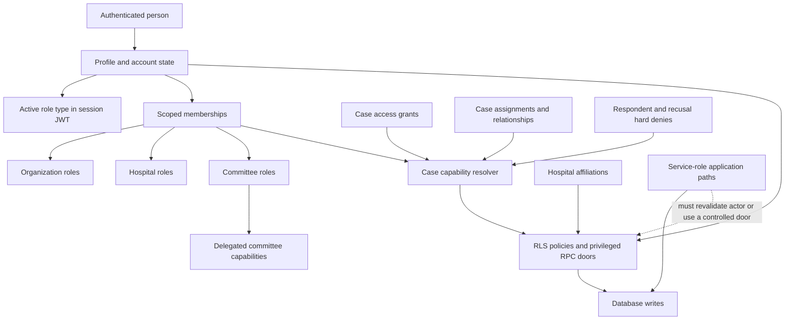
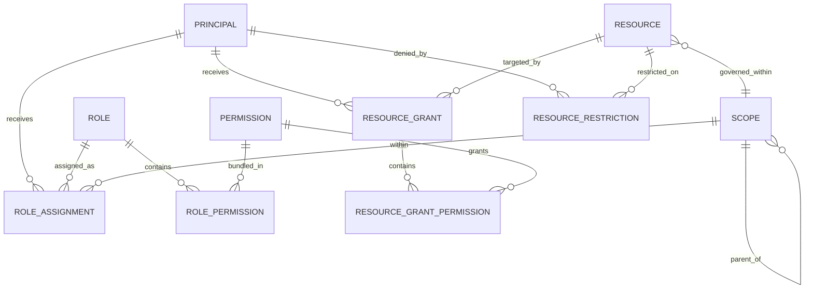

# Authorization Database Design Audit and Implementation Handoff

**Date:** 2026-08-11  
**Status:** Audit complete; recommendations only; no authorization migration implemented  
**Audience:** Product owner, technical lead, database implementer, security reviewer, QA, and operations  
**System:** Hospital Form Platform — Supabase/PostgreSQL authorization  
**Decision requested:** Approve, modify, or reject the target direction before implementation begins

## Executive summary

The current authorization model is secure-minded and substantially better than a conventional “role column on the user” design. It has full Row Level Security coverage on the live local `public` schema, current membership writes are forced through actor-validating database doors, account deactivation and role expiry are checked in database predicates, administrative authority is deliberately separated from clinical authority, and case access has already been decomposed into independent capabilities instead of a single read/write level.

The central concern is not that the present model is obviously insecure. No cross-tenant or PHI bypass was confirmed in this design audit. The concern is that adding a new standing role or a new organizational scope remains a cross-cutting change with too many coordinated edit points. A role currently exists simultaneously as:

- a value in a `memberships.role` CHECK constraint;
- a branch in the role-to-scope shape constraint;
- a value in the separate `public.platform_role` enum;
- grant and revoke branches in privileged functions;
- one or more role-specific helper predicates;
- a partition in the session-context adapter;
- a landing/navigation case;
- a display-label and role-switching case; and
- a row in several authorization test matrices.

The code explicitly records that the session and landing integration seam for a new role “has been missed three times.” That is strong internal evidence that the model is closed and integration-heavy even though it fails closed when an edit is missed.

If this were a new project, I would use a hybrid authorization model:

1. **Scoped RBAC** for standing authority: principals receive roles at institutional scopes.
2. **Permission catalogs** for stable action vocabulary: roles are bundles of permissions, not hard-coded aliases for database branches.
3. **Relationship-based authorization** for domain participation: assignment, meeting participation, custody, referral, and similar relationships remain in their domain tables.
4. **Explicit resource grants and restrictions** for exceptions, with restrictions evaluated before grants.
5. **ABAC checks** for lifecycle, confidentiality, purpose, tenant coherence, and minimum-necessary rules.
6. **One authorization module interface** used by RLS policies, controlled RPCs, application code, tests, and privileged diagnostics.

For the current project, I would not replace everything at once, split `memberships` into organization/hospital/committee tables, or discard the case-capability resolver. I would introduce a permission and role catalog beside the existing system, map the existing roles into it, evaluate old and new decisions in shadow mode, and move callers through stable authorization wrappers in phases. The existing case capability lattice should become the reference implementation and later an adapter to the shared permission vocabulary.

The highest-priority changes are:

1. Introduce a migration-managed permission catalog, role definitions, and role-permission mappings.
2. Introduce a real scope registry so future scopes do not require adding another nullable foreign key to `memberships` and another `CASE` arm everywhere.
3. Replace role-type-only session assumption with an authorization context that is backed by live database assignments.
4. Make one deep authorization module the only decision seam; retain thin domain-specific wrappers for readable RLS policies.
5. Expand the “door-only write” rule from two tables to every authorization-bearing relation and every service-role mutation.
6. Reduce and explicitly grant the `SECURITY DEFINER` surface.
7. Normalize explicit grant permissions when the next case capability or grantable resource arrives; do not force this migration before there is a product consumer.

## 1. Scope and audit questions

This audit answers four questions:

1. What is the live authorization model today?
2. Which parts are robust and should be retained?
3. Which parts make future roles, permissions, scopes, and protected resource types expensive or risky to add?
4. What would a greenfield model look like, and how can the current project move toward it safely?

The audit covers:

- identities and account state;
- organization, hospital, and committee standing authority;
- the `memberships` table, its constraints, indexes, ACLs, RLS, and write doors;
- role assumption and JWT/session context;
- case capabilities, explicit grants, assignments, and restrictions;
- delegated committee capabilities;
- hospital affiliation as an authorization input;
- RLS-policy and privileged-function shape;
- service-role application paths;
- auditability and test gates; and
- likely future requirements such as additional administrative roles, departments/programs, external reviewers, service actors, and new resource families.

This was a design audit, not a line-by-line penetration test of every privileged function. The limitations are recorded in [Section 15](#15-audit-limitations).

## 2. Method and evidence

The repository states that migration text may be stale and that the live PostgreSQL catalog is the authority for schema, RLS, ACL, trigger, and function-security claims. The audit therefore used both source and live catalog evidence.

### 2.1 Sources inspected

- [`ARCHITECTURE.md`](../../ARCHITECTURE.md), including the canonical `memberships` contract and case capability lattice.
- [ADR 0078](../decisions/0078-authorization-capability-model.md), including its amendments and the rule that `SECURITY DEFINER` gates must be audited beside RLS policies.
- [ADR 0106](../decisions/0106-act-as-role-assumption.md) and the current active-role implementation.
- The previous membership audit and follow-up analyses in [`docs/design/temp`](./temp/).
- The prior broad authorization proposal, [`supabase-user-roles-rls-handoff-2026-08-06.md`](./temp/supabase-user-roles-rls-handoff-2026-08-06.md).
- Current authorization-related migrations, SQL tests, mutation gates, TypeScript session resolution, server actions, and role UI.
- The live local PostgreSQL catalog: `pg_class`, `pg_constraint`, `pg_indexes`, `pg_policies`, `pg_proc`, routine/table ACLs, schema privileges, and function definitions.
- Current official Supabase guidance for RLS, Data API exposure, views, function security, and explicit grants.

### 2.2 Point-in-time live catalog snapshot

The completed local catalog snapshot showed:

| Metric | Verified value |
| --- | ---: |
| PostgreSQL version | 17.6 |
| `public` base tables | 161 |
| `public` tables with RLS enabled | 161 |
| `public` policies | 271 |
| `storage` policies | 16 |
| `app` policies | 1 |
| `app` functions | 431 |
| `public` functions | 510 |
| `app` `SECURITY DEFINER` functions | 333 |
| `public` `SECURITY DEFINER` functions | 419 |
| `app.can_*` predicates | 48 |
| Membership roles | 10 |
| Session/platform role values | 11, including `platform_admin` |

The 752 `SECURITY DEFINER` functions include authorization predicates, public RPC doors, trigger functions, audit writers, validators, and domain helpers. The count is therefore an attack-surface and maintainability census, not a claim that 752 functions are externally callable authorization endpoints.

ACL inspection added important context:

- No `public`-schema definer function had default `PUBLIC` execute in the completed snapshot.
- 406 `public`-schema definer functions had a direct `authenticated` execute grant. Many are intended Data API RPCs.
- 175 `app`-schema definer functions retained default `PUBLIC` execute.
- `authenticated` had `USAGE` on `app`; `anon` did not.
- The Data API exposed `public` and `graphql_public`, not `app`, so the `app` functions were not RPC endpoints through PostgREST. The ACL is still broader than required and increases direct-database and audit surface.

### 2.3 Verification performed

- The live `memberships` table, constraints, indexes, RLS, and table privileges were inspected.
- Definitions of `app.has_role`, `app.has_role_any`, `app._case_caps`, `app.has_case_capability`, `app.grant_role_impl`, `app.revoke_role_impl`, `public.assume_role`, and `public.custom_access_token_hook` were inspected.
- Supplemental authorization tables were inventoried, including `case_access_grants`, `case_recusals`, `commission_administrativos`, `commission_administrativo_capabilities`, `hospital_affiliations`, and domain assignment tables.
- The repository’s static door guard passed:

  ```text
  door gate: OK (no raw DML on memberships, hospital_affiliations in src)
  ```

- Targeted Vitest execution was attempted but could not start because the local dependency runner attempted a registry request and failed certificate validation. No dependency installation or network workaround was authorized. This does not invalidate catalog findings, but the unexecuted tests remain an explicit handoff item.

## 3. Current authorization model



### 3.1 Identity and account state

`public.profiles` is the application identity anchor. It carries global account state and the legacy/global `is_admin` flag. `app.is_active` fails closed when a profile is absent, inactive, or currently suspended.

`platform_admin` is deliberately outside tenant membership. The product’s “noun rule” permits platform administration of tenancy, identity, vocabulary, and audit, but not clinical or committee content. This separation is a significant strength.

### 3.2 Standing roles

`public.memberships` is one multi-scope table with these columns:

```text
id, principal_id,
organization_id, hospital_id, commission_id,
role, title_id,
granted_by, granted_at, expires_at
```

The live role vocabulary is:

| Scope | Roles |
| --- | --- |
| Organization | `org_admin`, `nsp_org_admin` |
| Hospital | `hospital_admin`, `nsp_coordinator`, `pqs_member`, `technical_director`, `technical_director_deputy`, `quality_reviewer` |
| Committee | `staff_admin`, `staff` |

Important live invariants include:

- an exhaustive role CHECK;
- an exhaustive role-to-scope shape CHECK;
- a composite hospital/organization FK;
- a composite title/committee FK;
- one committee role per principal per committee;
- one titular technical director per hospital;
- expiry-aware role predicates;
- SELECT-only access for `authenticated`; and
- grant/revoke writes through controlled doors.

This means several defects identified by the August 4 membership audit have already been fixed: commission-role cardinality, composite referential integrity, effective session expiry, and raw application DML on the two currently gated tables.

### 3.3 Active-role assumption

The current session selects one **role type**, not one assignment. `public.assume_role` validates that the user holds at least one live membership of the requested type, stores a session selection, and the custom access-token hook mints an `active_role` claim. Database role predicates require the caller’s requested role to match this claim.

Consequences:

- A user with multiple role types must choose which responsibility to exercise.
- Revocation and expiry are still live-checked against `memberships`, so the JWT claim alone does not preserve a revoked role.
- Selecting `staff_admin`, for example, activates that role type across every committee in which the user currently holds it. The context does not identify a particular assignment or scope.
- Adding a role requires editing the separate `platform_role` enum and every consumer of the role partition.

### 3.4 Case authorization

Case authorization is the most mature and reusable part of the design. `app._case_caps` computes a bitmask over independent capabilities:

- `view_case_overview`;
- `read_case_deliberation`;
- `read_case_content`;
- `read_standard_phi`;
- `read_restricted_phi`;
- `write_case_content`; and
- `manage_case_access`.

The resolver evaluates account state, tenant anchor, hard denies, committee coordinator authority, limited administrative authority, ordinary committee participation, quality oversight, explicit grants, and case assignments. Important implications are explicit: write implies content read; restricted PHI implies standard PHI; content read does not imply PHI; PHI does not imply write.

`case_access_grants` stores capabilities as Boolean columns plus source, reason, expiry, and revocation metadata. Case recusal and respondent relationships act as hard denies before positive sources.

### 3.5 Other authorization planes

Authorization is not represented only by `memberships`:

- `commission_administrativos` and `commission_administrativo_capabilities` provide delegated committee permissions.
- `hospital_affiliations` influence which people hospital administrators may see or manage.
- Domain assignment tables confer relationship entitlements.
- `case_recusals` provide explicit hard denial.
- Attachment sensitivity and confidentiality labels participate in access decisions.
- Referral, patient safety, meeting, interview, document, and action-item domains have their own `app.can_*` predicates.

This separation is often correct. Domain participation should not be forced into tenant membership. The problem is the lack of a shared permission vocabulary and shared decision/provenance interface across these planes.

## 4. What the current design does well

### S1 — Database-enforced isolation

All 161 completed-snapshot `public` tables had RLS enabled. The system does not rely on hidden UI elements as the security boundary.

### S2 — Administrative and clinical duties are separated

Organization, hospital, platform, quality, NSP, and committee responsibilities do not automatically collapse into full clinical access. The case resolver’s separation of content, deliberation, PHI, write, and access management is exactly the kind of minimum-necessary design a hospital platform needs.

### S3 — Current membership storage is relationally stronger than earlier reports

The live table has the partial unique index and composite FKs that previous audits recommended. It is indexed by principal and by each current scope path.

### S4 — Membership writes have a real door

`authenticated` has SELECT only. Current application code passes the repository’s static gate forbidding direct `memberships` and `hospital_affiliations` DML. Cookie and service-role paths now call actor-validating database functions.

### S5 — Revocation, expiry, suspension, and active-role checks fail closed

Role predicates check live database state. The session context reads effective grants. The active-role claim is not itself sufficient to manufacture a membership.

### S6 — Case authorization is a deep module

Callers can ask a small number of questions while the resolver hides a large amount of source, deny, implication, expiry, and sensitivity logic. This produces leverage for RLS policies and locality for future case changes.

### S7 — Privileged reads and writes are designed as auditable doors

The PHI single-door pattern, append-only audit log, and mutation-test program recognize that RLS policies are not the whole attack surface.

### S8 — The test culture is unusually strong

The repository includes cross-scope pgTAP tests, door coverage floors, mutation-tested authorization keystones, catalog completeness checks, and a static raw-DML guard. These controls should be preserved and generalized, not replaced.

## 5. Findings

Severity means migration priority and future-change risk, not necessarily a presently exploitable vulnerability.

### F1 — High: the standing role model is a closed, duplicated vocabulary

**Evidence**

- `memberships.role` is text constrained by `memberships_role_check`.
- `memberships_scope_shape` separately maps each role to nullable scope columns.
- `public.platform_role` duplicates the role vocabulary as an enum and adds `platform_admin`.
- `app.grant_role_impl` and `app.revoke_role_impl` contain explicit role branches.
- Session partitioning and the landing page contain role-specific branches.
- UI labels and role switch cards contain another role switch.
- Source comments state that the new-role session seam has been missed three times.

**Impact**

Adding a new role is not locally data-driven. It requires a coordinated schema, privileged-function, session, routing, UI, and test change. Misses generally fail closed, which protects data, but can ship unusable roles or inconsistent application authority. Redefining an existing role is riskier because literal role checks are spread across functions and policies.

**Recommendation**

Introduce migration-managed `permissions`, `roles`, and `role_permissions`. Keep permission codes stable and action-oriented. Make common role grantability data-driven through grant rules. Leave genuinely exceptional invariants—physician qualification, single titular office, last-admin protection—in explicit validators rather than embedding every role in one giant grant function.

### F2 — High: one record conflates affiliation, role assignment, and current state

**Evidence**

`memberships` is described and consumed as both “membership” and the tenant role grant itself. A row carries scope, role, grantor, grant time, and expiry. Revocation currently deletes the row; a role replacement updates it.

**Impact**

The model cannot cleanly represent “belongs to Hospital A but currently has no administrative role,” multiple roles at one scope where the business permits them, approval workflows, future-dated grants, or assignment history without relying on the audit log as the historical source. It also encourages new features to decide between adding another membership role and creating a bespoke capability table.

**Recommendation**

Separate the domain concepts:

- membership/affiliation = belonging;
- role assignment = authority;
- permission = action;
- resource grant = exception for one resource;
- relationship entitlement = domain participation.

For the current project, do this through new authorization tables and compatibility adapters. Do not split the existing table by organization/hospital/committee.

### F3 — High: scopes are fixed to exactly three nullable foreign keys

**Evidence**

`memberships` has `organization_id`, `hospital_id`, and `commission_id`. `app.has_role` dispatches over the literal scope types `organization`, `hospital`, and `commission`. The shape constraint enumerates the same hierarchy by role.

**Impact**

A new standing scope—department, service line, regional network, accreditation program, project, or external survey engagement—requires schema DDL, constraints, indexes, session projection, grant branches, and new predicates. Adding `department_id` would continue the sparse-column pattern and widen every exhaustive dispatcher.

**Recommendation**

Add an authorization scope registry with a real FK from assignments to scopes and an explicit parent relation. Each business aggregate that can own standing authority receives one unique scope identity. This retains referential integrity without a generic un-FK’d `(scope_type, scope_id)` pair.

### F4 — High: authorization mechanisms are fragmented without shared permission semantics

**Evidence**

- standing roles are strings in `memberships`;
- case grants are Boolean capability columns;
- delegated committee capabilities are rows with a constrained text capability;
- platform administration is a profile Boolean plus a session enum value;
- assignment roles and meeting/action/referral roles use domain-specific strings;
- 48 `app.can_*` functions express domain decisions independently.

**Impact**

Future implementers must first choose which authorization plane to extend. Equivalent actions may receive different names, implication rules, expiry semantics, audit metadata, or denial ordering. Cross-domain roles such as “hospital quality manager” become a collection of literal exceptions instead of a permission bundle.

**Recommendation**

Create one action-oriented permission vocabulary and require every positive source to resolve to those permissions. Keep domain relationship tables, but adapt their outcomes into the shared resolver. Add a privileged explanation interface that reports decision provenance without returning PHI.

### F5 — Medium-high: service-role paths remain a second enforcement plane

**Evidence**

Fifteen source files instantiate `createAdminClient`, and several contain multiple calls. Current comments correctly warn that some TypeScript checks are the only authority before an RLS-bypassing operation. The static raw-DML gate covers only `memberships` and `hospital_affiliations`.

**Impact**

The two gated tables are currently protected, but a new authorization-bearing table or privileged mutation can be added without entering the gate’s map. A future permission may be enforced in RLS and still be bypassed by a service-role path whose TypeScript mirror is incomplete.

**Recommendation**

- Expand the door-only registry to all authorization-bearing and PHI-bearing tables.
- Require actor-validating service-only RPCs for every privileged mutation.
- Make service-role application code orchestration-only: authenticate the caller, call a database command that re-derives authority, and handle the result.
- Add a catalog/source gate that inventories every service-role DML target and requires an owner, justification, actor-revalidation path, and test.

### F6 — Medium: role assumption selects a role type, not an assignment or permission context

**Evidence**

The session claim stores `active_role`. `assume_role` finds any current assignment of that type and records only the enum role. Database checks then admit all live assignments matching that role type.

**Impact**

A person who coordinates multiple committees cannot choose one particular committee context; selecting the coordinator role activates all of them. The claim also couples session infrastructure to the closed role vocabulary. Future custom roles or delegated permission sets would require new enum values and token-hook behavior.

**Recommendation**

Replace role-type assumption with an `authorization_context_id` or `role_assignment_id` that is session-bound, server-minted, and resolved against live database state on every sensitive decision. If the product intentionally wants “all assignments for this responsibility,” model that explicitly as a context containing a role definition plus a controlled scope set.

Do not place the effective permission list in the JWT. The token should identify the user, session, and selected context; the database should resolve current authority.

### F7 — Medium: the case capability model is deep but not yet a platform authorization seam

**Evidence**

The case resolver centralizes case decisions, while meeting, referral, patient-safety, action-item, attachment, document, and interview domains retain separate `can_*` families.

**Impact**

The case model demonstrates the right shape but its capability names and grant representation are case-specific. New cross-cutting permissions cannot be granted or explained consistently across resources.

**Recommendation**

Keep the case resolver and expose it as a typed adapter behind a shared authorization interface. Do not replace readable wrappers such as `can_read_case`; make them delegate to the shared permission engine.

### F8 — Medium: explicit case capabilities are schema columns

**Evidence**

Each grant row has Boolean columns such as `read_case_content`, `read_standard_phi`, and `write_case_content`.

**Impact**

This is efficient and constrained, but each new grantable capability requires table DDL, constraints, function changes, generated type changes, UI changes, and migration of every union/aggregation path. It cannot naturally grant the same permission for a different resource type.

**Recommendation**

When the next grantable capability or second compatible resource-grant domain is approved, split the grant header from grant permissions:

```text
resource_grants
resource_grant_permissions
```

Until that trigger exists, retain the current case table. Migrating it speculatively would add joins and risk without immediate leverage.

### F9 — Medium: the privileged-function surface is too large to reason about cheaply

**Evidence**

The completed snapshot contained 752 definer functions across `app` and `public`. There were 406 authenticated-executable public definer functions. There were also 175 `app` definer functions with default PUBLIC execute, while `authenticated` had schema usage.

**Impact**

Many functions are valid trigger or RPC implementations, but the interface is broad. Every definer function is a potential RLS bypass whose gate, search path, ACL, and tests must be correct. Broad default privileges create unnecessary review work and make “which functions are actual interfaces?” difficult to answer.

**Recommendation**

- Revoke default function execute in private schemas.
- Set explicit `ALTER DEFAULT PRIVILEGES` for the migration owner.
- Classify functions as public door, policy predicate, trigger, or internal helper.
- Grant execute only to the roles that must call each interface.
- Prefer internal helpers that are not executable by application roles.
- Track the count of authenticated-reachable definer doors as a security budget and require a reason for growth.

### F10 — Medium-low: the delegated committee appointment table lacks direct subject and scope FKs

**Evidence**

In the completed live snapshot, `commission_administrativos` had a primary key and an `appointed_by` FK, but no FK from `commission_id` to the committee/commission table and no FK from `user_id` to profiles. Its capability child correctly referenced the composite appointment key.

**Impact**

Orphaned delegated appointments are possible through privileged writes or future lifecycle changes, and the catalog cannot prove the subject and scope exist.

**Recommendation**

Add the missing declarative FKs after a guarded orphan census. Index referencing columns as needed. Preserve the composite child FK.

### F11 — Medium-low: the project has no general principal model

**Evidence**

Standing assignments and explicit grants target profile/user identifiers. There is no common principal abstraction for a group, external organization, service account, or workload identity.

**Impact**

Future team-based grants, external survey teams, integration actors, or automation identities will require either duplicated user rows or domain-specific authorization tables.

**Recommendation**

In a greenfield system, introduce principals and optional non-nested groups. In the current project, defer this until a real non-user actor or group-grant requirement exists; design new tables so `principal_id` can migrate without changing permission semantics.

### F12 — Operational: Data API exposure behavior should be explicit

**Evidence**

`supabase/config.toml` exposes `public` and `graphql_public`, while `auto_expose_new_tables` is commented out. Supabase changed new-project behavior in 2026 so public tables may not be automatically exposed, separate from RLS.

**Impact**

Local, new cloud, and existing cloud environments may differ on whether new tables receive Data API grants. RLS and object grants can drift while tests pass in only one environment.

**Recommendation**

Set the intended behavior explicitly and maintain explicit grants in migrations. The target authorization schema should not be Data API-exposed.

## 6. Greenfield design

### 6.1 Design principles

1. **Authentication identifies; authorization decides.** Supabase Auth supplies the user and session, not the permission list.
2. **Permissions are actions.** Names describe stable operations, not job titles.
3. **Roles are bundles.** Changing a role bundle is local to role-permission data plus tests.
4. **Assignments are scoped and time-bounded.** They are not profile attributes.
5. **Scope inheritance is explicit.** An organization assignment does not automatically imply every hospital or committee permission.
6. **Domain relationships stay in the domain.** Do not copy assignments or custody into generic role rows.
7. **Restrictions precede allows.** Recusal, respondent exclusion, legal hold, and purpose restrictions cannot be out-voted by a broader role.
8. **Clinical authority is independent of administration.** Permission bundles encode the distinction.
9. **Decisions are explainable.** A reviewer can see which role, relationship, grant, or restriction produced a decision.
10. **All privileged writes pass through one interface.** Application service-role code is not an alternate policy engine.

### 6.2 Recommended schemas

```text
auth          Supabase-managed authentication
public        Data API business resources and safe public RPC doors
authz         non-exposed authorization catalogs, assignments, resolvers, and internals
audit         non-exposed append-only audit internals and controlled read interfaces
```

`authz` and `audit` should not be exposed through the Data API. Revoke default privileges and grant only explicit schema usage/function execution.

### 6.3 Core model



#### Principals

```text
authz.principals
  id
  kind: user | group | service
  user_id nullable unique
  status

authz.group_members
  group_principal_id
  member_principal_id
  starts_at, ends_at, revoked_at
```

Do not support nested groups initially. Group cycles and transitive revocation add significant complexity.

#### Scopes

```text
authz.scopes
  id
  kind
  parent_scope_id nullable
  status
  created_at
```

Each scope-owning business table has one unique `authorization_scope_id` FK. Examples:

```text
organizations.authorization_scope_id
hospitals.authorization_scope_id
commissions.authorization_scope_id
future_departments.authorization_scope_id
```

Assignments reference `authz.scopes(id)`, so a new scope type does not change the assignment table. Parent-kind and tenant-root invariants are enforced by controlled creation functions and constraints/triggers. If ancestor queries become hot, maintain a closure table:

```text
authz.scope_closure(ancestor_scope_id, descendant_scope_id, depth)
```

Inheritance is never inferred merely from `depth`; a permission or role definition must declare whether it applies to descendants and to which kinds.

#### Permissions and roles

```text
authz.permissions
  id
  code unique
  resource_kind
  risk_class
  sensitivity_ceiling
  is_assignable
  is_system

authz.roles
  id
  code unique
  display_name
  allowed_scope_kind
  is_system
  tenant_id nullable
  status

authz.role_permissions
  role_id
  permission_id
  applies_to_descendants
  descendant_scope_kinds nullable
```

Example permission codes:

```text
organization.people.read
organization.people.manage
hospital.settings.manage
committee.membership.manage
case.overview.read
case.deliberation.read
case.content.read
case.content.write
case.phi.standard.read
case.phi.restricted.read
case.access.manage
meeting.content.read
meeting.manage
document.publish
audit.authorization.read
```

Permission codes are code-coupled and migration-managed because an enforcement path and tests must exist before a permission is meaningful. Role bundles can be data-driven. Tenant-defined roles should be a later feature and may combine only permissions explicitly marked tenant-assignable and within a grant ceiling.

#### Role assignments

```text
authz.role_assignments
  id
  principal_id
  role_id
  scope_id
  starts_at
  ends_at nullable
  revoked_at nullable
  revoked_by nullable
  granted_by
  reason_code
  reason_note nullable
  created_at
```

Assignments are append-preserving. Revocation sets metadata rather than deleting the row. A partial unique index prevents overlapping equivalent active assignments. Exclusion constraints may be considered if scheduled assignments and overlapping time ranges become a real requirement.

#### Grant ceilings

```text
authz.role_grant_rules
  grantor_permission_id
  grantable_role_id
  scope_relation: same | descendant | selected_descendants
  requires_second_approval
```

The common grant algorithm becomes data-driven. Exceptional domain invariants stay explicit:

- last organization access administrator cannot be removed;
- technical director must satisfy professional qualification;
- only one titular technical director per hospital;
- clinical/PHI roles may require a purpose, expiry, or approval;
- self-grant is denied unless a separately approved workflow exists.

#### Resources, explicit grants, and restrictions

Only resources that support explicit ACL-style grants need registry rows:

```text
authz.resources
  id
  resource_kind
  scope_id
  sensitivity_class
  lifecycle_state

authz.resource_grants
  id
  resource_id
  principal_id
  source
  source_entity_id nullable
  starts_at
  ends_at nullable
  revoked_at nullable
  granted_by
  reason_code

authz.resource_grant_permissions
  grant_id
  permission_id

authz.resource_restrictions
  id
  resource_id
  principal_id
  permission_id nullable
  source
  starts_at
  ends_at nullable
  lifted_at nullable
```

Each grantable domain row holds a unique FK to `authz.resources`. This avoids an unreferenced `(resource_type, resource_id)` pair. Domain relationships such as case assignments remain in domain tables and are read by typed adapters.

### 6.4 Decision algorithm

For `authorize(principal, permission, resource, context)`:

1. Deny if the principal, session, selected context, tenant, or resource is inactive.
2. Deny if resource and scope anchors are inconsistent or unknown.
3. Evaluate hard restrictions and domain exclusions first.
4. Resolve standing role permissions at the resource scope and approved ancestor scopes.
5. Resolve live relationship entitlements through domain adapters.
6. Resolve live explicit resource grants.
7. Apply permission implications from a migration-managed, acyclic implication graph.
8. Apply confidentiality, purpose, lifecycle, separation-of-duties, and minimum-necessary ceilings.
9. Return allow/deny plus non-sensitive provenance.

The engine must not use “allow if any source allows” until hard restrictions and ceilings have been evaluated.

### 6.5 Deep authorization interface

The external seam should be small:

```text
authz.has_scope_permission(principal_id, scope_id, permission_code) -> boolean
authz.has_resource_permission(principal_id, resource_id, permission_code) -> boolean
authz.explain_resource_permission(principal_id, resource_id, permission_code) -> decision record
authz.assign_role(actor_id, principal_id, role_id, scope_id, window, reason) -> assignment id
authz.revoke_role_assignment(actor_id, assignment_id, reason) -> void
authz.grant_resource_permission(actor_id, principal_id, resource_id, permissions, window, reason) -> grant id
```

RLS policies should normally call thin typed wrappers:

```text
app.can_read_case(case_id, uid)
app.can_manage_meeting(meeting_id, uid)
app.can_read_referral_phi(referral_id, uid)
```

Those wrappers translate a domain row into an authorization resource and permission, and contain any truly domain-specific relationship checks. They must not reimplement standing role semantics.

### 6.6 Authorization context

```text
authz.authorization_contexts
  id
  session_id
  principal_id
  role_id or role_assignment_id
  selected_scope_id nullable
  created_at
  last_validated_at
```

The custom access-token hook mints only the opaque context identifier. Every sensitive check validates that the context belongs to the current session and principal and that its assignments remain effective. A role switch writes and audits a new context selection, then refreshes the token.

### 6.7 What not to make generic

- Do not turn case lifecycle rules into configurable policy expressions.
- Do not allow tenant administrators to invent new permission codes.
- Do not fold assignment, custody, attendance, referral, or recusal into role assignments.
- Do not use one untyped JSON condition language for security decisions.
- Do not create one dynamic-SQL RLS function that queries arbitrary tables by name.
- Do not grant all ancestor permissions by default.

## 7. Recommended changes for the current project

### 7.1 Preserve

- RLS on every exposed table.
- The single current `memberships` table during migration.
- `app.is_active` as the universal fail-closed outer gate.
- The case capability lattice and hard-deny ordering.
- PHI single-door reads and exact audit requirements.
- Actor-validating grant/revoke doors.
- The session-context RPC as the application’s effective-grant snapshot.
- Mutation-tested authorization gates and catalog census discipline.

### 7.2 Change now

1. Add an internal `authz` schema with explicit default privileges.
2. Add migration-managed permission, role, role-permission, and current-role mapping tables.
3. Add a scope registry and backfill organization, hospital, and committee scope identities.
4. Add a shadow resolver that maps current memberships to effective permissions without enforcing them yet.
5. Add missing FKs to delegated committee appointments after an orphan check.
6. Make Data API auto-exposure intent explicit.
7. Expand the static door registry and service-role mutation inventory.
8. Add a function classification/ACL manifest and revoke unnecessary `app` PUBLIC execute privileges.

### 7.3 Change when the next feature requires it

- Normalize case grant permissions when a new grantable case capability or compatible resource-grant domain is approved.
- Add non-user principals when a group, survey team, or service account must receive authority.
- Add tenant-defined roles only after system roles are running through the permission catalog and grant ceilings are proven.

### 7.4 Do not do now

- Do not split `memberships` into separate organization, hospital, and committee assignment tables.
- Do not rewrite all 271 policies in one release.
- Do not replace the case resolver with a generic policy interpreter.
- Do not drop old role columns or the `platform_role` enum before shadow equivalence and cutover gates pass.
- Do not permit “old decision OR new decision” during migration.

## 8. Implementation scope

### In scope

- authorization glossary and decision record;
- authorization schemas and catalogs;
- scope registry and current-scope mapping;
- role-to-permission mapping for all existing roles;
- active assignment and authorization-context model;
- shared decision and explanation interfaces;
- adapters for current memberships and case capabilities;
- controlled mutation interfaces;
- ACL/default-privilege hardening;
- RLS wrapper migration;
- audit event updates;
- shadow evaluation and telemetry;
- catalog, pgTAP, mutation, application, E2E, performance, and operational gates; and
- safe retirement of superseded structures.

### Out of scope unless separately approved

- redesign of business workflows unrelated to authorization;
- patient-data encryption changes;
- regulatory certification claims;
- customer-editable policy languages;
- arbitrary nested groups;
- automatic role mining from existing user behavior;
- production deployment or remote schema mutation; and
- rewriting every domain-specific relationship table.

## 9. Phased implementation plan

Each phase is independently releasable and must retain the current authorization result until an explicit cutover phase says otherwise.

### Phase 0 — Record, baseline, and freeze the interface

**Objective:** Make the existing decision surface measurable before adding new structures.

**Work**

- Approve canonical terms from [`CONTEXT.md`](../../CONTEXT.md).
- Create an ADR for the approved authorization direction.
- Capture production and local catalog inventories of tables, policies, functions, ACLs, triggers, and service-role mutation targets.
- Define the canonical current permission matrix by persona, scope, resource, operation, sensitivity, and lifecycle.
- Assign every public privileged door and every `app` predicate an owner and classification.
- Record current query plans and latency for hot authorization checks.

**Gate 0**

- No unexplained catalog differences between local and target environment.
- Every current role and case capability appears in the matrix.
- Existing pgTAP and authorization mutation gates pass.
- Targeted Vitest tests that could not run during this audit are green in the implementation environment.
- No schema enforcement change ships in this phase.

### Phase 1 — Add catalogs and scope registry in shadow-only mode

**Objective:** Introduce the target vocabulary without changing access.

**Work**

- Create private `authz` schema and explicit default privileges.
- Create `permissions`, `roles`, `role_permissions`, and `legacy_role_mappings`.
- Seed one permission bundle for every current role, including `platform_admin`.
- Create `scopes` and optional `scope_closure`.
- Add/backfill one scope identity for every organization, hospital, and committee.
- Create a read-only adapter that projects each current membership as a target role assignment.
- Create a shadow scope-permission resolver.

**Gate 1**

- Every live role maps to exactly one role definition.
- Every role definition maps to at least one permission or is explicitly marked non-authorizing.
- Every current organization, hospital, and committee has one scope identity and correct parentage.
- Shadow results equal current results for the approved matrix. Any “new allow” is blocking. Any “new deny” requires product approval.
- No RLS policy uses the new result yet.

### Phase 2 — Unify authorization mutations

**Objective:** Establish one write interface before new tables become authoritative.

**Work**

- Add target role-assignment tables with append-preserving lifecycle metadata.
- Refactor current grant/revoke doors to call one internal assignment kernel.
- Dual-write current membership and target assignment in one database transaction.
- Add actor-validating service-only twins with exact ACLs.
- Add role grant rules for common cases.
- Retain exceptional validators for technical director, last administrator, self-grant, and clinical roles.
- Expand the static door-only gate to all authorization-bearing relations.

**Gate 2**

- No application source performs direct DML on an authorization-bearing table.
- Every grant/revoke produces exactly one authorization audit event with no PHI.
- Dual-write rows reconcile exactly after each test and migration batch.
- Unauthorized, cross-scope, self-grant, expired, suspended, and deactivated actor tests fail atomically.
- Mutation tests prove each gate can be made to fail.

### Phase 3 — Introduce the shared read decision seam

**Objective:** Make standing permission resolution data-driven while keeping domain wrappers stable.

**Work**

- Implement `has_scope_permission` and explanation output.
- Make current role helper predicates delegate to the new resolver one family at a time.
- Keep function names used by RLS stable during the change.
- Add explicit permission implications and validate that the implication graph is acyclic.
- Index active assignment lookup paths by principal, scope, role, and validity window.
- Benchmark policies with realistic row counts and representative scope fan-out.

**Gate 3**

- Old and new resolver decisions agree for every matrix cell and seeded randomized scenario.
- There are zero unexplained gained permissions.
- Query plans use intended indexes and meet the agreed latency budget.
- RLS tests run as `anon` and `authenticated`, not as table owner.
- Policy OR-sibling and update-requires-select cases are explicitly tested.

### Phase 4 — Replace active role type with authorization context

**Objective:** Decouple session responsibility from a closed role enum.

**Work**

- Add session-bound authorization contexts.
- Update `assume_role` or replace it with `select_authorization_context`.
- Mint an opaque context id in the token rather than an effective permission list.
- Validate context, live assignment, account state, and scope at decision time.
- Derive navigation from effective context permissions and destinations, not a hard-coded role-precedence chain.
- Keep an audited role/context switch history.

**Gate 4**

- Forged, foreign-session, revoked, expired, and stale context ids fail closed.
- A role at multiple scopes behaves according to the approved context semantics.
- A user switching contexts cannot retain pages or mutations from the previous context.
- Session refresh, sign-out, suspension, and role revocation invalidate effective authority within the defined SLA.

### Phase 5 — Add resource grants and adapters

**Objective:** Generalize exceptions without weakening domain rules.

**Work**

- Create resource registry, resource grants, grant permissions, and restrictions.
- Register cases first or wait for the next compatible resource feature.
- Backfill current case grants in a guarded, resumable migration.
- Make the case resolver read both representations in shadow mode, then target representation only after cutover.
- Keep case assignments and recusal in domain tables.
- Add explanation provenance for coordinator, role, assignment, explicit grant, relationship, and restriction sources.

**Gate 5**

- Every current case bit has an exact permission mapping.
- Content read never implies PHI; PHI never implies write.
- Hard restrictions always override every positive source.
- Grant expiry and revocation are immediate.
- No PHI or free text appears in decision explanations or authorization audit metadata.

### Phase 6 — RLS consolidation and privileged-function hardening

**Objective:** Reduce the surface future developers must understand.

**Work**

- Migrate policy families to stable typed wrappers backed by the shared resolver.
- Inventory and revoke unnecessary function execute privileges.
- Apply explicit default privileges for `public`, `authz`, and `audit`.
- Keep private schemas out of Data API exposure.
- Convert eligible views to `security_invoker` or revoke application access.
- Remove pass-through helpers whose deletion would not reintroduce complexity.
- Expand the existing door census to classify every authenticated-reachable definer function.

**Gate 6**

- Every definer function has a classification, owner, pinned/empty search path, exact ACL, and test disposition.
- PUBLIC/anon cannot execute privileged public doors.
- Internal helpers are not directly executable by application roles unless a policy requires it and the grant is documented.
- Full policy, door, row-door, and never-called-door gates pass.

### Phase 7 — Cutover and cleanup

**Objective:** Make the target model authoritative and remove duplicated vocabulary.

**Work**

- Run shadow evaluation in production for an agreed observation window.
- Review every disagreement; never auto-accept broadened access.
- Switch standing-role reads to target assignments.
- Stop dual writes, then remove compatibility writes after reconciliation.
- Retire obsolete role CHECK branches, role-specific grant branches, session partition code, and enum values only when no dependency remains.
- Archive final catalog, access matrix, query plans, and operational runbook.

**Gate 7**

- Zero unexplained shadow disagreements for the observation window.
- Authorization audit events and deny rates remain within expected bounds.
- Rollback drill succeeds before production cutover.
- Product owner approves every intentional access change.
- Security reviewer signs the final ACL, definer-door, RLS, and service-role inventory.

## 10. Testing strategy and release gates

### 10.1 Catalog and schema tests

Assert:

- RLS on every exposed table;
- no unexpected exposed schema;
- exact table and function ACLs;
- no default PUBLIC execute on privileged interfaces;
- scope parent and root consistency;
- role/permission mapping completeness;
- no orphan assignment, grant, restriction, or delegated capability;
- FK indexes on authorization write and lookup paths;
- partial uniqueness for live assignments/grants; and
- acyclic permission implications and scope hierarchy.

### 10.2 Decision-matrix tests

For every permission, include at least:

- one legitimate allow;
- one same-tenant wrong-scope deny;
- one cross-hospital deny;
- one cross-organization deny;
- one inactive principal deny;
- one expired/revoked assignment deny;
- one wrong active-context deny;
- one hard-restriction override; and
- one lifecycle or sensitivity ceiling deny where applicable.

The same-tenant wrong-scope persona is important. A fully foreign user often fails an earlier SELECT policy and does not prove the intended write or capability gate.

### 10.3 Product-called path tests

Test the actual surface the product calls:

- Data API table/view access;
- public RPC doors with authenticated JWTs;
- Server Actions and route handlers;
- service-role orchestration paths;
- Storage objects and buckets;
- Realtime subscriptions, if authorization-bearing tables are subscribed; and
- background jobs/webhooks using service credentials.

### 10.4 Mutation tests

For high-risk gates, intentionally neutralize or remove the protection and prove the test turns red:

- active account gate;
- scope containment;
- role assignment validity;
- active-context match;
- self-grant denial;
- last-admin protection;
- hard restriction precedence;
- PHI separation;
- explicit grant expiry/revocation;
- service-role actor revalidation; and
- audit emission.

### 10.5 Shadow evaluation tests

Log both decisions with:

```text
principal pseudonymous id
resource kind/id
permission code
old decision
new decision
reason/source codes
request correlation id
```

Do not log PHI, free text, case titles, names, answers, or narrative bodies.

Migration mode must continue enforcing the old decision until the approved cutover. It must never use `old_allow OR new_allow`.

### 10.6 Performance tests

- Generate realistic high-cardinality assignments and resources.
- Benchmark hot RLS paths with `EXPLAIN (ANALYZE, BUFFERS)` in a non-production environment.
- Ensure principal/scope/permission lookups use composite or partial indexes matching the active-row predicates.
- Wrap stable request-wide functions in scalar subqueries where appropriate so PostgreSQL can use initplans.
- Test high-fan-out organization and multi-committee users.
- Establish p50/p95 targets for case list, committee dashboard, session context, and grant/revoke commands.

### 10.7 Migration and rollback tests

- Backfills are idempotent and resumable.
- Constraints are added with preflight queries and, where appropriate, `NOT VALID` followed by validation.
- Large indexes use production-safe creation strategy.
- Dual writes are transactionally atomic.
- Rollback does not delete new history or broaden access.
- A failed migration leaves old enforcement intact.

### 10.8 Required release gates

| Gate | Blocking condition |
| --- | --- |
| Catalog completeness | Any role, permission, policy, privileged door, or service-role DML target lacks a disposition |
| No widening | Any unexplained new allow |
| No orphaning | Any invalid scope, assignment, grant, restriction, or delegated capability |
| Exact ACL | Any unintended PUBLIC/anon/authenticated execute or table privilege |
| RLS behavior | Any cross-scope row or mutation succeeds |
| Door behavior | Any controlled mutation bypasses actor validation or audit |
| PHI separation | Content/read/write implication grants PHI unexpectedly |
| Mutation proof | A keystone remains green after its protection is neutralized |
| Performance | Authorization change breaches agreed latency or query-plan budget |
| Operations | Rollback, alerting, and access-review runbooks are incomplete |

## 11. Risk register

| Risk | Likelihood | Impact | Mitigation | Owner |
| --- | --- | --- | --- | --- |
| Big-bang rewrite creates an access leak | High without phasing | Critical | Shadow mode, wrapper stability, phased cutover, no policy-wide rewrite | Technical lead |
| Dual-write stores drift | Medium | High | One transactional kernel, reconciliation job, blocking mismatch alert | Database lead |
| Legacy role mapping broadens clinical access | Medium | Critical | Permission-by-permission product approval; new allows block | Product + security |
| Generic scope registry loses domain integrity | Medium | High | Business-table scope FKs, controlled scope creation, parent-kind constraints | Database lead |
| Generic resource registry creates dangling/untyped targets | Medium | High | Resource FK on domain row, typed registration doors, orphan tests | Database lead |
| Permission explosion makes roles incomprehensible | Medium | Medium | Stable naming rules, bounded resource/action grammar, catalog ownership | Product + architecture |
| Tenant-custom roles permit PHI escalation | Medium if enabled early | Critical | Defer; grant ceilings; non-assignable high-risk permissions; approvals | Security |
| RLS recursion or poor plans cause outages | Medium | High | Private definer lookup helpers, indexes, plan tests, staged rollout | Database lead |
| Stale JWT/context preserves revoked authority | Low-medium | Critical | JWT contains opaque context only; live assignment check; short token lifetime | Auth lead |
| Service role bypasses new resolver | Medium | Critical | Actor-validating RPCs, expanded source gate, service-path tests | Application lead |
| Administrative/clinical separation regresses | Medium | Critical | Permission bundles, noun-rule tests, explicit PHI matrix | Product + security |
| Hard deny can be out-voted | Low-medium | Critical | Deny-first algorithm and mutation tests | Database lead |
| Audit log receives sensitive content | Medium | High | Allow-listed metadata, no free text, audit payload tests | Security |
| Migration locks production tables | Medium | High | Preflight counts, short transactions, concurrent indexes, staged validation | Operations |
| UI hides/permits actions inconsistently with DB | Medium | Medium | UI derives from same session permission result; E2E deny tests | Frontend lead |
| Authorization catalogs become editable application data | Low | Critical | Private schema, migration-managed rows, exact ACLs | Database lead |
| Local/cloud Data API exposure differs | Medium | High | Explicit config and migration grants; environment catalog comparison | Operations |

## 12. Mapping from current to target concepts

| Current structure | Target concept | Migration posture |
| --- | --- | --- |
| `profiles` | user principal + account state | Preserve; add principal mapping only when needed |
| `profiles.is_admin` | platform role assignment | Shadow-map first; retire only after context cutover |
| `memberships` | current role assignment projection | Preserve during migration; dual-write then retire as authority |
| org/hospital/commission nullable FKs | authorization scope | Backfill registry and adapter |
| membership role CHECK | role definitions | Map every value; keep CHECK until cutover |
| `platform_role` enum | authorization context role reference | Replace after session cutover |
| `commission_administrativos` | delegated scoped role/assignment | Map carefully; add missing FKs now |
| `commission_administrativo_capabilities` | delegated role permissions | Seed equivalent permission bundle |
| `case_access_grants` | resource grant + grant permissions | Preserve until Phase 5 trigger |
| `case_recusals` | resource restriction / domain hard deny | Preserve as domain source |
| case phase/narrative assignments | relationship entitlement | Preserve as domain source |
| `app._case_caps` | case authorization adapter | Preserve and make it delegate incrementally |
| role-specific `is_*` helpers | typed authorization wrappers | Keep names; replace internals |
| `session_context()` | effective context projection | Preserve; later source it from target assignments |
| audit triggers/RPC calls | authorization audit events | Preserve semantics; add target assignment/grant events |

## 13. Decisions that require product approval

Before Phase 1, product and security must decide:

1. Is a selected responsibility meant to activate all assignments of that role type or one exact assignment/scope?
2. May a principal hold multiple standing roles at the same scope?
3. Which roles are bundles only, and which offices have additional lifecycle or qualification rules?
4. Can organization/hospital permissions apply to descendant scopes, and exactly which permissions may inherit?
5. Are tenant-defined custom roles a committed requirement or only a future option?
6. Which future scope types are plausible enough to validate the scope registry design?
7. Which resources besides cases will need explicit per-resource grants?
8. Are groups, service accounts, or external survey teams in the near roadmap?
9. Which high-risk grants require expiry, reason, or second approval?
10. What is the acceptable revocation propagation time for non-PHI and PHI permissions?

## 14. Handoff checklist

### Before implementation

- [ ] Product approves the permission matrix and role/context semantics.
- [ ] Security approves the deny precedence and administrative/clinical separation.
- [ ] Technical lead creates an ADR from the approved decision.
- [ ] Production catalog is compared with this local snapshot.
- [ ] Full existing authorization gates are green.
- [ ] Performance baseline is captured.

### During each phase

- [ ] Migration uses catalog preconditions and postconditions.
- [ ] Generated database types are refreshed.
- [ ] Every new permission has allow, deny, and mutation-proof tests.
- [ ] Every new definer function has exact ACL and search-path tests.
- [ ] Every service-role path revalidates a named actor in PostgreSQL.
- [ ] Audit metadata is allow-listed and contains no sensitive content.
- [ ] Shadow disagreement report is reviewed.
- [ ] Documentation and role/permission matrix are updated in the same change.

### Before cutover

- [ ] Zero unexplained new allows.
- [ ] Intentional denied/allowed deltas are product-approved.
- [ ] Dual-write reconciliation is exact.
- [ ] Rollback drill has passed.
- [ ] Operations can identify active assignments, grants, contexts, restrictions, and break-glass access.
- [ ] Access review and emergency revocation runbooks exist.
- [ ] Final security review covers RLS, policies, definer doors, ACLs, Storage, Realtime, and service-role paths.

## 15. Audit limitations

- The live snapshot was the seeded local stack, not the production catalog or production data volume.
- The local Supabase database was restarted/reset by another process during the later audit. All numeric catalog claims in this report come from the completed 161-table snapshot captured before that restart. Later incomplete snapshots were discarded.
- The audit did not execute the approximately 90-minute full authorization mutation sweep.
- Targeted Vitest tests could not start because the local runner attempted a registry request and failed certificate validation.
- The 752 definer functions were censused and representative authorization functions were inspected; every body was not manually reviewed.
- Application service-role paths were inventoried by source usage, not dynamically traced through every E2E workflow.
- No remote database, production Supabase advisors, or production query statistics were accessed.
- Regulatory language in existing architecture documents was treated as a design constraint, not independently validated legal advice.

These limitations mean the report is suitable for architecture and migration planning. They do not make it a production security attestation.

## 16. Final recommendation

Keep the current security posture and evolve the model behind stable interfaces.

The current single `memberships` table should not be split for naming purity. The current case capability resolver should not be discarded. The system’s main weakness is the absence of a shared, normalized permission and scope model above those working implementations.

The desired end state is:

```text
identity/session
  -> selected live authorization context
  -> scoped role assignments
  -> role permission bundles
  + domain relationship entitlements
  + explicit resource grants
  - hard restrictions
  -> lifecycle/sensitivity/minimum-necessary ceilings
  -> one explainable decision interface
  -> RLS and controlled RPC enforcement
```

This direction makes adding a **new role bundle** primarily a catalog and test change, adding a **new permission** an explicit enforcement-and-test change, adding a **new scope type** a scope registration change rather than a membership-table redesign, and adding a **new protected resource** a typed adapter change rather than another independent authorization system.

That is the right kind of flexibility: not arbitrary runtime policy, but a smaller and safer change surface with explicit security work whenever a genuinely new action is introduced.

## 17. References

- [Supabase Row Level Security](https://supabase.com/docs/guides/database/postgres/row-level-security)
- [Supabase securing the Data API](https://supabase.com/docs/guides/api/securing-your-api)
- [Supabase 2026 Data API exposure change](https://supabase.com/changelog/45329-breaking-change-tables-not-exposed-to-data-and-graphql-api-automatically)
- [PostgreSQL row security policies](https://www.postgresql.org/docs/17/ddl-rowsecurity.html)
- [PostgreSQL function security](https://www.postgresql.org/docs/17/perm-functions.html)
- [PostgreSQL constraints](https://www.postgresql.org/docs/17/ddl-constraints.html)
- [Project architecture](../../ARCHITECTURE.md)
- [Authorization capability ADR](../decisions/0078-authorization-capability-model.md)
- [Act-as-role ADR](../decisions/0106-act-as-role-assumption.md)
- [Previous membership audit](./temp/membership-model-audit-handoff.md)
- [Previous broad authorization proposal](./temp/supabase-user-roles-rls-handoff-2026-08-06.md)
