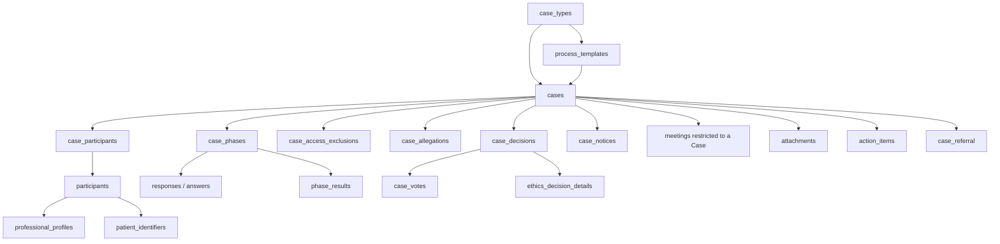

# Ethics Committee Case Model — Design Handoff

**Status:** Proposed replacement design for ADR 0072 / ADR 0073 review  
**Date:** 2026-07-14  
**Scope:** Data model, authorization model, read interfaces, lifecycle mapping, migration order, and verification  
**Implementation status:** Design only; no production schema changes are included in this handoff

## Source anchors

This handoff was derived from and should be reviewed beside:

- [ADR 0064 — Case subject generalization](../decisions/0064-case-subject-generalization-participants.md)
- [ADR 0072 — Ethics access spine](../decisions/0072-ethics-access-spine.md)
- [ADR 0073 — Ethics procedure model](../decisions/0073-ethics-procedure-model.md)
- [E1 access-spine build plan](../phases/ethics-e1-access-spine.md)
- [E2 procedure build plan](../phases/ethics-e2-procedure.md)
- [`case_types` and participant registry migration](../../supabase/migrations/20260716000000_participants_registry.sql)
- [Case Participant and patient-identifier migration](../../supabase/migrations/20260716000100_patient_identifiers_rekey.sql)
- [Current Case authorization predicate](../../supabase/migrations/20260710000000_nsp_per_hospital.sql)
- [Current Case and response RLS policies](../../supabase/migrations/20260711000800_perf_indexes.sql)
- [Current attachment owner authorization](../../supabase/migrations/20260717000000_attachments_core.sql)
- [Current shared Case, phase, response, Meeting, and event schema](../../supabase/migrations/20260620000000_baseline.sql)

The intended outcome is a replacement architectural decision, not an undocumented implementation deviation. If adopted, this design should supersede the conflicting portions of ADRs 0072 and 0073 before migrations are written.

## 1. Executive decision

Implement ethics review as a specialization of the existing `Case` engine. Do not create an `ethics_cases` root and do not create a second procedure engine beside `cases`, `case_phases`, forms, responses, meetings, attachments, action items, referrals, and audit.

The recommended model introduces five reusable Case primitives and one optional ethics-specific detail table:

1. `case_access_exclusions` — active recusals and resolved conflict declarations.
2. `case_allegations` — individually addressable allegations with their current findings.
3. `case_decisions` — formal decisions, including appeal/review lineage.
4. `case_votes` — ballots on a Decision.
5. `case_notices` — formal communications and response deadlines.
6. `ethics_decision_details` — optional sanction and external-reporting fields that are genuinely ethics-specific.

The following proposed ADR 0073 tables are intentionally not created:

- `ethics_case_details`: intake and admissibility use generic Case columns plus a keyed Case phase and its result.
- `ethics_findings`: the proposal allows only one current finding per allegation, so finding fields belong on `case_allegations` until version history is required.
- `ethics_hearings`: hearings use case-restricted `meetings` and participant-aware attendance.
- `ethics_appeals`: an appeal is a review Decision linked to the Decision it reviews.

This is not a claim of HIPAA, LGPD, CFM, or other regulatory compliance. Retention periods, sanction vocabularies, statutory deadlines, and erasure rules require separate human legal and records-governance approval.

## 2. Goals

- Preserve one `cases` root for every committee and subject kind.
- Make a doctor-centered Case a configuration and participant difference, not a parallel aggregate.
- Reuse the existing workflow, form, response, narrative, meeting, attachment, action-item, referral, and audit modules.
- Keep the Case-detail interface cohesive even though its implementation reads several focused tables.
- Make respondent exclusion and recusal hard denials at the database layer.
- Allow a respondent to submit a narrowly scoped defense without granting access to the investigation.
- Avoid one-to-one tables that do not add independent cardinality, history, or authorization.
- Prefer generic procedure concepts that can later support credentialing, complaints, professional review, and other committee types.

## 3. Non-goals

- Replacing the form builder or response engine.
- Creating a general-purpose business-process engine.
- Encoding legal rules that have not been approved by counsel or records governance.
- Giving organization- or hospital-level administrators implicit clinical Case authority.
- Solving external regulator delivery beyond recording a notice, attachment, or existing Referral.
- Adding allegation-finding version history before a real requirement exists.
- Making every Case type use allegations, votes, or formal notices.

## 4. Canonical domain language

The handoff uses these terms consistently:

| Term | Meaning |
|---|---|
| **Case** | The shared committee-owned work record. Patient-, doctor-, and entity-centered work all use the same root. |
| **Case Type** | Organization-scoped configuration that selects subject kind, terminology, workflow defaults, and visibility defaults. |
| **Case Participant** | A typed person or entity connected to a Case in a recorded role. |
| **Respondent** | The professional participant whose conduct is under review. This is a role, not a separate Case type or user role. |
| **Case Access Grant** | A positive, time-bounded authorization to a Case. |
| **Case Access Exclusion** | A case-scoped hard denial created by recusal or a resolved conflict. It takes precedence over every positive authority. |
| **Case Allegation** | An individually addressable assertion under review, including its current finding. |
| **Case Decision** | A formal determination, including a later review Decision that refers to an earlier Decision. |
| **Case Vote** | One eligible member's ballot on a Decision. Recusal is not a vote value. |
| **Case Notice** | A formal communication with delivery, acknowledgement, and response-deadline state. It is not an in-app reminder. |
| **Reminder** | A derived notification sent to a responsible user because a Case Notice or Decision deadline is approaching. |
| **Hearing** | A case-restricted Meeting whose type and linked Case identify it as a hearing. |

## 5. Architectural shape



The external seam remains the Case module. A caller opens a Case, performs a permitted Case command, or obtains a Case-detail bundle. Ethics-specific behavior remains behind that interface and is selected from the snapshotted Case Type.

## 6. Changes to existing shared tables

### 6.1 `case_types`

`case_types` already exists but is not yet connected to `process_templates` or `cases`. Make the relationship real before implementing ethics access.

Recommended additions:

```sql
alter table public.case_types
  add column default_confidentiality_label text not null
    default 'non_phi_internal',
  add constraint case_types_id_org_uniq
    unique (id, organization_id);
```

`default_confidentiality_label` is classification metadata and the default for new Case-owned attachments. It is not an ordered clearance level.

Required invariants:

- `key` remains unique within an organization.
- `primary_subject_kind` determines which participant role may be primary.
- An ethics type uses `primary_subject_kind = 'professional'`.
- The ethics default visibility is `explicit_grants_only`.
- Changing Case Type defaults never changes existing Cases.

### 6.2 `process_templates`

Recommended additions:

```sql
alter table public.process_templates
  add column organization_id uuid,
  add column case_type_id uuid;
```

After backfill, make both columns `not null` and add tenant-safe references. `organization_id` must equal the organization resolved from `commission_id`. `case_type_id` must reference a Case Type in that organization.

Why the template references the type:

- It declares whether the workflow is an ethics, patient-safety, credentialing, or other workflow.
- It supplies the Case Type that `create_case` snapshots.
- It prevents a caller from choosing a permissive Case Type independently of the approved template.

### 6.3 `cases`

Recommended additions:

```sql
alter table public.cases
  add column case_type_id uuid,
  add column visibility_policy text not null default 'commission_default',
  add column confidentiality_label text not null default 'non_phi_internal',
  add column received_at timestamptz,
  add column intake_channel_key text;
```

After backfill, `case_type_id` becomes `not null` and receives a tenant-composite FK through `(case_type_id, organization_id)`.

Column meanings:

| Column | Meaning |
|---|---|
| `case_type_id` | Immutable Case Type snapshot selected by the approved Process Template. |
| `visibility_policy` | Immutable-by-default reach policy: `commission_default` or `explicit_grants_only`. |
| `confidentiality_label` | Classification/default label, not a numerical or ordered clearance. |
| `received_at` | When the underlying report or complaint was received. It may precede platform creation. |
| `intake_channel_key` | Optional generic intake source such as `internal`, `patient`, `external_body`, `anonymous`, or `other`. |

Creation invariant:

```text
process_template.case_type_id
    -> cases.case_type_id
case_type.default_visibility_policy
    -> cases.visibility_policy
case_type.default_confidentiality_label
    -> cases.confidentiality_label
```

These values are copied in the same transaction that creates the Case. The caller does not supply them independently.

### 6.4 Stable Case-phase keys

Admissibility should use the existing phase and result engine, but lifecycle code needs a stable identifier that is not a translated title or array position.

Recommended additions:

```sql
alter table public.process_template_phases
  add column phase_key text;

alter table public.case_phases
  add column phase_key text;
```

Constraints:

- `unique(template_id, phase_key)` where `phase_key is not null`.
- `unique(case_id, phase_key)` where `phase_key is not null`.
- `create_case` snapshots the template phase key.
- A published template cannot change an existing phase key.

Suggested ethics keys:

- `admissibility`
- `respondent_defense`
- `investigation`
- `hearing_preparation`
- `deliberation`
- `decision_issuance`

The `admissibility` phase emits one of the existing configurable Phase Results, such as `admissible` or `inadmissible`. The form carries rationale and other intake content. This removes the need for `ethics_case_details`.

### 6.5 `case_access`

Do not introduce `max_confidentiality`. The confidentiality labels are semantic regimes, not a total ordering.

Recommended addition:

```sql
alter table public.case_access
  add column clearance_labels text[] not null default '{}';
```

The column must be constrained to the supported label vocabulary. A clearance authorizes an exact capability, not every label that happens to be ranked beneath it.

Examples:

```text
{}                                           ordinary Case content
{legal_privileged}                           legal documents only
{credentialing_sensitive}                    credentialing documents only
{legal_privileged,credentialing_sensitive}   both capabilities
```

The Case's `confidentiality_label` remains classification/default metadata. Attachment access compares the attachment's exact gated label against the reader's capabilities.

### 6.6 `responses.target_case_participant_id`

Add the proposed target column, but give it a narrow security purpose rather than treating it as a projection-only field.

```sql
alter table public.responses
  add column target_case_participant_id uuid;
```

Required integrity:

- The target Case Participant must belong to the same Case as `responses.case_phase_id`.
- Only phases configured for participant submission may have a target.
- A respondent-linked user may read and write only the targeted draft/response and its form definition.
- Targeted-response authority does not imply `can_read_case`.
- Once submitted, the respondent cannot change the response unless a correction workflow explicitly reopens it.

This is the respondent-defense seam. It avoids the contradiction between “the respondent never reads the investigation” and “the respondent must submit a defense.”

### 6.7 Case-restricted Meetings

Reuse `meetings` for hearings, but add a Case authorization root.

```sql
alter table public.meetings
  add column restricted_to_case_id uuid;

alter table public.meeting_attendees
  add column case_participant_id uuid;
```

Rules:

- `restricted_to_case_id is null`: retain ordinary meeting membership access.
- `restricted_to_case_id is not null`: `can_read_meeting` delegates to `can_read_case`.
- Every Meeting child delegates to `can_read_meeting`: agenda, attendees, `meeting_cases`, minutes, signatures, and attachments.
- A restricted Meeting may link only its authorizing Case unless a future multi-Case restricted-meeting design is approved.
- `case_participant_id`, when present, must belong to `restricted_to_case_id`.
- Presence of respondent, complainant, witness, or legal representative is derived from attendee rows and participant roles; it is not copied into booleans on a separate hearing table.

The existing meeting-type catalog supplies the `Audiência` label. The semantic fact that the meeting is a Case hearing is the combination of its type and `restricted_to_case_id`.

## 7. New table: `case_access_exclusions`

### 7.1 Purpose

Represent a declared conflict and its resolution in one auditable record. An active record is a hard Case deny. Direct self-recusal or coordinator recusal creates the row directly in the active state.

This replaces the proposed `case_conflict_declarations` plus `case_recusals` pair.

### 7.2 Proposed schema

```sql
create table public.case_access_exclusions (
  id uuid primary key default gen_random_uuid(),
  case_id uuid not null references public.cases(id) on delete cascade,
  user_id uuid not null references public.profiles(id) on delete restrict,

  source text not null check (source in (
    'self_declaration',
    'self_recusal',
    'coordinator_recusal'
  )),
  conflict_type text check (conflict_type is null or conflict_type in (
    'professional_relationship',
    'personal_relationship',
    'financial_interest',
    'prior_involvement',
    'other'
  )),
  description_md text,

  status text not null check (status in (
    'declared',
    'waived',
    'active',
    'lifted'
  )),

  declared_at timestamptz,
  declared_by uuid references public.profiles(id),
  resolved_at timestamptz,
  resolved_by uuid references public.profiles(id),
  activated_at timestamptz,
  lifted_at timestamptz,
  lifted_by uuid references public.profiles(id),
  lift_reason_md text,

  created_at timestamptz not null default now(),
  updated_at timestamptz not null default now()
);

create unique index case_access_exclusions_one_active
  on public.case_access_exclusions (case_id, user_id)
  where status = 'active';
```

### 7.3 State transitions

```text
self_declaration: declared -> waived
                         \-> active -> lifted
self_recusal:                    active -> lifted
coordinator_recusal:             active -> lifted
```

Closed records remain immutable except for permitted transition stamps. A later conflict creates another record; historical records are not overwritten or deleted.

### 7.4 Authorization

- Any Case reader may declare their own conflict.
- A user may directly recuse themselves.
- Only the Committee Coordinator may waive, impose, or lift another person's exclusion.
- A user may select their own exclusion row even while active, but that does not grant Case content.
- A Committee Coordinator may read all exclusion records for Cases they coordinate unless the coordinator is personally the respondent or actively excluded from that Case.
- Every mutation is performed by a guarded `SECURITY DEFINER` RPC and audited without copying `description_md` into the audit log.

## 8. New table: `case_allegations`

### 8.1 Purpose

Represent the independently reviewable assertions within a Case. The current finding lives on the same row because the proposed model allows only one current finding per allegation.

This table is generic. Ethics is the first consumer, but complaints, credentialing, and professional-review Cases can reuse it.

### 8.2 Proposed schema

```sql
create table public.case_allegations (
  id uuid primary key default gen_random_uuid(),
  case_id uuid not null references public.cases(id) on delete cascade,
  position integer not null,

  category_key text not null check (btrim(category_key) <> ''),
  description_md text not null check (btrim(description_md) <> ''),
  alleged_event_date date,
  severity_key text,

  review_status text not null default 'under_review' check (review_status in (
    'under_review',
    'resolved',
    'dismissed',
    'referred_elsewhere'
  )),

  finding_outcome text check (finding_outcome is null or finding_outcome in (
    'substantiated',
    'not_substantiated',
    'partially_substantiated',
    'inconclusive',
    'dismissed'
  )),
  finding_rationale_md text,
  evidence_summary_md text,
  found_at timestamptz,
  found_by uuid references public.profiles(id),

  created_by uuid references public.profiles(id),
  created_at timestamptz not null default now(),
  updated_at timestamptz not null default now(),

  unique (case_id, position)
);
```

Coherence constraints should require the finding outcome, `found_at`, and `found_by` to be either all absent or all present. A resolved allegation must have a finding; an under-review allegation must not.

### 8.3 Category strategy

For the pilot, use stable `category_key` values maintained in seed/configuration and validated by the write RPC. Do not add a catalog table until users must manage categories at runtime.

If runtime management becomes a confirmed requirement, add a generic, Case-Type-scoped catalog later:

```text
case_allegation_categories(case_type_id, key, display_name, active, position)
```

### 8.4 Finding history

The base model intentionally stores one current finding. Every change is mutation-audited, but the audit log is not a content-version store.

Add `case_allegation_finding_versions` only when the product requires restoration, side-by-side comparison, or multiple formally issued findings. Do not create the table merely because history might someday be useful.

## 9. New table: `case_decisions`

### 9.1 Purpose

Represent formal determinations for any Case Type. A review or appeal is another Decision that identifies the earlier Decision it reviews.

### 9.2 Proposed schema

```sql
create table public.case_decisions (
  id uuid primary key default gen_random_uuid(),
  case_id uuid not null references public.cases(id) on delete cascade,
  parent_decision_id uuid,

  decision_kind text not null,
  status text not null default 'draft' check (status in (
    'draft',
    'requested',
    'under_review',
    'voting',
    'issued',
    'voided'
  )),

  summary_md text,
  rationale_md text,

  requested_by_participant_id uuid references public.case_participants(id),
  requested_at timestamptz,
  request_reason_md text,
  review_due_at timestamptz,

  eligible_voter_count_snapshot integer,
  quorum_required_snapshot integer,
  voting_opened_at timestamptz,
  voting_closed_at timestamptz,

  issued_at timestamptz,
  issued_by uuid references public.profiles(id),
  voided_at timestamptz,
  voided_by uuid references public.profiles(id),
  void_reason_md text,

  created_by uuid references public.profiles(id),
  created_at timestamptz not null default now(),
  updated_at timestamptz not null default now(),

  unique (id, case_id),
  foreign key (parent_decision_id, case_id)
    references public.case_decisions(id, case_id)
);
```

### 9.3 Original Decision versus review Decision

Original ethics Decision:

```text
parent_decision_id = null
decision_kind = disciplinary_decision
```

Appeal/review:

```text
parent_decision_id = issued disciplinary Decision
decision_kind = appeal_review
requested_by_participant_id = appellant
requested_at / request_reason_md populated
```

The review Decision follows the same deliberation, voting, issuance, attachment, and audit rules as the original. This removes the need for `ethics_appeals` while preserving independent identity and lifecycle.

### 9.4 Issuance invariants

- Only an admissible Case may issue an original disciplinary Decision.
- Only an issued Decision may be reviewed.
- A review Decision must belong to the same Case as its parent.
- `voting` snapshots eligible voter count and required quorum.
- Issuance requires the approved quorum rule.
- Issuance freezes votes and the Decision's substantive content.
- Voiding is a separate transition; issued Decisions are not deleted.
- Closing a Case checks unresolved notices, required referrals, open remediation work, and pending review Decisions according to the Case Type policy.

## 10. New table: `case_votes`

### 10.1 Proposed schema

```sql
create table public.case_votes (
  id uuid primary key default gen_random_uuid(),
  case_id uuid not null references public.cases(id) on delete cascade,
  decision_id uuid not null,
  meeting_id uuid references public.meetings(id) on delete set null,
  voter_id uuid not null references public.profiles(id) on delete restrict,
  vote text not null check (vote in ('approve', 'reject', 'abstain')),
  rationale_md text,
  voted_at timestamptz not null default now(),

  foreign key (decision_id, case_id)
    references public.case_decisions(id, case_id) on delete cascade,
  unique (decision_id, voter_id)
);
```

### 10.2 Eligibility

`cast_case_vote` permits a ballot only when all are true:

- The Decision is in `voting`.
- The caller is an eligible voting member of the owning Committee.
- The caller can read the Case.
- The caller is not the respondent.
- No active Case Access Exclusion exists for the caller.
- The caller has not already voted.
- The optional Meeting belongs to the same Committee and, when restricted, to the same Case.

`recused` is deliberately not a vote. The active Case Access Exclusion is the auditable recusal record.

Votes become immutable when voting closes or the Decision is issued.

## 11. New table: `case_notices`

### 11.1 Purpose

Represent formal procedural communications. A Case Notice may create reminders, but it is not itself an in-app notification-delivery record.

### 11.2 Proposed schema

```sql
create table public.case_notices (
  id uuid primary key default gen_random_uuid(),
  case_id uuid not null references public.cases(id) on delete cascade,

  recipient_case_participant_id uuid
    references public.case_participants(id) on delete restrict,
  recipient_user_id uuid references public.profiles(id) on delete set null,

  notice_kind text not null,
  delivery_method text not null check (delivery_method in (
    'system', 'email', 'letter', 'in_person', 'phone', 'other'
  )),
  status text not null default 'draft' check (status in (
    'draft', 'issued', 'sent', 'acknowledged', 'failed', 'cancelled'
  )),

  issued_at timestamptz,
  sent_at timestamptz,
  acknowledged_at timestamptz,
  response_due_at timestamptz,

  document_id uuid references public.attachments(id),
  notes_md text,

  created_by uuid references public.profiles(id),
  created_at timestamptz not null default now(),
  updated_at timestamptz not null default now()
);
```

### 11.3 Integrity

- At least one recipient identifier must be present.
- A recipient Case Participant must belong to the same Case.
- If both recipient fields are present, they must resolve to the same person.
- A document must be owned by the same Case and have an appropriate confidentiality label.
- `response_due_at` is meaningful only for notice kinds that expect a response.
- Acknowledged or cancelled notices no longer generate deadline reminders.
- Notice content and respondent identity never appear in generic in-app reminder titles.

### 11.4 Reminder integration

The notification engine scans due Case Notices and sends a reminder to:

1. `recipient_user_id`, when the recipient is expected to act in the platform; or
2. the responsible Case coordinator, when an external recipient must be followed up manually.

The notification engine owns delivery idempotency. `case_notices` owns procedural state.

## 12. Optional table: `ethics_decision_details`

### 12.1 Graduation rule

Create this table only for fields that are:

- specific to ethics disciplinary Decisions;
- structurally queried or lifecycle-gating; and
- not already represented by action items, attachments, referrals, notices, or the generic Decision.

### 12.2 Proposed schema

```sql
create table public.ethics_decision_details (
  decision_id uuid primary key,
  case_id uuid not null,

  sanction_key text,
  sanction_start_date date,
  sanction_end_date date,

  external_reporting_required boolean not null default false,
  external_reporting_target text check (
    external_reporting_target is null or
    external_reporting_target in ('crm', 'cfm', 'legal_department', 'police', 'other')
  ),
  external_reporting_referral_id uuid references public.case_referral(id),
  external_reporting_due_at timestamptz,
  external_reporting_completed_at timestamptz,

  appeal_allowed boolean not null default true,
  appeal_due_at timestamptz,
  decision_letter_document_id uuid references public.attachments(id),

  created_at timestamptz not null default now(),
  updated_at timestamptz not null default now(),

  foreign key (decision_id, case_id)
    references public.case_decisions(id, case_id) on delete cascade
);
```

Do not copy remediation tasks into this table. Remediation uses Case-restricted `action_items`. Do not copy external hand-off payloads into this table. On-platform hand-off uses `case_referral`; off-platform delivery uses a Case Notice and attachment.

An insert/update guard must prove that `case_id` has the ethics Case Type.

## 13. Authorization model

### 13.1 One authoritative Case predicate

Every Case-owned read must ultimately pass through `app.can_read_case(case_id, uid)`. RLS policies must not add administrator or membership `OR` arms outside it.

Evaluation order:

```text
1. Reject missing Case or user.
2. HARD DENY if user is the respondent of this Case.
3. HARD DENY if an active Case Access Exclusion exists.
4. Permit platform break-glass authority only through a separate, audited mechanism, if approved.
5. Permit the Committee Coordinator.
6. Permit a live Case Access Grant.
7. Permit explicitly approved attribution, if the Case Type allows attribution-based reach.
8. For commission_default only, permit ordinary Committee membership if that remains the product rule.
9. Otherwise deny.
```

Organization Users do not receive Case Content merely because they administer an organization or hospital.

### 13.2 Respondent identity

`app.is_case_respondent(case_id, uid)` traverses base tables inside a hardened `SECURITY DEFINER` function:

```text
case_participants
  -> case_participant_roles(key = respondent_doctor)
  -> professional_participants
  -> professional_profiles(user_id = uid)
```

It considers only live Case Participant links.

### 13.3 Active exclusion

`app.is_excluded_from_case(case_id, uid)` checks for a live row:

```sql
exists (
  select 1
  from public.case_access_exclusions
  where case_id = p_case_id
    and user_id = p_uid
    and status = 'active'
)
```

### 13.4 Targeted respondent submission

The respondent hard deny has one narrow exception: targeted submission access. This exception never calls or overrides `can_read_case`.

Define a separate predicate:

```text
can_access_targeted_response(response_id, uid)
```

It proves that:

- the Response targets a live Case Participant;
- that participant resolves to `uid`;
- the Response is in an allowed state;
- the form/phase is configured for participant submission.

It authorizes only the form definition, that Response, and its Answers. It does not authorize Case rows, participants, allegations, decisions, votes, notices, meetings, narratives, or attachments. A Notice attachment intended for the respondent needs its own targeted opening door.

### 13.5 Meeting access

Define:

```text
can_read_meeting(meeting_id, uid)
```

- Restricted Meeting: delegates to `can_read_case(restricted_to_case_id, uid)`.
- Ordinary Meeting: uses the existing Meeting Participation rule.

All Meeting-child RLS policies call `can_read_meeting`; none independently grant access by committee membership.

### 13.6 Attachment clearance

For a Case-owned attachment:

1. Require `can_read_case`.
2. If its label is not independently gated, allow.
3. If its label is gated, require that exact label in the caller's live `case_access.clearance_labels` or in an explicitly approved coordinator capability.

Do not compare labels by rank.

### 13.7 `SECURITY DEFINER` requirements

Every privileged function must:

- use a fixed `search_path`;
- be owned by the intended database owner;
- revoke execution from `PUBLIC` before granting named roles;
- validate `auth.uid()` internally;
- validate tenant and Case ownership before mutation;
- avoid trusting caller-provided `organization_id` or `commission_id` when they can be derived;
- write one PHI-free/sensitive-payload-free audit event;
- never use `SECURITY DEFINER` merely to bypass a failed RLS policy.

## 14. Command interfaces

The exact function names may follow project conventions, but the module should expose a small command set.

### Case configuration and access

```text
set_case_visibility(case_id, visibility_policy)
grant_case_access(case_id, user_id, level, expires_at, clearance_labels)
revoke_case_access(case_id, user_id)
declare_case_conflict(case_id, conflict_type, description_md)
activate_case_exclusion(exclusion_id | case_id + user_id, reason)
lift_case_exclusion(exclusion_id, reason)
```

### Participants and respondent submission

```text
add_case_participant(case_id, participant_id, role_id, is_primary_subject, summary)
remove_case_participant(case_participant_id)
set_primary_case_participant(case_participant_id)
target_case_response(response_id, case_participant_id)
submit_targeted_case_response(response_id)
```

### Allegations

```text
add_case_allegation(case_id, category_key, description_md, event_date, severity_key)
update_case_allegation(allegation_id, editable_fields)
record_case_allegation_finding(allegation_id, outcome, rationale_md, evidence_summary_md)
dismiss_case_allegation(allegation_id, rationale_md)
```

### Decisions and votes

```text
create_case_decision(case_id, decision_kind, summary_md, rationale_md)
request_decision_review(parent_decision_id, participant_id, reason_md)
open_decision_voting(decision_id)
cast_case_vote(decision_id, vote, rationale_md, meeting_id?)
close_decision_voting(decision_id)
issue_case_decision(decision_id)
void_case_decision(decision_id, reason_md)
set_ethics_decision_details(decision_id, fields)
```

### Notices and hearings

```text
create_case_notice(case_id, recipient, kind, delivery_method, response_due_at, document_id)
issue_case_notice(notice_id)
record_case_notice_sent(notice_id)
acknowledge_case_notice(notice_id)
cancel_case_notice(notice_id, reason)
create_case_restricted_meeting(case_id, meeting_type_id, schedule, title)
```

Avoid one RPC per column. Commands should represent domain transitions and enforce all invariants in one transaction.

## 15. Read interfaces and Case detail composition

Do not continually enlarge one monolithic SQL JSON function. Keep focused database readers and compose them behind one TypeScript Case-detail module.

Recommended database readers:

```text
get_case_detail_core(case_id)
get_case_participants(case_id)
get_case_workflow(case_id)
get_case_procedure(case_id)
get_case_meetings(case_id)
get_case_attachments(case_id)
```

Recommended TypeScript interface:

```ts
type CaseDetail = {
  core: CaseCore
  capabilities: CaseCapabilities
  participants: CaseParticipantSummary[]
  workflow: CaseWorkflowItem[]
  procedure?: {
    allegations: CaseAllegation[]
    decisions: CaseDecision[]
    notices: CaseNotice[]
  }
  meetings: CaseMeetingSummary[]
  attachments: CaseAttachmentSummary[]
}
```

The module interface is one cohesive Case detail. Its implementation may fetch independent sections concurrently after one core authorization check, but every database reader must also enforce authorization independently.

The procedure section appears based on capabilities and data, not by creating a separate ethics detail route with a separate root model.

## 16. Ethics lifecycle mapped to the shared model

| Ethics activity | Shared representation |
|---|---|
| Complaint received | `cases.received_at`, `intake_channel_key`, Case label, primary respondent participant |
| Admissibility review | `case_phases.phase_key = 'admissibility'` + form Response + Phase Result |
| Respondent notified | `case_notices` with notice document and `response_due_at` |
| Respondent defense | Targeted `responses` row; narrow respondent submission authority |
| Investigation | Case phases, forms, narratives, interviews, attachments, action items |
| Allegations | `case_allegations` |
| Finding per allegation | Finding columns on `case_allegations` |
| Conflict declaration / recusal | `case_access_exclusions` |
| Hearing | `meetings.restricted_to_case_id` + meeting type + attendee Case Participants |
| Deliberation | Meeting minutes and restricted Case narratives |
| Formal ballot | `case_votes` linked to `case_decisions` |
| Decision | `case_decisions`; optional `ethics_decision_details` |
| Decision letter | Case-owned `attachments` row linked from ethics Decision detail and/or Case Notice |
| Sanction remediation | Case-restricted `action_items` |
| CRM/CFM/legal hand-off | Existing `case_referral` when on-platform; Case Notice + attachment when off-platform |
| Appeal | Review `case_decisions` row with `parent_decision_id` |
| Closure | Existing `close_case` extended with unresolved procedure gates |

## 17. State invariants

### Case

- A Case has exactly one immutable Case Type snapshot.
- An ethics Case has exactly one live primary respondent.
- `explicit_grants_only` never falls back to ordinary Committee membership.
- Respondent and active exclusion hard-denies precede every grant.

### Allegation

- Every allegation belongs to exactly one Case.
- A resolved allegation has one current finding.
- An under-review allegation has no finding.
- Allegations are never hard-deleted after a Decision references their Case.

### Decision

- A review Decision and its parent belong to the same Case.
- A Decision cannot vote before voting opens.
- Eligibility and quorum are snapshotted when voting opens.
- Issued Decision content and votes are immutable.
- A voided Decision remains addressable.

### Notice

- A formal response deadline belongs to a Notice or Decision, not free text.
- Acknowledged/cancelled Notice deadlines stop generating reminders.
- External delivery evidence is an attachment or delivery stamp, not an audit-log payload.

### Meeting

- A restricted Meeting is not visible through ordinary membership.
- Every restricted Meeting child inherits the same access decision.
- Case Participant attendance is derived from attendee rows.

## 18. Migration and rollout sequence

### Gate 0 — Ratify the replacement decision

- Amend or supersede ADRs 0072 and 0073.
- Freeze the glossary and enum/key vocabularies needed for the pilot.
- Obtain human sign-off on retention, erasure, deadlines, sanctions, quorum, and external-reporting rules.

### Gate 1 — Repair the Case Type foundation

- Add tenant anchors and `case_type_id` to templates and Cases.
- Backfill every existing template and Case to a safe default type.
- Add composite tenant integrity.
- Update `create_case` to snapshot type and defaults.
- Keep ethics-related flags off.

### Gate 2 — Centralize Case authorization

- Add `case_access_exclusions`.
- Implement respondent and active-exclusion predicates.
- Rewrite all Case and Case-child RLS to use the authoritative Case predicate without external positive `OR` arms.
- Audit board, Meus Casos, timelines, referrals, responses, answers, interviews, storage, and every SECURITY DEFINER reader.
- Add exact-label attachment clearances.

### Gate 3 — Build targeted respondent submission

- Add and tenant-guard `responses.target_case_participant_id`.
- Add narrow Response/Answer/form-definition authorization.
- Add targeted Notice-attachment opening if required.
- Verify the respondent cannot pivot from the Response to Case Content.

### Gate 4 — Build generic procedure primitives

- Add `case_allegations`, `case_decisions`, `case_votes`, and `case_notices`.
- Add guarded command RPCs and audit events.
- Add indexes for Case reads, active exclusions, deadlines, Decision status, and vote uniqueness.

### Gate 5 — Make Meetings Case-restrictable

- Add `restricted_to_case_id` and participant-aware attendance.
- Introduce `can_read_meeting` and migrate every Meeting-child policy.
- Seed/use `Audiência` in the existing meeting-type catalog.

### Gate 6 — Add the ethics-only Decision satellite

- Add `ethics_decision_details` if the pilot fields have been approved.
- Wire remediation to action items, external hand-off to referrals/notices, and Decision letters to attachments.

### Gate 7 — Compose the read interface and UI

- Add focused readers and the Case-detail facade.
- Use Case Type terminology for labels.
- Keep respondent submission separate from the investigation detail screen.

### Gate 8 — Release

- Run a fresh database reset and all pgTAP tests.
- Run end-to-end tests for every persona and negative authorization path.
- Flip flags only after the hard-deny matrix is green.

## 19. Required indexes

At minimum:

```sql
create index case_access_exclusions_active_lookup
  on public.case_access_exclusions (case_id, user_id)
  where status = 'active';

create index case_allegations_case_position
  on public.case_allegations (case_id, position);

create index case_allegations_case_status
  on public.case_allegations (case_id, review_status);

create index case_decisions_case_status
  on public.case_decisions (case_id, status);

create index case_decisions_parent
  on public.case_decisions (parent_decision_id)
  where parent_decision_id is not null;

create index case_votes_decision
  on public.case_votes (decision_id);

create index case_notices_due
  on public.case_notices (response_due_at, status)
  where response_due_at is not null
    and status in ('issued', 'sent');

create index meetings_restricted_case
  on public.meetings (restricted_to_case_id)
  where restricted_to_case_id is not null;
```

Use `EXPLAIN (ANALYZE, BUFFERS)` against representative tenant sizes before finalizing additional indexes. Avoid indexing low-selectivity booleans without a partial predicate tied to a real query.

## 20. Verification plan

### 20.1 Tenant integrity

- Reject a Case Type from another organization on a template or Case.
- Reject a Case Participant, allegation target, notice recipient, Decision parent, Meeting, Referral, or attachment from another Case/tenant.
- Prove a foreign-organization user receives zero rows from every new table and reader.

### 20.2 Hard-deny matrix

For both respondent and actively excluded users, test while also:

- ordinary Committee Member;
- Committee Coordinator;
- hospital administrator;
- organization administrator;
- Case Access Grant holder;
- phase assignee;
- narrative assignee;
- QPS/NSP operator;
- Meeting attendee;
- Response creator.

Expected result: no Case Overview or Case Content except the explicitly targeted respondent Response/Notice surface.

### 20.3 Targeted submission isolation

- Respondent opens only the targeted defense form.
- Respondent cannot select `cases`, `case_participants`, allegations, Decisions, votes, Meeting content, narratives, or unrelated attachments.
- Another participant cannot open the respondent's draft.
- Submitted Answers freeze.
- Removing/replacing the respondent participant invalidates future targeted access safely.

### 20.4 Meeting isolation

- Grantless member cannot see a restricted hearing.
- Respondent cannot see it.
- Excluded member loses it immediately.
- Authorized panel member sees the Meeting and all permitted children.
- No child table or storage object remains membership-readable independently.

### 20.5 Procedure lifecycle

- Admissibility result gates original Decision creation.
- Allegation cannot resolve without a coherent finding.
- Excluded/respondent member cannot vote.
- Duplicate vote fails.
- Quorum snapshot and issuance gate behave deterministically.
- Review Decision must point to an issued Decision in the same Case.
- Issued content and ballots are immutable.
- Due Notice creates one reminder per engine idempotency contract.

### 20.6 Classification and clearance

Test a truth table rather than a rank:

| Reader clearance | Legal attachment | Credentialing attachment |
|---|---:|---:|
| none | deny | deny |
| legal | allow | deny |
| credentialing | deny | allow |
| both | allow | allow |

### 20.7 Audit

- Each mutation writes one audit row.
- No allegation text, finding rationale, conflict description, professional identity, Notice notes, vote rationale, or attachment title is copied into generic audit metadata.
- Targeted respondent reads and sensitive attachment opens are audited using approved verbs.

## 21. Rejected alternatives

### Separate `ethics_cases` root

Rejected because it forks authorization, audit, attachments, timeline, meetings, action items, referrals, dashboards, and lifecycle behavior.

### Nine-table ethics procedure set

Rejected because several tables duplicate existing phases/meetings or split one-to-one state without adding cardinality or history.

### Store the entire ethics procedure in forms

Rejected. Allegations, Decisions, votes, and Notices require stable identity, lifecycle constraints, indexed queries, and direct authorization. Repeating groups are also not fully operational yet.

### Separate `ethics_findings`

Deferred. A one-to-one current finding belongs on the allegation. Graduate to versions only when multiple formal finding revisions are required.

### Separate `ethics_hearings`

Rejected. Schedule, lifecycle, minutes, quorum, attendance, signatures, and attachments already belong to Meetings. The missing capability is Case-restricted Meeting authorization.

### Separate `ethics_appeals`

Rejected. An appeal is a review request and subsequent formal Decision, so Decision lineage is the deeper reusable model.

### Ordered `max_confidentiality`

Rejected because legal privilege, credentialing sensitivity, peer review, and PHI categories are not safely ordered. Use explicit clearance capabilities.

### Administrator `OR` arms in RLS

Rejected because any grant outside `can_read_case` can outvote respondent and recusal denials. Positive authority must be centralized behind the hard denies.

## 22. Open decisions requiring human approval

1. Which Committee roles are eligible to vote, and how is eligibility snapshotted?
2. Is quorum inherited from Meeting settings, set by Case Type, or set per Decision?
3. Which allegation categories and finding outcomes are required for the pilot?
4. Which sanctions may the internal committee actually issue versus only recommend or refer?
5. Which Notice types expect a response, and which deadlines are statutory versus configurable?
6. Can a respondent with a platform account submit directly, or must every defense arrive through a coordinator-managed external channel?
7. Which Notice attachments may the respondent open without Case access?
8. Can a hearing ever cover more than one restricted Case?
9. Which confidentiality labels require explicit capabilities?
10. What retention/redaction rule applies before and after an issued Decision?
11. Does an appeal produce a replacement Decision, an affirming Decision, or both depending on outcome?
12. Which lifecycle conditions block `close_case`?

## 23. Acceptance criteria for implementation readiness

Implementation may begin only when:

- the Case Type FK/backfill plan is approved;
- the authoritative Case and Meeting access truth tables are approved;
- the targeted respondent submission path is specified;
- quorum and voting eligibility are specified;
- pilot allegation, Notice, Decision, and sanction vocabularies are frozen;
- retention and redaction posture has human sign-off;
- the migration sequence has owners and feature-flag gates;
- pgTAP coverage includes every positive and negative persona combination above.

## 24. Handoff summary

The ethics feature should deepen the existing Case module, not sit beside it. Subject identity belongs to Case Participants; intake and admissibility belong to the Case workflow; hearings belong to Meetings; evidence belongs to attachments; remediation belongs to action items; external hand-off belongs to referrals and Notices.

Only allegations, formal Decisions, votes, formal Notices, and active Case exclusions introduce genuinely new behavior that the current engine cannot express safely. Those concepts are generic Case children. The small ethics-specific remainder is sanction and external-reporting detail attached to an issued Decision.

The first implementation priority is not the procedure tables. It is making Case Type wiring real and ensuring that respondent/recusal hard denials cannot be outvoted by RLS, read functions, boards, Responses, Meetings, or storage policies.


# GLOSSARY
Language

**Organization User**:
An organization- or hospital-level administrator whose authority is administrative and analytical, not clinical case authority.
_Avoid_: Organization member, super user, global administrator

**NSP Coordinator**:
The hospital-scoped leader of the Nucleo de Seguranca do Paciente, responsible for patient-safety oversight and assigning investigations.
_Avoid_: QPS coordinator, organization NSP coordinator

**NSP Member**:
A hospital-scoped patient-safety professional who receives detailed case access through an assigned investigation.
_Avoid_: NPS member, PQS member, global NSP member

**Committee Coordinator**:
A committee-scoped clinical leader with responsibility for every Case owned by that Committee.
_Avoid_: Committee admin, staff administrator

**Committee Member**:
A committee participant who receives Case access through direct involvement or an explicit grant.
_Avoid_: Staff, ordinary member

**Case Overview**:
The PHI-free operational description of a Case, limited to identifiers and attributes safe for boards, workload views, and indicators.
_Avoid_: Case metadata, macro Case

**Case Content**:
The substantive clinical or deliberative record of a Case, excluding separately protected patient identifiers and Restricted PHI.
_Avoid_: Full Case, Case details

**Standard PHI**:
Patient information necessary for an authorized user to identify or analyze the subject of a Case.
_Avoid_: Patient data, normal PHI

**Restricted PHI**:
PHI or confidential material whose sensitivity requires an explicit clearance beyond ordinary Case participation.
_Avoid_: Special PHI, secret document

**Case Access Grant**:
A time-bounded authorization that gives a person specified Case capabilities for a recorded purpose.
_Avoid_: Case permission, ACL row

**Case Access Exclusion**:
An auditable, case-scoped hard denial that removes a person's Case authority because of recusal or another recorded participation conflict.
_Avoid_: Negative grant, blocked member, conflict flag

**Case Allegation**:
An individually addressable assertion under review within a Case, carrying its current finding and rationale.
_Avoid_: Ethics allegation, complaint item, finding row

**Case Decision**:
A formal, reviewable determination issued within a Case, optionally derived from an earlier Decision through review or appeal.
_Avoid_: Ethics decision, outcome, meeting decision

**Case Notice**:
An auditable formal communication to a Case Participant, including delivery and response-deadline state.
_Avoid_: Notification, email, reminder

**NSP Investigation**:
A hospital patient-safety activity that authorizes designated NSP personnel to examine a particular Case for a recorded purpose and period.
_Avoid_: NSP Case, macro access

**Referral**:
A request from one Committee to another to evaluate a defined question without transferring ownership of the source Case.
_Avoid_: Case transfer, shared Case

**PHI Disclosure**:
An approved, minimum-necessary, immutable snapshot of PHI transmitted to a specific Referral recipient for a stated purpose.
_Avoid_: PHI sharing, patient copy

**Meeting Participation**:
The relationship that permits a person to read the general materials of a Meeting; it does not independently authorize linked Case content.
_Avoid_: Meeting membership, Meeting access