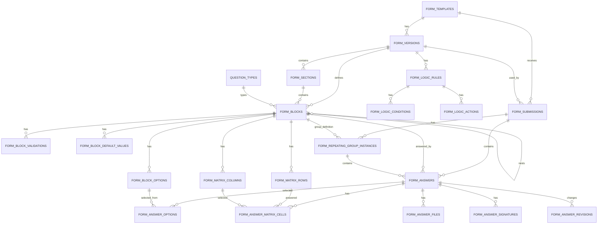

# Hospital Committee Platform — Forms and Answers Data Model Handoff

## Purpose

This document describes the proposed **Supabase/Postgres data model for the form engine and answer storage layer** of the hospital committee platform.

It covers:

- Form templates
- Form versions
- Form sections
- Question/block definitions
- Question options
- Validation rules
- Default values
- Conditional logic
- Calculated fields
- Translations
- Reusable block/question library
- Matrix/grid definitions
- Form submissions
- Answers
- Multiple-choice selections
- Repeating group answers
- File answers
- Signature answers
- Matrix answers
- Risk matrix answers
- Reference answers
- Answer revisions
- Draft snapshots

It intentionally does **not** cover:

- User profile model
- Organization/hospital membership model
- Committee membership model
- Role-based permissions/RLS policies
- RCA cases
- Action-item domain tables
- Meetings
- Analytics fact tables
- Audit log implementation

Those systems should integrate with this model, but they are separate bounded contexts.

---

# 1. Architectural Overview

The form engine is divided into two major layers:

```text
Form Definition Layer
    Defines what a form is.
    Includes templates, versions, sections, blocks/questions, options, validations, defaults, logic, and translations.

Answer Storage Layer
    Stores what users submitted.
    Includes submissions, answers, selected options, repeated group instances, files, signatures, matrix cells, and revisions.
```

The central architectural principle is:

> **A form submission must always point to the exact immutable form version used at the time of completion.**

This is essential because hospital committee forms will evolve over time. A medication error review form in 2026 may not have the same questions, options, labels, scoring, or conditional logic as the same form in 2027.

Therefore, the model separates:

```text
forms.form_templates
    Stable identity of a form.

forms.form_versions
    Immutable versioned definition of that form.

form_responses.form_submissions
    A user-created draft or submitted response tied to one specific form version.
```

---

# 2. Recommended Schemas

Use dedicated schemas:

```sql
create schema if not exists forms;
create schema if not exists form_responses;
```

## Reasoning

Using separate schemas makes the architecture cleaner:

- `forms` contains the definition engine.
- `form_responses` contains user-entered data.
- Other schemas can later exist for `committees`, `cases`, `actions`, `analytics`, or `audit`.

This avoids polluting the public schema with a large number of domain-specific tables and makes database ownership, migrations, and documentation easier.

---

# 3. Form Definition Layer

## 3.1 `forms.form_templates`

### Purpose

Represents the stable identity of a form.

Examples:

- Medication Error Review
- Surgical M&M Review
- ICU Adverse Event Screening
- Infection Control Audit
- RCA Intake Form
- Corrective Action Effectiveness Review

A template is not the editable form itself. The editable/published structure lives in `form_versions`.

### Suggested Table

```sql
create table forms.form_templates (
  id uuid primary key default gen_random_uuid(),

  organization_id uuid,
  hospital_id uuid,
  committee_id uuid,

  key text not null,
  name text not null,
  description text,

  category text,
  icon text,

  is_system_template boolean not null default false,
  is_active boolean not null default true,

  created_by uuid,
  created_at timestamptz not null default now(),
  updated_at timestamptz not null default now(),

  unique (organization_id, key)
);
```

### Important Columns

| Column | Meaning |
|---|---|
| `id` | Stable internal identifier |
| `organization_id` | Optional ownership/scope |
| `hospital_id` | Optional hospital-level ownership |
| `committee_id` | Optional committee-level ownership |
| `key` | Stable slug, e.g. `medication_error_review` |
| `name` | Human-facing form name |
| `category` | Audit, RCA, M&M, infection control, medication safety, etc. |
| `is_system_template` | Indicates built-in platform templates |
| `is_active` | Controls whether users can create new versions/submissions |

### Design Reasoning

A form template gives the product a stable conceptual object. For example, the Medication Error Review form may have many published versions, but it remains one logical form.

This is important for:

- Listing forms in the UI
- Grouping analytics across versions
- Cloning templates
- Deprecating a form without deleting its versions
- Supporting hospital-specific custom forms
- Supporting system-provided starter templates

### Relationships

```text
forms.form_templates 1 ─── many forms.form_versions
```

---

## 3.2 `forms.form_versions`

### Purpose

Represents a specific version of a form definition.

Each version contains its own sections, blocks, options, validation rules, logic rules, calculations, and translations.

Published versions should be treated as immutable.

### Suggested Type

```sql
create type forms.form_version_status as enum (
  'draft',
  'in_review',
  'published',
  'deprecated',
  'archived'
);
```

### Suggested Table

```sql
create table forms.form_versions (
  id uuid primary key default gen_random_uuid(),

  form_template_id uuid not null
    references forms.form_templates(id)
    on delete cascade,

  version_major int not null default 1,
  version_minor int not null default 0,
  version_patch int not null default 0,

  status forms.form_version_status not null default 'draft',

  title text not null,
  subtitle text,
  description text,

  layout_mode forms.form_layout_mode not null default 'classic',

  default_locale text not null default 'pt-BR',
  supported_locales text[] not null default array['pt-BR'],

  theme_config jsonb not null default '{}'::jsonb,
  behavior_config jsonb not null default '{}'::jsonb,
  metadata jsonb not null default '{}'::jsonb,

  effective_from timestamptz,
  effective_until timestamptz,

  created_by uuid,
  created_at timestamptz not null default now(),
  published_by uuid,
  published_at timestamptz,

  unique (
    form_template_id,
    version_major,
    version_minor,
    version_patch
  )
);
```

### Related Types

```sql
create type forms.form_layout_mode as enum (
  'classic',
  'wizard',
  'conversational'
);
```

### Important Columns

| Column | Meaning |
|---|---|
| `form_template_id` | Parent template |
| `version_major/minor/patch` | Semantic versioning |
| `status` | Draft, review, published, deprecated, archived |
| `layout_mode` | Classic, wizard, or conversational rendering |
| `theme_config` | JSONB for theme/color/branding configuration |
| `behavior_config` | JSONB for autosave, review screen, progress bar, etc. |
| `effective_from` | Scheduled activation date |
| `effective_until` | Scheduled deprecation/retirement date |

### Example `theme_config`

```json
{
  "accentColor": "#2563EB",
  "logoPosition": "top-left",
  "density": "comfortable",
  "showSectionNumbers": true,
  "showProgressBar": true
}
```

### Example `behavior_config`

```json
{
  "autosave": true,
  "allowDrafts": true,
  "showReviewBeforeSubmit": true,
  "submitButtonLabel": "Submit review"
}
```

### Design Reasoning

Versioning is non-negotiable for a hospital-grade form system.

Without immutable form versions, historical submissions become ambiguous. If a question label, option, score, or condition changes after a user submits a form, the database must still know what the user originally saw.

This table allows:

- Safe form evolution
- Scheduled publication
- Historical reproducibility
- Version-specific exports
- Version-specific analytics
- Governance workflows before publication

### Relationships

```text
forms.form_templates 1 ─── many forms.form_versions
forms.form_versions 1 ─── many forms.form_sections
forms.form_versions 1 ─── many forms.form_blocks
forms.form_versions 1 ─── many forms.form_logic_rules
forms.form_versions 1 ─── many forms.form_translations
form_responses.form_submissions many ─── 1 forms.form_versions
```

---

## 3.3 `forms.form_sections`

### Purpose

Represents an ordered section within a form version.

Examples:

- Event Identification
- Patient Context
- Medication Details
- Contributing Factors
- Corrective Actions
- Committee Decision

### Suggested Table

```sql
create table forms.form_sections (
  id uuid primary key default gen_random_uuid(),

  form_version_id uuid not null
    references forms.form_versions(id)
    on delete cascade,

  key text not null,
  title text not null,
  subtitle text,
  description text,

  position int not null,

  icon text,
  color text,

  is_required boolean not null default false,
  is_collapsible boolean not null default false,
  starts_collapsed boolean not null default false,

  visibility_expression jsonb,
  layout_config jsonb not null default '{}'::jsonb,
  metadata jsonb not null default '{}'::jsonb,

  created_at timestamptz not null default now(),
  updated_at timestamptz not null default now(),

  unique (form_version_id, key),
  unique (form_version_id, position)
);
```

### Important Columns

| Column | Meaning |
|---|---|
| `form_version_id` | Parent form version |
| `key` | Stable section key within version |
| `position` | Ordering in the rendered form |
| `is_required` | Whether the section must be completed |
| `is_collapsible` | UI behavior |
| `visibility_expression` | Optional section-level show/hide condition |
| `layout_config` | Section-level layout behavior |

### Example `layout_config`

```json
{
  "columns": 2,
  "showCard": true,
  "pageBreakBefore": false,
  "printMode": "expanded"
}
```

### Design Reasoning

Sections are first-class because hospital forms can be long and multidisciplinary. Different sections may be completed by different roles, rendered differently, validated separately, or conditionally shown.

A section-level entity allows:

- Wizard navigation
- Section-level progress
- Section-level validation
- Section-level confidentiality later
- Section-level comments/review later
- Conditional sections
- Cleaner PDF exports

### Relationships

```text
forms.form_versions 1 ─── many forms.form_sections
forms.form_sections 1 ─── many forms.form_blocks
form_responses.form_submission_section_states many ─── 1 forms.form_sections
```

---

## 3.4 `forms.question_types`

### Purpose

Defines the catalog of supported question types.

Examples:

- short_text
- long_text
- number
- date
- single_select
- multi_select
- file_upload
- signature
- matrix
- risk_matrix
- calculated

### Suggested Table

```sql
create table forms.question_types (
  key text primary key,

  label text not null,
  description text,

  value_shape text not null,
  supports_options boolean not null default false,
  supports_multiple_values boolean not null default false,
  supports_placeholder boolean not null default false,
  supports_default_value boolean not null default true,
  supports_validation boolean not null default true,
  supports_calculation boolean not null default false,

  default_config jsonb not null default '{}'::jsonb,
  is_active boolean not null default true
);
```

### Important Columns

| Column | Meaning |
|---|---|
| `key` | Stable internal question type key |
| `value_shape` | Expected answer shape, e.g. string, number, option_id_array |
| `supports_options` | Whether it uses `form_block_options` |
| `supports_multiple_values` | Whether multiple values may be selected/uploaded |
| `default_config` | Default UI/config for this question type |

### Design Reasoning

Question types should be table-driven rather than implemented as a Postgres enum.

Reason: question types will evolve frequently. New block/question types may be introduced as the product matures:

- Clinical timeline
- Medication selector
- Protocol selector
- Committee voting field
- Risk matrix
- Action-strength selector
- AI-assisted narrative extraction

Using a table allows new types to be introduced without schema migrations.

### Relationships

```text
forms.question_types 1 ─── many forms.form_blocks
forms.question_types 1 ─── many forms.block_library_items
```

---

## 3.5 `forms.form_blocks`

### Purpose

This is the core table of the form engine.

A block is any ordered item inside a section or inside a parent block.

A block can be:

- A question
- A display/instruction block
- A divider
- A media block
- A calculation
- A visual group
- A repeating group

### Suggested Types

```sql
create type forms.form_block_kind as enum (
  'question',
  'display',
  'divider',
  'media',
  'calculation',
  'group',
  'repeating_group'
);

create type forms.block_width as enum (
  'full',
  'half',
  'third',
  'two_thirds',
  'quarter'
);
```

### Suggested Table

```sql
create table forms.form_blocks (
  id uuid primary key default gen_random_uuid(),

  form_version_id uuid not null
    references forms.form_versions(id)
    on delete cascade,

  section_id uuid
    references forms.form_sections(id)
    on delete cascade,

  parent_block_id uuid
    references forms.form_blocks(id)
    on delete cascade,

  kind forms.form_block_kind not null,

  question_type_key text
    references forms.question_types(key),

  key text not null,
  variable_key text,

  title text,
  label text,
  description text,
  help_text text,
  placeholder text,

  position int not null,

  width forms.block_width not null default 'full',

  is_required boolean not null default false,
  is_readonly boolean not null default false,
  is_hidden boolean not null default false,

  default_value jsonb,
  config jsonb not null default '{}'::jsonb,
  display_config jsonb not null default '{}'::jsonb,
  data_config jsonb not null default '{}'::jsonb,
  metadata jsonb not null default '{}'::jsonb,

  created_at timestamptz not null default now(),
  updated_at timestamptz not null default now(),

  check (
    section_id is not null
    or parent_block_id is not null
  ),

  check (
    not (
      section_id is not null
      and parent_block_id is not null
    )
  ),

  check (
    (
      kind = 'question'
      and question_type_key is not null
      and variable_key is not null
    )
    or
    (
      kind <> 'question'
    )
  ),

  unique (form_version_id, key),
  unique (form_version_id, variable_key)
);
```

### Important Columns

| Column | Meaning |
|---|---|
| `form_version_id` | Parent form version |
| `section_id` | Parent section for top-level blocks |
| `parent_block_id` | Parent block for nested/grouped/repeating children |
| `kind` | Block kind: question, display, group, repeating group, etc. |
| `question_type_key` | Required for question blocks |
| `key` | Stable internal block key |
| `variable_key` | Stable analytics/export key |
| `position` | Order inside parent section/block |
| `config` | Type-specific behavior |
| `display_config` | UI rendering behavior |
| `data_config` | Data source or reference configuration |

### Design Reasoning

This table intentionally uses a **single block abstraction** instead of creating a different table for each question type.

This is the right tradeoff because:

- Every block needs ordering.
- Every block needs labels/help text.
- Every block can participate in conditional logic.
- Every block can be versioned.
- Repeating groups need nested child blocks.
- Display blocks and questions should share the same layout engine.

The model avoids both extremes:

```text
Bad extreme #1:
    Store the entire form as one JSON document.

Bad extreme #2:
    Create separate SQL tables for every question type.
```

The recommended design is:

```text
One relational form_blocks table
+ type-specific JSONB config
+ relational option/validation/logic tables where queryability matters.
```

### Repeating Group Behavior

A repeating group is a block with:

```text
kind = 'repeating_group'
```

Its child questions are also rows in `form_blocks`, with:

```text
parent_block_id = repeating_group_block_id
```

Example:

```text
Section: Medications Involved
    Block: medications_involved
        kind = repeating_group
        children:
            medication_name
            dose_prescribed
            dose_administered
            error_type
```

### Relationships

```text
forms.form_versions 1 ─── many forms.form_blocks
forms.form_sections 1 ─── many forms.form_blocks
forms.form_blocks 1 ─── many child forms.form_blocks
forms.form_blocks 1 ─── many forms.form_block_options
forms.form_blocks 1 ─── many forms.form_block_validations
forms.form_blocks 1 ─── many forms.form_block_default_values
forms.form_blocks 1 ─── many forms.form_calculations as target block
forms.form_blocks 1 ─── many form_responses.form_answers
forms.form_blocks 1 ─── many form_responses.form_repeating_group_instances as group block
```

---

## 3.6 `forms.form_block_options`

### Purpose

Stores selectable options for option-based blocks.

Used by:

- single_select
- multi_select
- dropdown
- yes_no_na
- likert
- committee decision fields
- action strength fields
- harm severity fields

### Suggested Table

```sql
create table forms.form_block_options (
  id uuid primary key default gen_random_uuid(),

  form_block_id uuid not null
    references forms.form_blocks(id)
    on delete cascade,

  key text not null,
  value text not null,
  label text not null,
  description text,

  position int not null,

  color text,
  icon text,

  score numeric,
  risk_weight numeric,

  is_default boolean not null default false,
  is_exclusive boolean not null default false,
  is_active boolean not null default true,

  metadata jsonb not null default '{}'::jsonb,

  unique (form_block_id, key),
  unique (form_block_id, position)
);
```

### Important Columns

| Column | Meaning |
|---|---|
| `form_block_id` | Parent question block |
| `key` | Stable option key |
| `value` | Stored option value/code |
| `label` | Human-facing label |
| `position` | Display order |
| `color` | Color-coded option support |
| `score` | Numeric score for analytics/calculations |
| `risk_weight` | Optional risk-specific weight |
| `is_exclusive` | Useful for options like N/A or None of the above |

### Design Reasoning

Options should not be stored only inside `form_blocks.config`.

They deserve a table because they need:

- Stable identifiers
- Ordering
- Color coding
- Scores
- Translations
- Analytics
- Snapshots at answer time
- Option-level metadata

This is especially important in hospital forms, where options such as harm severity, preventability, action strength, and final disposition have governance and analytics meaning.

### Relationships

```text
forms.form_blocks 1 ─── many forms.form_block_options
forms.form_block_options 1 ─── many form_responses.form_answer_options
```

---

## 3.7 `forms.form_block_validations`

### Purpose

Defines validation rules attached to a form block.

Examples:

- Required
- Minimum length
- Maximum length
- Number range
- Date cannot be in the future
- File type restriction
- Minimum number of repeated items
- Custom expression

### Suggested Table

```sql
create table forms.form_block_validations (
  id uuid primary key default gen_random_uuid(),

  form_block_id uuid not null
    references forms.form_blocks(id)
    on delete cascade,

  key text not null,
  validation_type text not null,

  severity text not null default 'error'
    check (severity in ('info', 'warning', 'error')),

  message text not null,

  config jsonb not null default '{}'::jsonb,

  is_active boolean not null default true,

  unique (form_block_id, key)
);
```

### Example Validation Types

```text
required
required_if
min_length
max_length
regex
number_min
number_max
number_range
date_min
date_max
datetime_order
file_type
file_size
min_items
max_items
unique_within_group
custom_expression
```

### Example Config

```json
{
  "min": 0,
  "max": 100
}
```

### Design Reasoning

Validation must not live only in frontend code. The database should store the intended validation rules so that:

- The builder can display them.
- The renderer can enforce them.
- Server-side validation can reproduce them.
- Published form versions remain self-contained.
- Validation messages can be translated.

### Relationships

```text
forms.form_blocks 1 ─── many forms.form_block_validations
forms.form_block_validations 1 ─── many forms.form_translations
```

---

## 3.8 `forms.form_block_default_values`

### Purpose

Stores static or dynamic default value rules for form blocks.

Examples:

- Current date
- Current user
- Current committee
- User's default department
- Previous answer
- Context value from a case/event
- Static default value

### Suggested Table

```sql
create table forms.form_block_default_values (
  id uuid primary key default gen_random_uuid(),

  form_block_id uuid not null
    references forms.form_blocks(id)
    on delete cascade,

  default_type text not null
    check (
      default_type in (
        'static',
        'current_date',
        'current_datetime',
        'current_user',
        'current_user_department',
        'current_committee',
        'previous_answer',
        'context_value',
        'expression'
      )
    ),

  value jsonb,
  expression jsonb,

  priority int not null default 100,

  is_active boolean not null default true
);
```

### Design Reasoning

A simple `default_value` column on `form_blocks` is enough for static defaults, but not for dynamic hospital workflows.

Dynamic defaults are important when a form is opened from context:

```text
Current committee
Current hospital
Current user
Current case
Current patient context
Current department
```

This table allows defaults to be computed in a controlled and auditable way.

### Relationships

```text
forms.form_blocks 1 ─── many forms.form_block_default_values
```

---

## 3.9 `forms.form_logic_rules`

### Purpose

Defines a conditional logic rule at the form-version level.

A logic rule is composed of:

```text
IF conditions
THEN actions
```

Examples:

```text
If harm severity = severe:
    show immediate containment section
    require immediate containment description

If event type = medication error:
    show medications involved section

If action strength = strong:
    require effectiveness metric
```

### Suggested Table

```sql
create table forms.form_logic_rules (
  id uuid primary key default gen_random_uuid(),

  form_version_id uuid not null
    references forms.form_versions(id)
    on delete cascade,

  key text not null,
  name text not null,
  description text,

  priority int not null default 100,

  condition_operator text not null default 'and'
    check (condition_operator in ('and', 'or')),

  is_active boolean not null default true,

  created_at timestamptz not null default now(),

  unique (form_version_id, key)
);
```

### Design Reasoning

Conditional logic must be versioned with the form. A published form version must preserve the exact logic that existed at publication time.

Logic belongs to the form version rather than directly to a question because a single rule can affect multiple blocks or sections.

### Relationships

```text
forms.form_versions 1 ─── many forms.form_logic_rules
forms.form_logic_rules 1 ─── many forms.form_logic_conditions
forms.form_logic_rules 1 ─── many forms.form_logic_actions
```

---

## 3.10 `forms.form_logic_conditions`

### Purpose

Stores the IF side of a logic rule.

### Suggested Table

```sql
create table forms.form_logic_conditions (
  id uuid primary key default gen_random_uuid(),

  logic_rule_id uuid not null
    references forms.form_logic_rules(id)
    on delete cascade,

  source_block_id uuid not null
    references forms.form_blocks(id)
    on delete cascade,

  operator text not null,

  comparison_value jsonb,

  position int not null default 1
);
```

### Supported Operators

```text
equals
not_equals
contains
not_contains
in
not_in
greater_than
greater_than_or_equal
less_than
less_than_or_equal
is_empty
is_not_empty
is_true
is_false
date_before
date_after
```

### Design Reasoning

Conditions should be structured data, not arbitrary JavaScript strings. This makes them:

- Safer
- Testable
- Builder-friendly
- Serializable
- Validatable
- Portable across web/mobile/server

### Relationships

```text
forms.form_logic_rules 1 ─── many forms.form_logic_conditions
forms.form_blocks 1 ─── many forms.form_logic_conditions as source block
```

---

## 3.11 `forms.form_logic_actions`

### Purpose

Stores the THEN side of a logic rule.

Actions can target either a block or a section.

### Suggested Table

```sql
create table forms.form_logic_actions (
  id uuid primary key default gen_random_uuid(),

  logic_rule_id uuid not null
    references forms.form_logic_rules(id)
    on delete cascade,

  target_block_id uuid
    references forms.form_blocks(id)
    on delete cascade,

  target_section_id uuid
    references forms.form_sections(id)
    on delete cascade,

  action_type text not null,

  config jsonb not null default '{}'::jsonb,

  position int not null default 1,

  check (
    target_block_id is not null
    or target_section_id is not null
  )
);
```

### Supported Actions

```text
show
hide
require
make_optional
set_value
clear_value
show_warning
block_submission
jump_to_section
calculate
```

### Design Reasoning

Actions are separated from conditions so a single condition can trigger several effects.

Example:

```text
If harm_severity = severe_harm:
    show immediate containment section
    require containment description
    show high-risk warning
```

That is one rule, one condition, and multiple actions.

### Relationships

```text
forms.form_logic_rules 1 ─── many forms.form_logic_actions
forms.form_blocks 1 ─── many forms.form_logic_actions as target block
forms.form_sections 1 ─── many forms.form_logic_actions as target section
```

---

## 3.12 `forms.form_calculations`

### Purpose

Stores calculated field definitions.

Examples:

- Time to antibiotic administration
- Risk score
- Compliance percentage
- Total number of corrective actions
- Audit score

### Suggested Table

```sql
create table forms.form_calculations (
  id uuid primary key default gen_random_uuid(),

  target_block_id uuid not null
    references forms.form_blocks(id)
    on delete cascade,

  calculation_type text not null,

  expression jsonb not null,

  dependencies text[] not null default '{}',

  rounding_config jsonb not null default '{}'::jsonb,

  created_at timestamptz not null default now()
);
```

### Example Expression

```json
{
  "startVariable": "sepsis_recognition_time",
  "endVariable": "antibiotic_administration_time"
}
```

### Design Reasoning

Calculated values should be form-defined, not hardcoded into frontend components.

This allows:

- Consistent rendering
- Server-side validation
- Historical reproducibility
- Version-specific calculations
- Reuse across forms
- Export consistency

### Relationships

```text
forms.form_blocks 1 ─── many forms.form_calculations as target block
```

---

## 3.13 `forms.form_translations`

### Purpose

Stores translations for labels, descriptions, help texts, option labels, validation messages, and other human-facing text.

### Suggested Table

```sql
create table forms.form_translations (
  id uuid primary key default gen_random_uuid(),

  form_version_id uuid not null
    references forms.form_versions(id)
    on delete cascade,

  locale text not null,

  entity_type text not null
    check (
      entity_type in (
        'form_version',
        'section',
        'block',
        'option',
        'validation',
        'logic_message'
      )
    ),

  entity_id uuid not null,

  field_name text not null,

  translated_value text not null,

  created_at timestamptz not null default now(),

  unique (
    form_version_id,
    locale,
    entity_type,
    entity_id,
    field_name
  )
);
```

### Design Reasoning

Do not create separate forms for Portuguese, English, and Spanish. That would duplicate structure and create maintenance problems.

Instead:

```text
One form structure
Multiple translation rows
```

This allows the same form version to render in multiple languages while preserving one source of truth for logic, validation, options, and analytics variable keys.

### Relationships

```text
forms.form_versions 1 ─── many forms.form_translations
forms.form_translations polymorphically references sections, blocks, options, validations, etc.
```

### Implementation Note

`entity_id` is polymorphic. PostgreSQL cannot enforce a standard foreign key across multiple possible tables. This is acceptable if application-level validation and form linting enforce integrity.

---

## 3.14 `forms.block_library_items`

### Purpose

Stores reusable approved blocks/questions/components.

Examples:

- Harm Severity Question
- Preventability Question
- Risk Matrix
- Corrective Action Repeating Group
- Clinical Timeline Repeating Group
- Committee Decision Field
- Action Strength Field

### Suggested Table

```sql
create table forms.block_library_items (
  id uuid primary key default gen_random_uuid(),

  key text not null unique,
  name text not null,
  description text,

  category text,

  kind forms.form_block_kind not null,
  question_type_key text
    references forms.question_types(key),

  variable_key_suggestion text,

  label text,
  help_text text,

  config jsonb not null default '{}'::jsonb,
  display_config jsonb not null default '{}'::jsonb,
  data_config jsonb not null default '{}'::jsonb,

  is_system_item boolean not null default false,
  is_active boolean not null default true,

  created_at timestamptz not null default now()
);
```

### Design Reasoning

A hospital committee platform needs standardization. If every committee invents a different harm severity question, aggregate analytics become useless.

The block library allows hospitals to provide approved reusable components while still allowing form designers to compose custom forms.

Important: when a library item is inserted into a form version, it should usually be **copied** into `form_blocks`, not referenced live forever. Published form versions must remain immutable even if the library item later changes.

### Relationships

```text
forms.question_types 1 ─── many forms.block_library_items
forms.block_library_items 1 ─── many forms.block_library_options
```

---

## 3.15 `forms.block_library_options`

### Purpose

Stores reusable options for reusable library items.

### Suggested Table

```sql
create table forms.block_library_options (
  id uuid primary key default gen_random_uuid(),

  library_item_id uuid not null
    references forms.block_library_items(id)
    on delete cascade,

  key text not null,
  value text not null,
  label text not null,
  description text,

  position int not null,

  color text,
  score numeric,

  metadata jsonb not null default '{}'::jsonb,

  unique (library_item_id, key),
  unique (library_item_id, position)
);
```

### Design Reasoning

Reusable select fields need reusable option definitions. For example, an approved harm severity question should carry its standard options, colors, and scores.

### Relationships

```text
forms.block_library_items 1 ─── many forms.block_library_options
```

---

## 3.16 `forms.form_lint_results`

### Purpose

Stores validation/linting results for a form version before publication.

Examples:

- Duplicate variable key
- Broken logic reference
- Unreachable section
- Required field hidden by default
- Option without label
- Question without variable key
- Calculation missing dependency
- Repeating group without child blocks

### Suggested Table

```sql
create table forms.form_lint_results (
  id uuid primary key default gen_random_uuid(),

  form_version_id uuid not null
    references forms.form_versions(id)
    on delete cascade,

  severity text not null
    check (severity in ('info', 'warning', 'error')),

  code text not null,
  message text not null,

  entity_type text,
  entity_id uuid,

  details jsonb not null default '{}'::jsonb,

  created_at timestamptz not null default now()
);
```

### Design Reasoning

Complex form builders need guardrails. Without linting, hospital administrators can accidentally publish broken, unsafe, or analytically useless forms.

Form linting is a product-quality differentiator because it catches design errors before the form is used in clinical governance workflows.

### Relationships

```text
forms.form_versions 1 ─── many forms.form_lint_results
```

---

## 3.17 `forms.form_matrix_rows`

### Purpose

Defines rows for matrix/grid questions.

Examples:

```text
Patient correctly identified
Consent documented
Antibiotic given within protocol window
Checklist completed
```

### Suggested Table

```sql
create table forms.form_matrix_rows (
  id uuid primary key default gen_random_uuid(),

  form_block_id uuid not null
    references forms.form_blocks(id)
    on delete cascade,

  key text not null,
  label text not null,
  description text,
  position int not null,

  metadata jsonb not null default '{}'::jsonb,

  unique (form_block_id, key),
  unique (form_block_id, position)
);
```

### Design Reasoning

Matrix rows should be relational if they have clinical, audit, or analytics meaning.

For example, an infection control audit matrix should support:

- Per-row compliance statistics
- Translations
- Stable row keys
- Conditional comments
- Scoring

That is awkward if matrix rows are stored only in JSON.

### Relationships

```text
forms.form_blocks 1 ─── many forms.form_matrix_rows
forms.form_matrix_rows 1 ─── many form_responses.form_answer_matrix_cells
```

---

## 3.18 `forms.form_matrix_columns`

### Purpose

Defines columns/options for matrix/grid questions.

Examples:

- Yes
- No
- N/A
- Compliant
- Non-compliant
- Partially compliant

### Suggested Table

```sql
create table forms.form_matrix_columns (
  id uuid primary key default gen_random_uuid(),

  form_block_id uuid not null
    references forms.form_blocks(id)
    on delete cascade,

  key text not null,
  label text not null,
  description text,
  position int not null,

  color text,
  score numeric,

  metadata jsonb not null default '{}'::jsonb,

  unique (form_block_id, key),
  unique (form_block_id, position)
);
```

### Design Reasoning

Matrix columns often function like option choices with scores and colors. Storing them relationally allows cleaner analytics and validation.

### Relationships

```text
forms.form_blocks 1 ─── many forms.form_matrix_columns
forms.form_matrix_columns 1 ─── many form_responses.form_answer_matrix_cells
```

---

# 4. Answer Storage Layer

## 4.1 `form_responses.form_submissions`

### Purpose

Represents one draft or submitted response to a specific form version.

### Suggested Type

```sql
create type form_responses.submission_status as enum (
  'draft',
  'submitted',
  'under_review',
  'returned_for_correction',
  'approved',
  'closed',
  'archived'
);
```

### Suggested Table

```sql
create table form_responses.form_submissions (
  id uuid primary key default gen_random_uuid(),

  form_template_id uuid not null
    references forms.form_templates(id),

  form_version_id uuid not null
    references forms.form_versions(id),

  status form_responses.submission_status not null default 'draft',

  organization_id uuid,
  hospital_id uuid,
  committee_id uuid,
  department_id uuid,

  related_event_id uuid,
  related_case_id uuid,
  patient_context_id uuid,

  created_by uuid,
  submitted_by uuid,

  created_at timestamptz not null default now(),
  updated_at timestamptz not null default now(),
  submitted_at timestamptz,

  context jsonb not null default '{}'::jsonb,

  client_generated_id text,

  unique (client_generated_id)
);
```

### Important Columns

| Column | Meaning |
|---|---|
| `form_template_id` | Logical form identity |
| `form_version_id` | Exact version used |
| `status` | Draft/submitted/review state |
| `organization_id/hospital_id/committee_id` | Optional context/scope |
| `related_event_id` | Optional link to an event domain object |
| `related_case_id` | Optional link to a case/RCA domain object |
| `patient_context_id` | Optional link to patient-context record |
| `context` | Non-answer contextual payload |
| `client_generated_id` | Useful for offline/mobile creation |

### Design Reasoning

Submissions should not store all answers directly. They are the container for answer rows.

This makes it possible to:

- Save drafts
- Submit later
- Run validation across answers
- Apply RLS at submission and answer level
- Link a submission to committee/case/event contexts
- Preserve the exact form version

### Relationships

```text
forms.form_templates 1 ─── many form_responses.form_submissions
forms.form_versions 1 ─── many form_responses.form_submissions
form_responses.form_submissions 1 ─── many form_responses.form_answers
form_responses.form_submissions 1 ─── many form_responses.form_repeating_group_instances
form_responses.form_submissions 1 ─── many form_responses.form_submission_section_states
form_responses.form_submissions 1 ─── many form_responses.form_submission_draft_snapshots
```

---

## 4.2 `form_responses.form_answers`

### Purpose

Stores one answer row per answered question/block.

This is the central answer table.

### Suggested Type

```sql
create type form_responses.answer_value_type as enum (
  'empty',
  'string',
  'text',
  'rich_text',
  'number',
  'boolean',
  'date',
  'time',
  'datetime',
  'single_option',
  'multiple_options',
  'json',
  'file',
  'signature',
  'matrix',
  'calculated',
  'reference'
);
```

### Suggested Table

```sql
create table form_responses.form_answers (
  id uuid primary key default gen_random_uuid(),

  submission_id uuid not null
    references form_responses.form_submissions(id)
    on delete cascade,

  form_block_id uuid not null
    references forms.form_blocks(id),

  repeating_group_instance_id uuid,

  variable_key_snapshot text not null,
  question_type_key_snapshot text,
  block_label_snapshot text,
  block_position_snapshot int,

  value_type form_responses.answer_value_type not null,

  value_string text,
  value_text text,
  value_number numeric,
  value_boolean boolean,
  value_date date,
  value_time time,
  value_datetime timestamptz,

  value_jsonb jsonb,

  display_value text,

  score numeric,
  unit text,

  confidentiality_level text not null default 'standard',

  is_empty boolean not null default false,
  is_valid boolean,
  validation_errors jsonb not null default '[]'::jsonb,

  answered_by uuid,
  answered_at timestamptz,
  created_at timestamptz not null default now(),
  updated_at timestamptz not null default now(),

  unique (
    submission_id,
    form_block_id,
    repeating_group_instance_id
  )
);
```

### Important Columns

| Column | Meaning |
|---|---|
| `submission_id` | Parent submission |
| `form_block_id` | Question/block answered |
| `repeating_group_instance_id` | Non-null if answer belongs to a repeated item |
| `variable_key_snapshot` | Stable export/analytics key snapshot |
| `question_type_key_snapshot` | Question type at answer time |
| `block_label_snapshot` | Human label at answer time |
| `value_type` | Type of stored answer |
| `value_*` columns | Typed storage for common values |
| `value_jsonb` | Complex or flexible value payload |
| `display_value` | Human-readable rendered value |
| `score` | Optional numeric score |
| `confidentiality_level` | Future RLS/field confidentiality support |

### Design Reasoning

This table uses a **hybrid typed-column + JSONB approach**.

The mistake to avoid is storing all answers as a single JSON blob on `form_submissions`.

The recommended approach is:

```text
One answer row per answered question.
```

Benefits:

- Better RLS compatibility
- Field-level confidentiality
- Easier filtering
- Easier analytics
- Better exports
- Easier validation
- Easier revision tracking
- Easier support for repeating groups

The reason for multiple typed value columns is that common values should be queryable without JSON extraction:

```text
value_string
value_text
value_number
value_boolean
value_date
value_time
value_datetime
```

`value_jsonb` remains available for complex values such as rich text documents, calculated metadata, or specialized payloads.

### Relationships

```text
form_responses.form_submissions 1 ─── many form_responses.form_answers
forms.form_blocks 1 ─── many form_responses.form_answers
form_responses.form_repeating_group_instances 1 ─── many form_responses.form_answers
form_responses.form_answers 1 ─── many form_responses.form_answer_options
form_responses.form_answers 1 ─── many form_responses.form_answer_files
form_responses.form_answers 1 ─── many form_responses.form_answer_signatures
form_responses.form_answers 1 ─── many form_responses.form_answer_matrix_cells
form_responses.form_answers 1 ─── many form_responses.form_answer_revisions
```

---

## 4.3 `form_responses.form_answer_options`

### Purpose

Stores selected options for single-choice and multiple-choice answers.

### Suggested Table

```sql
create table form_responses.form_answer_options (
  id uuid primary key default gen_random_uuid(),

  answer_id uuid not null
    references form_responses.form_answers(id)
    on delete cascade,

  form_block_option_id uuid
    references forms.form_block_options(id),

  option_key_snapshot text not null,
  option_value_snapshot text not null,
  option_label_snapshot text not null,

  option_position_snapshot int,
  color_snapshot text,
  score_snapshot numeric,

  created_at timestamptz not null default now(),

  unique (answer_id, option_key_snapshot)
);
```

### Design Reasoning

For multiple-choice questions, selected option IDs should **not** be stored primarily inside `form_answers.value_jsonb`.

Instead:

```text
form_answers
    One parent answer row.

form_answer_options
    One row per selected option.
```

Example:

```text
Question: Contributing factors
Selected:
    Communication failure
    Protocol ambiguity
    Training gap
```

Storage:

```text
form_answers:
    value_type = multiple_options
    display_value = Communication failure; Protocol ambiguity; Training gap

form_answer_options:
    row 1 = Communication failure
    row 2 = Protocol ambiguity
    row 3 = Training gap
```

This design makes option selections easier to:

- Count
- Filter
- Join
- Score
- Export
- Audit
- Translate historically
- Query for dashboards

Snapshots are intentionally duplicated because option labels, colors, or scores may change in future form versions.

### Relationships

```text
form_responses.form_answers 1 ─── many form_responses.form_answer_options
forms.form_block_options 1 ─── many form_responses.form_answer_options
```

---

## 4.4 `form_responses.form_repeating_group_instances`

### Purpose

Stores one repeated item instance for a repeating group.

Examples:

```text
Medication #1
Medication #2
Corrective Action #1
Corrective Action #2
Timeline Event #1
Timeline Event #2
```

### Suggested Table

```sql
create table form_responses.form_repeating_group_instances (
  id uuid primary key default gen_random_uuid(),

  submission_id uuid not null
    references form_responses.form_submissions(id)
    on delete cascade,

  group_block_id uuid not null
    references forms.form_blocks(id),

  parent_group_instance_id uuid
    references form_responses.form_repeating_group_instances(id)
    on delete cascade,

  position int not null,

  item_label_snapshot text,
  item_title text,

  is_deleted boolean not null default false,

  created_by uuid,
  created_at timestamptz not null default now(),
  updated_at timestamptz not null default now(),

  unique (
    submission_id,
    group_block_id,
    parent_group_instance_id,
    position
  )
);
```

### Design Reasoning

Repeating groups should not be stored as arrays inside one answer JSON blob.

A repeated item needs its own identity because it may have:

- Multiple child answers
- Ordering
- Validation state
- Comments later
- Attachments later
- Review status later
- Deletion/restore behavior
- Nested repeated groups later

This model allows a clean structure:

```text
form_repeating_group_instances:
    Medication #1

form_answers:
    Medication #1 → medication_name
    Medication #1 → dose_prescribed
    Medication #1 → dose_administered
    Medication #1 → error_type
```

### Relationships

```text
form_responses.form_submissions 1 ─── many form_responses.form_repeating_group_instances
forms.form_blocks 1 ─── many form_responses.form_repeating_group_instances as group block
form_responses.form_repeating_group_instances 1 ─── many form_responses.form_answers
form_responses.form_repeating_group_instances 1 ─── many child form_responses.form_repeating_group_instances
```

---

## 4.5 `form_responses.form_answer_files`

### Purpose

Stores metadata for files uploaded as answers.

The actual file should live in Supabase Storage or another object storage system.

### Suggested Table

```sql
create table form_responses.form_answer_files (
  id uuid primary key default gen_random_uuid(),

  answer_id uuid not null
    references form_responses.form_answers(id)
    on delete cascade,

  storage_bucket text not null,
  storage_path text not null,

  original_file_name text not null,
  content_type text,
  file_size_bytes bigint,

  description text,
  confidentiality_level text not null default 'standard',

  uploaded_by uuid,
  uploaded_at timestamptz not null default now(),

  metadata jsonb not null default '{}'::jsonb
);
```

### Design Reasoning

File answers should not be stored directly in `form_answers`.

The answer row should represent the file-upload question. The file table should store one row per uploaded file.

This supports:

- Multiple files per answer
- Storage bucket/path references
- File-level confidentiality
- File metadata
- Attachment descriptions
- Future virus scanning status
- Future redaction/review status

### Relationships

```text
form_responses.form_answers 1 ─── many form_responses.form_answer_files
```

---

## 4.6 `form_responses.form_answer_signatures`

### Purpose

Stores signature-specific answer data.

### Suggested Table

```sql
create table form_responses.form_answer_signatures (
  id uuid primary key default gen_random_uuid(),

  answer_id uuid not null
    references form_responses.form_answers(id)
    on delete cascade,

  signed_by uuid,
  signer_name_snapshot text,
  signer_role_snapshot text,

  signature_method text not null
    check (signature_method in ('typed', 'drawn', 'certificate', 'external')),

  typed_signature text,

  storage_bucket text,
  storage_path text,

  signed_at timestamptz not null default now(),

  signature_hash text,
  metadata jsonb not null default '{}'::jsonb
);
```

### Design Reasoning

Signatures have specialized metadata that should not be squeezed into generic answer columns.

They may need:

- Signer snapshot
- Signature method
- Timestamp
- Drawn signature file
- Typed signature
- Hash/integrity metadata
- Certificate/external provider metadata

### Relationships

```text
form_responses.form_answers 1 ─── many form_responses.form_answer_signatures
```

In most cases, one signature answer will have one signature row, but the model allows more than one if future workflows require co-signatures.

---

## 4.7 `form_responses.form_answer_matrix_cells`

### Purpose

Stores row-level/cell-level answers for matrix/grid questions.

### Suggested Table

```sql
create table form_responses.form_answer_matrix_cells (
  id uuid primary key default gen_random_uuid(),

  answer_id uuid not null
    references form_responses.form_answers(id)
    on delete cascade,

  matrix_row_id uuid
    references forms.form_matrix_rows(id),

  matrix_column_id uuid
    references forms.form_matrix_columns(id),

  row_key_snapshot text not null,
  row_label_snapshot text not null,

  column_key_snapshot text,
  column_label_snapshot text,

  value_type form_responses.answer_value_type not null default 'single_option',

  value_boolean boolean,
  value_number numeric,
  value_text text,
  value_jsonb jsonb,

  score numeric,
  comment text,

  created_at timestamptz not null default now(),

  unique (answer_id, row_key_snapshot)
);
```

### Design Reasoning

Matrix answers are too structured to store only in generic JSON.

A matrix question usually needs per-row analytics, for example:

```text
Which audit items most often fail?
Which checklist rows have the lowest compliance?
Which rows require comments when marked No?
```

This table allows each row/cell to be queried independently.

### Relationships

```text
form_responses.form_answers 1 ─── many form_responses.form_answer_matrix_cells
forms.form_matrix_rows 1 ─── many form_responses.form_answer_matrix_cells
forms.form_matrix_columns 1 ─── many form_responses.form_answer_matrix_cells
```

---

## 4.8 `form_responses.form_answer_risk_matrix`

### Purpose

Stores specialized risk matrix results.

### Suggested Table

```sql
create table form_responses.form_answer_risk_matrix (
  id uuid primary key default gen_random_uuid(),

  answer_id uuid not null
    references form_responses.form_answers(id)
    on delete cascade,

  severity_key text not null,
  severity_label_snapshot text not null,
  severity_score numeric not null,

  likelihood_key text not null,
  likelihood_label_snapshot text not null,
  likelihood_score numeric not null,

  risk_score numeric not null,
  risk_level_key text not null,
  risk_level_label_snapshot text not null,
  risk_color_snapshot text,

  created_at timestamptz not null default now()
);
```

### Design Reasoning

Risk matrices are central to hospital quality and patient safety workflows. They should be easy to query.

Although a risk matrix could be stored in `value_jsonb`, a dedicated table makes it easier to answer questions such as:

```text
How many events were classified as high risk?
Which committees generated the most extreme-risk reviews?
How did risk scores change over time?
```

### Relationships

```text
form_responses.form_answers 1 ─── one/many form_responses.form_answer_risk_matrix
```

In practice, this is usually one-to-one.

---

## 4.9 `form_responses.form_answer_references`

### Purpose

Stores answers that reference other entities.

Examples:

- User selector
- Department selector
- Committee selector
- Medication selector
- Protocol selector
- Patient context selector

### Suggested Table

```sql
create table form_responses.form_answer_references (
  id uuid primary key default gen_random_uuid(),

  answer_id uuid not null
    references form_responses.form_answers(id)
    on delete cascade,

  reference_type text not null,
  reference_id uuid not null,
  reference_label_snapshot text not null,

  metadata jsonb not null default '{}'::jsonb,

  created_at timestamptz not null default now()
);
```

### Design Reasoning

References should be first-class when the platform commonly asks users to select internal entities.

Examples:

```text
Responsible owner
Department involved
Committee reviewer
Hospital unit
Protocol involved
```

A relational reference table makes these answers easier to query and join later.

Snapshots are important because names can change:

```text
Old department name: Adult ICU
New department name: Critical Care Unit
```

Historical forms should remain understandable.

### Relationships

```text
form_responses.form_answers 1 ─── many form_responses.form_answer_references
```

---

## 4.10 `form_responses.form_answer_revisions`

### Purpose

Stores meaningful changes to answers over time.

### Suggested Table

```sql
create table form_responses.form_answer_revisions (
  id uuid primary key default gen_random_uuid(),

  answer_id uuid not null
    references form_responses.form_answers(id)
    on delete cascade,

  revision_number int not null,

  previous_value jsonb,
  new_value jsonb,

  previous_display_value text,
  new_display_value text,

  changed_by uuid,
  changed_at timestamptz not null default now(),

  change_reason text,
  source text not null default 'user'
    check (source in ('user', 'system', 'import', 'calculation', 'migration')),

  unique (answer_id, revision_number)
);
```

### Design Reasoning

Hospital committee submissions should not silently overwrite important answers.

For drafts, you do not need a revision for every keystroke. But after submission, review, correction, or approval, meaningful changes should be tracked.

This supports:

- Amendment history
- Reviewer correction history
- Accountability
- Medicolegal defensibility
- Quality governance

### Relationships

```text
form_responses.form_answers 1 ─── many form_responses.form_answer_revisions
```

---

## 4.11 `form_responses.form_submission_section_states`

### Purpose

Stores per-section completion/validation state for a submission.

### Suggested Table

```sql
create table form_responses.form_submission_section_states (
  id uuid primary key default gen_random_uuid(),

  submission_id uuid not null
    references form_responses.form_submissions(id)
    on delete cascade,

  form_section_id uuid not null
    references forms.form_sections(id),

  is_visible boolean not null default true,
  is_complete boolean not null default false,

  completion_percentage numeric,

  validation_errors jsonb not null default '[]'::jsonb,

  updated_at timestamptz not null default now(),

  unique (submission_id, form_section_id)
);
```

### Design Reasoning

This table is optional but useful for large forms.

It allows the UI to show:

```text
Event Identification: Complete
Medication Details: Missing 2 fields
Corrective Actions: Not started
```

This can be calculated dynamically, but materializing it improves performance and UX for long committee forms.

### Relationships

```text
form_responses.form_submissions 1 ─── many form_responses.form_submission_section_states
forms.form_sections 1 ─── many form_responses.form_submission_section_states
```

---

## 4.12 `form_responses.form_submission_draft_snapshots`

### Purpose

Stores autosave/offline draft snapshots when needed.

### Suggested Table

```sql
create table form_responses.form_submission_draft_snapshots (
  id uuid primary key default gen_random_uuid(),

  submission_id uuid not null
    references form_responses.form_submissions(id)
    on delete cascade,

  draft_payload jsonb not null,

  created_by uuid,
  created_at timestamptz not null default now()
);
```

### Design Reasoning

Most web drafts can save directly into normalized answer rows.

However, draft snapshots are useful for:

- Offline mode
- Mobile recovery
- Conflict resolution
- Emergency autosave
- Restoring a browser crash state

This table should not replace normalized answers as the source of truth for submitted data. It is a recovery and offline-support mechanism.

### Relationships

```text
form_responses.form_submissions 1 ─── many form_responses.form_submission_draft_snapshots
```

---

# 5. Multiple-Choice Answer Storage

For multiple-choice questions, the selected options should be stored in `form_answer_options`, not primarily in `form_answers.value_jsonb`.

## Example Question

```text
Question: What contributing factors were identified?
Options:
    Communication failure
    Staffing issue
    Equipment issue
    Protocol ambiguity
    Training gap
```

If the user selects:

```text
Communication failure
Protocol ambiguity
Training gap
```

The database stores:

```text
form_answers:
    id = ans_001
    submission_id = sub_123
    form_block_id = q_contributing_factors
    variable_key_snapshot = contributing_factors
    value_type = multiple_options
    display_value = Communication failure; Protocol ambiguity; Training gap
```

And:

```text
form_answer_options:
    answer_id = ans_001
    option = Communication failure

form_answer_options:
    answer_id = ans_001
    option = Protocol ambiguity

form_answer_options:
    answer_id = ans_001
    option = Training gap
```

## Why Not Store Selected Option IDs Only in JSONB?

Avoid making this the authoritative model:

```json
{
  "selectedOptionIds": [
    "option_uuid_1",
    "option_uuid_4",
    "option_uuid_5"
  ]
}
```

It is weaker for:

- SQL querying
- Analytics
- Joins
- Indexing
- RLS
- Option label snapshots
- Scoring
- Exports
- Data integrity

A lightweight copy may be stored in `value_jsonb` for frontend convenience, but the relational child table should be the source of truth.

---

# 6. Repeating Group Answer Storage

## Example

A repeating group called `medications_involved` has child fields:

```text
medication_name
dose_prescribed
dose_administered
error_type
```

If the user adds two medications, the database stores:

```text
form_repeating_group_instances:
    Medication #1

form_answers:
    Medication #1 → medication_name
    Medication #1 → dose_prescribed
    Medication #1 → dose_administered
    Medication #1 → error_type

form_repeating_group_instances:
    Medication #2

form_answers:
    Medication #2 → medication_name
    Medication #2 → dose_prescribed
    Medication #2 → dose_administered
    Medication #2 → error_type
```

## Reasoning

A repeating group item is not just a JSON object. It is a mini-record with identity, ordering, validation state, possible comments, and possible future workflow.

This is especially important for:

- Medications involved
- Corrective actions
- Contributing factors
- Timeline events
- Committee attendees
- Audit findings

---

# 7. Relationship Summary

## 7.1 Form Definition Relationships

```text
forms.form_templates
    1 ─── many forms.form_versions

forms.form_versions
    1 ─── many forms.form_sections
    1 ─── many forms.form_blocks
    1 ─── many forms.form_logic_rules
    1 ─── many forms.form_translations
    1 ─── many forms.form_lint_results

forms.form_sections
    1 ─── many forms.form_blocks

forms.form_blocks
    1 ─── many child forms.form_blocks
    1 ─── many forms.form_block_options
    1 ─── many forms.form_block_validations
    1 ─── many forms.form_block_default_values
    1 ─── many forms.form_matrix_rows
    1 ─── many forms.form_matrix_columns
    1 ─── many forms.form_calculations as target block

forms.question_types
    1 ─── many forms.form_blocks
    1 ─── many forms.block_library_items

forms.form_logic_rules
    1 ─── many forms.form_logic_conditions
    1 ─── many forms.form_logic_actions

forms.block_library_items
    1 ─── many forms.block_library_options
```

## 7.2 Answer Storage Relationships

```text
form_responses.form_submissions
    many ─── 1 forms.form_templates
    many ─── 1 forms.form_versions
    1 ─── many form_responses.form_answers
    1 ─── many form_responses.form_repeating_group_instances
    1 ─── many form_responses.form_submission_section_states
    1 ─── many form_responses.form_submission_draft_snapshots

form_responses.form_answers
    many ─── 1 forms.form_blocks
    many ─── 1 form_responses.form_submissions
    many ─── 0/1 form_responses.form_repeating_group_instances
    1 ─── many form_responses.form_answer_options
    1 ─── many form_responses.form_answer_files
    1 ─── many form_responses.form_answer_signatures
    1 ─── many form_responses.form_answer_matrix_cells
    1 ─── many form_responses.form_answer_risk_matrix
    1 ─── many form_responses.form_answer_references
    1 ─── many form_responses.form_answer_revisions

form_responses.form_answer_options
    many ─── 1 forms.form_block_options

form_responses.form_repeating_group_instances
    many ─── 1 forms.form_blocks as group block
    1 ─── many form_responses.form_answers
    1 ─── many child form_responses.form_repeating_group_instances

form_responses.form_answer_matrix_cells
    many ─── 1 forms.form_matrix_rows
    many ─── 1 forms.form_matrix_columns
```

---

# 8. Suggested Indexes

## 8.1 Form Definition Indexes

```sql
create index idx_form_versions_template
  on forms.form_versions(form_template_id);

create index idx_form_versions_status
  on forms.form_versions(status);

create index idx_sections_form_version_position
  on forms.form_sections(form_version_id, position);

create index idx_blocks_form_version
  on forms.form_blocks(form_version_id);

create index idx_blocks_section_position
  on forms.form_blocks(section_id, position)
  where section_id is not null;

create index idx_blocks_parent_position
  on forms.form_blocks(parent_block_id, position)
  where parent_block_id is not null;

create index idx_blocks_variable_key
  on forms.form_blocks(form_version_id, variable_key)
  where variable_key is not null;

create index idx_options_block_position
  on forms.form_block_options(form_block_id, position);

create index idx_validations_block
  on forms.form_block_validations(form_block_id);

create index idx_logic_rules_form_version
  on forms.form_logic_rules(form_version_id);

create index idx_logic_conditions_rule
  on forms.form_logic_conditions(logic_rule_id);

create index idx_logic_actions_rule
  on forms.form_logic_actions(logic_rule_id);

create index idx_translations_lookup
  on forms.form_translations(
    form_version_id,
    locale,
    entity_type,
    entity_id
  );
```

## 8.2 Answer Storage Indexes

```sql
create index idx_submissions_form_version
  on form_responses.form_submissions(form_version_id);

create index idx_submissions_status
  on form_responses.form_submissions(status);

create index idx_answers_submission
  on form_responses.form_answers(submission_id);

create index idx_answers_block
  on form_responses.form_answers(form_block_id);

create index idx_answers_variable_key
  on form_responses.form_answers(variable_key_snapshot);

create index idx_answers_submission_variable
  on form_responses.form_answers(submission_id, variable_key_snapshot);

create index idx_answers_repeating_instance
  on form_responses.form_answers(repeating_group_instance_id)
  where repeating_group_instance_id is not null;

create index idx_answer_options_answer
  on form_responses.form_answer_options(answer_id);

create index idx_answer_options_option_key
  on form_responses.form_answer_options(option_key_snapshot);

create index idx_repeating_group_instances_submission
  on form_responses.form_repeating_group_instances(submission_id);

create index idx_repeating_group_instances_group
  on form_responses.form_repeating_group_instances(group_block_id);

create index idx_matrix_cells_answer
  on form_responses.form_answer_matrix_cells(answer_id);

create index idx_answer_files_answer
  on form_responses.form_answer_files(answer_id);
```

---

# 9. Recommended Minimal V1 Table Set

If the team wants a practical first version, implement these first:

## Form Definition MVP

```text
forms.form_templates
forms.form_versions
forms.form_sections
forms.question_types
forms.form_blocks
forms.form_block_options
forms.form_block_validations
forms.form_block_default_values
forms.form_logic_rules
forms.form_logic_conditions
forms.form_logic_actions
forms.form_translations
```

## Answer Storage MVP

```text
form_responses.form_submissions
form_responses.form_answers
form_responses.form_answer_options
form_responses.form_repeating_group_instances
form_responses.form_answer_files
form_responses.form_answer_revisions
```

---

# 10. Recommended V1.5 / V2 Tables

Add these when advanced features mature:

```text
forms.form_calculations
forms.block_library_items
forms.block_library_options
forms.form_lint_results
forms.form_matrix_rows
forms.form_matrix_columns
form_responses.form_answer_signatures
form_responses.form_answer_matrix_cells
form_responses.form_answer_risk_matrix
form_responses.form_answer_references
form_responses.form_submission_section_states
form_responses.form_submission_draft_snapshots
```

---

# 11. Final Design Principles

## 11.1 Use form versions aggressively

Published form versions should be immutable. Create a new version for structural changes.

## 11.2 Use relational structure for queryable concepts

Use tables for:

- Sections
- Blocks
- Options
- Validations
- Logic
- Answers
- Selected options
- Repeating group instances
- Files
- Matrix cells

## 11.3 Use JSONB selectively

Use JSONB for:

- Type-specific configuration
- UI rendering configuration
- Complex values
- Metadata
- Draft recovery payloads

Do not use JSONB as the only storage mechanism for the whole form or the whole submission.

## 11.4 Store one answer per question

This is the most important answer-storage principle.

```text
One submission
    many answers
        selected options / files / matrix cells / revisions as child rows
```

## 11.5 Store snapshots

Always snapshot labels, variable keys, option labels, colors, and scores when answers are saved.

This protects historical meaning when form definitions evolve.

## 11.6 Design for RLS from the beginning

Because answers are rows, later field-level confidentiality becomes possible.

This is much safer than storing confidential and non-confidential answers together in one large JSON payload.

## 11.7 Keep workflow outside the form engine

Corrective actions, RCA cases, approvals, and meetings may be created from form answers, but they should not all be embedded directly inside the form engine.

The form engine captures structured data. Domain modules can later interpret and promote selected answers into first-class domain records.

---

# 12. Compact ER Diagram



---

# 13. Bottom-Line Recommendation

The recommended model is:

```text
Form definitions:
    relational, versioned, composable, and builder-friendly.

Answers:
    one answer row per question, with specialized child tables for options, files, matrix cells, signatures, references, and revisions.

Repeating groups:
    one group instance row per repeated item, with child answers linked to that instance.

JSONB:
    useful for configuration and complex payloads, but not the source of truth for core relational concepts.
```

This design is more complex than a simple JSON form schema, but it is the correct foundation for a hospital-grade committee platform that needs:

- Complex forms
- Repeating groups
- Conditional logic
- Versioning
- Field confidentiality
- Auditability
- Strong exports
- Future analytics
- Multi-language rendering
- Reliable governance workflows
