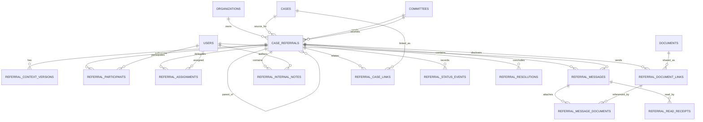

# Inter-Committee Referral Data Model

## Developer Handoff for PostgreSQL / Supabase

**Document purpose:** Define the data model and implementation boundaries for secure inter-committee referrals involving hospital cases.

**Primary use case:** A committee sends a specific `Case` to another committee for analysis. The receiving committee reviews the referral motive, requests additional information when needed, sends one or more replies, and eventually returns a formal response. Communication may continue until the referral is formally resolved.

---

## 1. Executive Summary

A referral should be modeled as its own workflow aggregate rather than as:

- A transfer of the original case.
- A message thread attached directly to the case.
- A status field on the case.
- A generic notification.
- A direct permission grant to the entire receiving committee.

The referral aggregate represents a controlled and auditable communication channel between exactly two committees:

1. The **source committee**, which creates the referral.
2. The **target committee**, which receives and analyzes it.

The original case remains owned by its current committee and continues to follow its existing permission model. The referral contains only the information deliberately disclosed for the receiving committee's analysis.

The core design separates:

- Referral workflow state.
- Disclosed case context.
- Official inter-committee messages.
- Committee-internal notes.
- Participants and permissions.
- Operational assignments.
- Documents shared through the referral.
- Related target-side cases.
- Status history.
- Formal resolution.
- Read and acknowledgement tracking.

This separation is essential for strong confidentiality, maintainable Row-Level Security, complete auditing, and future expansion.

---

## 2. Core Domain Principles

### 2.1 A referral does not transfer case ownership

The source case remains owned and governed by its existing committee.

Creating a referral must not:

- Change the case's owning committee.
- Automatically make the target committee a case participant.
- Grant access to every case form, document, timeline item, or internal note.
- Make future case changes visible to the target committee.
- Allow the target committee to edit the source case.

The referral is an independent communication and review boundary.

### 2.2 A referral has one source and one target committee

A referral must have exactly:

- One source committee.
- One target committee.

If a case must be referred to three committees, the application should create three referrals.

This avoids ambiguity around:

- Who must respond.
- Which committee has seen which information.
- Which deadline applies.
- Which messages are visible to each destination.
- Whether the referral is resolved.
- Which committee declined or accepted the request.

### 2.3 Shared information must be explicit

The target committee should see only:

- The referral motive.
- The referral context intentionally supplied.
- Messages sent in the shared referral thread.
- Documents intentionally disclosed through the referral.
- Other resources explicitly granted to it.

The target committee should not automatically inherit visibility into the source case.

### 2.4 Shared messages and internal notes are different security domains

Official messages exchanged between committees must be stored separately from notes that belong only to one committee.

This is safer than using one table with a `visibility` field. Separate tables reduce the risk that a query, API, or RLS mistake exposes internal deliberations.

### 2.5 A response is not the same as resolution

The target committee sends a response.

The source committee decides whether the response is sufficient and formally resolves the referral.

This distinction allows:

- Follow-up questions.
- Additional evidence.
- Clarifications.
- Reopening after new information.
- Multiple formal resolution cycles.

### 2.6 Important records are append-only

Messages, context versions, status transitions, and resolutions should not normally be overwritten or hard-deleted.

Corrections should produce new records that reference the previous record.

This preserves a defensible audit trail.

---

## 3. Aggregate Overview

The `case_referrals` table is the aggregate root.

```text
cases
  └── case_referrals
        ├── referral_context_versions
        ├── referral_participants
        ├── referral_assignments
        ├── referral_messages
        │     └── referral_message_documents
        ├── referral_internal_notes
        ├── referral_document_links
        ├── referral_case_links
        ├── referral_status_events
        ├── referral_resolutions
        └── referral_read_receipts
```

Recommended surrounding platform entities:

```text
organizations
hospitals
committees
users
organization_memberships
committee_memberships
cases
documents
document_versions
document_access_grants
audit_events
outbox_events
```

---

## 4. Entity Relationship Diagram



---

# 5. Table Definitions

## 5.1 `case_referrals`

Represents one referral from one committee to one other committee.

### Columns

| Column | Type | Null | Description |
|---|---|---:|---|
| `id` | `uuid` | No | Primary key |
| `organization_id` | `uuid` | No | Tenant boundary |
| `referral_number` | `text` | No | Human-readable identifier unique inside the organization |
| `source_case_id` | `uuid` | No | Case that originated the referral |
| `source_committee_id` | `uuid` | No | Committee sending the referral |
| `target_committee_id` | `uuid` | No | Committee receiving the referral |
| `parent_referral_id` | `uuid` | Yes | Upstream referral when this is a downstream referral |
| `created_by_user_id` | `uuid` | No | User who created the draft |
| `title` | `text` | No | Concise subject |
| `motive` | `text` | No | Reason for referral |
| `requested_action_code` | `text` | No | Structured category describing the requested analysis |
| `requested_action_details` | `text` | Yes | Additional instructions |
| `priority` | `text` | No | Workflow urgency |
| `status` | `text` | No | Current referral state |
| `waiting_on_committee_id` | `uuid` | Yes | Committee currently expected to act |
| `response_due_at` | `timestamptz` | Yes | Requested or SLA-derived deadline |
| `submitted_at` | `timestamptz` | Yes | Time sent |
| `accepted_at` | `timestamptz` | Yes | Time accepted |
| `accepted_by_user_id` | `uuid` | Yes | User accepting for target committee |
| `last_message_at` | `timestamptz` | Yes | Cached ordering field |
| `last_activity_at` | `timestamptz` | No | Cached workflow activity timestamp |
| `resolved_at` | `timestamptz` | Yes | Current resolution timestamp |
| `archived_at` | `timestamptz` | Yes | Optional UI archival |
| `row_version` | `integer` | No | Optimistic concurrency version |
| `created_at` | `timestamptz` | No | Creation timestamp |
| `updated_at` | `timestamptz` | No | Last material update |

### Recommended status values

```text
draft
submitted
accepted
under_review
awaiting_information
answered
resolved
declined
cancelled
```

### Recommended priority values

```text
routine
high
urgent
critical
```

### Design rationale

The referral row stores the current state for efficient inbox and dashboard queries. It does not attempt to store the entire conversation or history.

`waiting_on_committee_id` is deliberately separate from `status`. The status describes the lifecycle; `waiting_on_committee_id` identifies the actor responsible for the next step.

For example:

```text
status = awaiting_information
waiting_on_committee_id = source_committee_id
```

This is preferable to many highly specific status values such as:

```text
awaiting_source_information
awaiting_target_information
awaiting_source_acknowledgement
awaiting_target_acknowledgement
```

### Important constraints

```sql
CHECK (source_committee_id <> target_committee_id)
```

`waiting_on_committee_id`, when present, must equal either `source_committee_id` or `target_committee_id`.

The source case, both committees, creator, and parent referral must belong to the same organization.

Recommended natural uniqueness:

```sql
UNIQUE (organization_id, referral_number)
```

Recommended composite alternate key for tenant-safe child references:

```sql
UNIQUE (organization_id, id)
```

---

## 5.2 `referral_context_versions`

Stores the information from the source case that was intentionally disclosed through the referral.

### Columns

| Column | Type | Null | Description |
|---|---|---:|---|
| `id` | `uuid` | No | Primary key |
| `organization_id` | `uuid` | No | Tenant identifier |
| `referral_id` | `uuid` | No | Parent referral |
| `version_number` | `integer` | No | Sequential version |
| `case_summary` | `text` | No | Narrative context disclosed to target |
| `structured_context` | `jsonb` | Yes | Flexible referral-specific structured context |
| `source_case_revision_id` | `uuid` | Yes | Source case revision used to produce this snapshot |
| `created_by_user_id` | `uuid` | No | Author |
| `created_at` | `timestamptz` | No | Creation time |
| `superseded_at` | `timestamptz` | Yes | Time replaced by a newer context version |

### Constraints

```sql
UNIQUE (referral_id, version_number)
```

Only one context version may be current:

```sql
CREATE UNIQUE INDEX uq_referral_context_current
ON referral_context_versions (referral_id)
WHERE superseded_at IS NULL;
```

### Design rationale

The receiving committee should not depend on a live projection of the source case.

A context snapshot guarantees that the platform can later answer:

- What did the target committee know?
- When did it receive that information?
- Which version of the source case was used?
- Was a later case update ever shared?

When source-case information changes, the platform should create a new referral context version or send a new message rather than silently exposing the changed source case.

`structured_context` is appropriate for flexible supplemental data such as:

```json
{
  "relevant_dates": ["2026-06-18", "2026-06-21"],
  "questions_for_target_committee": [
    "Was this conduct consistent with institutional policy?",
    "Does this event require formal professional review?"
  ],
  "patient_identifiers_included": false,
  "clinical_summary": {
    "service": "Intensive Care Unit",
    "event_type": "Delayed escalation of care"
  }
}
```

It should not contain workflow state, participants, messages, permissions, or assignments.

---

## 5.3 `referral_participants`

Represents users explicitly authorized to access the referral.

### Columns

| Column | Type | Null | Description |
|---|---|---:|---|
| `id` | `uuid` | No | Primary key |
| `organization_id` | `uuid` | No | Tenant identifier |
| `referral_id` | `uuid` | No | Referral |
| `committee_id` | `uuid` | No | Source or target committee represented |
| `user_id` | `uuid` | No | Authorized user |
| `participant_role` | `text` | No | Functional role |
| `access_level` | `text` | No | Referral access level |
| `added_by_user_id` | `uuid` | No | User granting access |
| `added_at` | `timestamptz` | No | Grant time |
| `removed_at` | `timestamptz` | Yes | Revocation time |
| `removal_reason` | `text` | Yes | Revocation reason |

### Suggested participant roles

```text
coordinator
reviewer
consultant
observer
source_representative
target_representative
```

### Suggested access levels

```text
read
comment
manage
```

### Constraints

The participant committee must equal either the referral source or target committee.

One active participant record per user and referral:

```sql
CREATE UNIQUE INDEX uq_referral_participant_active
ON referral_participants (referral_id, user_id)
WHERE removed_at IS NULL;
```

### Design rationale

Committee membership and referral participation are not necessarily equivalent.

A referral may contain:

- Protected health information.
- Allegations against a clinician.
- Legal or credentialing information.
- Peer-review protected information.
- Documents with narrow disclosure requirements.

Therefore, ordinary committee membership should not automatically imply referral access unless institutional policy explicitly requires it.

A participant row answers:

> Is this user allowed to access and interact with this referral?

It does not answer:

> Is this user operationally responsible for completing the work?

That is handled by `referral_assignments`.

---

## 5.4 `referral_assignments`

Tracks operational responsibility for the referral.

### Columns

| Column | Type | Null | Description |
|---|---|---:|---|
| `id` | `uuid` | No | Primary key |
| `organization_id` | `uuid` | No | Tenant identifier |
| `referral_id` | `uuid` | No | Referral |
| `committee_id` | `uuid` | No | Committee issuing or owning the assignment |
| `assignee_user_id` | `uuid` | No | Assigned user |
| `assignment_role` | `text` | No | Responsibility type |
| `status` | `text` | No | Assignment state |
| `due_at` | `timestamptz` | Yes | Assignment deadline |
| `assigned_by_user_id` | `uuid` | No | User assigning |
| `assigned_at` | `timestamptz` | No | Assignment time |
| `completed_at` | `timestamptz` | Yes | Completion time |
| `cancelled_at` | `timestamptz` | Yes | Cancellation time |

### Suggested assignment roles

```text
referral_coordinator
primary_reviewer
secondary_reviewer
clinical_reviewer
legal_reviewer
committee_chair
```

### Suggested assignment statuses

```text
pending
accepted
in_progress
completed
cancelled
```

### Design rationale

Permission and responsibility must not be conflated.

Examples:

- An observer may read the referral but have no assigned responsibility.
- A coordinator may manage participants without reviewing the case.
- A reviewer may be assigned a task and later have the assignment cancelled.
- A committee chair may have implicit administrative access but no active assignment.

The application should ensure that an active assignee also has active referral participation.

---

## 5.5 `referral_messages`

Stores official communication exchanged between the source and target committees.

### Columns

| Column | Type | Null | Description |
|---|---|---:|---|
| `id` | `uuid` | No | Primary key |
| `organization_id` | `uuid` | No | Tenant identifier |
| `referral_id` | `uuid` | No | Parent referral |
| `sequence_number` | `integer` | No | Stable ordering inside the referral |
| `sender_committee_id` | `uuid` | No | Committee represented by sender |
| `sender_user_id` | `uuid` | No | Author |
| `message_type` | `text` | No | Semantic message category |
| `body` | `text` | No | Message content |
| `in_reply_to_message_id` | `uuid` | Yes | Optional reply relationship |
| `supersedes_message_id` | `uuid` | Yes | Corrected message relationship |
| `created_at` | `timestamptz` | No | Send time |
| `redacted_at` | `timestamptz` | Yes | Controlled redaction time |
| `redacted_by_user_id` | `uuid` | Yes | User authorizing redaction |
| `redaction_reason` | `text` | Yes | Mandatory justification |

### Suggested message types

```text
general_message
information_request
information_response
interim_update
formal_response
clarification
resolution_proposal
system_notice
```

### Constraints

```sql
UNIQUE (referral_id, sequence_number)
```

`sender_committee_id` must equal either the source or target committee.

`in_reply_to_message_id` and `supersedes_message_id` must reference messages in the same referral.

### Design rationale

Messages should be first-class rows rather than an array inside a JSONB field.

Benefits include:

- Reliable pagination.
- Stable ordering.
- Per-message permissions.
- Read receipts.
- Attachment relationships.
- Auditable corrections.
- Searchability.
- Lower write contention.
- Smaller row updates.

Sent messages should not normally be edited or deleted. A correction should create a new message with `supersedes_message_id`.

Redaction should be a privileged compliance workflow, not ordinary deletion.

### Sequence assignment

`sequence_number` should be generated transactionally.

A safe approach is:

1. Lock the referral row with `SELECT ... FOR UPDATE`.
2. Read the current maximum or maintain a `next_message_sequence` counter.
3. Insert the new message.
4. Update referral activity timestamps.
5. Commit.

Do not derive ordering exclusively from timestamps.

---

## 5.6 `referral_internal_notes`

Stores deliberative notes visible only to one committee.

### Columns

| Column | Type | Null | Description |
|---|---|---:|---|
| `id` | `uuid` | No | Primary key |
| `organization_id` | `uuid` | No | Tenant identifier |
| `referral_id` | `uuid` | No | Referral |
| `committee_id` | `uuid` | No | Committee owning the note |
| `author_user_id` | `uuid` | No | Author |
| `body` | `text` | No | Internal note |
| `created_at` | `timestamptz` | No | Creation time |
| `redacted_at` | `timestamptz` | Yes | Controlled redaction |
| `redacted_by_user_id` | `uuid` | Yes | Redaction actor |
| `redaction_reason` | `text` | Yes | Redaction justification |

### Design rationale

Internal notes are stored separately from shared messages to establish a stronger security boundary.

The target committee must not assume that its internal deliberations will become visible to the source committee.

Likewise, the source committee may need to record internal decisions about whether the response is adequate without sharing those notes with the target.

A single messages table with `visibility = internal` is more fragile because a missing filter or incorrect RLS policy can leak protected notes.

---

## 5.7 `referral_document_links`

Associates an existing document with the referral and defines the referral-specific disclosure.

### Columns

| Column | Type | Null | Description |
|---|---|---:|---|
| `id` | `uuid` | No | Primary key |
| `organization_id` | `uuid` | No | Tenant identifier |
| `referral_id` | `uuid` | No | Referral |
| `document_id` | `uuid` | No | Existing document |
| `document_version_id` | `uuid` | Yes | Exact shared version when snapshot mode is used |
| `audience` | `text` | No | Referral audience |
| `access_mode` | `text` | No | Snapshot or live reference |
| `purpose` | `text` | Yes | Why the document was disclosed |
| `shared_by_user_id` | `uuid` | No | User sharing |
| `shared_at` | `timestamptz` | No | Disclosure time |
| `expires_at` | `timestamptz` | Yes | Optional expiration |
| `revoked_at` | `timestamptz` | Yes | Revocation time |
| `revoked_by_user_id` | `uuid` | Yes | Revocation actor |
| `revocation_reason` | `text` | Yes | Revocation reason |

### Suggested audiences

```text
shared_thread
source_committee_internal
target_committee_internal
```

### Suggested access modes

```text
snapshot
live_reference
```

### Design rationale

A document belongs to the platform's general document model. The referral should not duplicate the document binary or metadata.

Instead, the referral creates a disclosure link.

`access_mode = snapshot` should be the default for formal or sensitive referrals because it preserves exactly which document version was shared.

`live_reference` should be uncommon because future document changes can alter the evidence available to the target committee.

### Permission requirement

Creating `referral_document_links` must not bypass the main document authorization system.

Document access should require both:

```text
User may read the referral
AND
User has an active referral-specific document grant
```

The same transaction that creates the referral link should create or update the corresponding document access grant.

Revoking the referral link should revoke the grant.

---

## 5.8 `referral_message_documents`

Associates a shared document with a specific message.

### Columns

| Column | Type | Null | Description |
|---|---|---:|---|
| `message_id` | `uuid` | No | Referral message |
| `referral_document_link_id` | `uuid` | No | Referral disclosure record |
| `created_at` | `timestamptz` | No | Association time |

### Primary key

```sql
PRIMARY KEY (message_id, referral_document_link_id)
```

### Design rationale

A referral document may be:

- Shared as part of the initial referral.
- Attached to an information request.
- Added in an information response.
- Included with the formal response.

The join table permits one document to be referenced by multiple messages without duplicating the disclosure record.

---

## 5.9 `referral_case_links`

Relates the referral to cases created or identified during the receiving committee's analysis.

### Columns

| Column | Type | Null | Description |
|---|---|---:|---|
| `id` | `uuid` | No | Primary key |
| `organization_id` | `uuid` | No | Tenant identifier |
| `referral_id` | `uuid` | No | Referral |
| `case_id` | `uuid` | No | Related case |
| `committee_id` | `uuid` | No | Committee owning the related case |
| `relationship_type` | `text` | No | Nature of relationship |
| `created_by_user_id` | `uuid` | No | Creator |
| `created_at` | `timestamptz` | No | Creation time |

### Suggested relationship types

```text
target_review_case
related_case
follow_up_case
escalated_case
duplicate_case
```

### Design rationale

The target committee may need to create its own case.

Example:

```text
Case C-102
Owned by Morbidity and Mortality Committee

Referral R-221
Sent to Medical Ethics Committee

Case C-188
Owned by Medical Ethics Committee
Linked to R-221 as target_review_case
```

The source committee should not automatically gain access to `C-188`.

The relationship indicates association, not authorization.

Any content from the target-side case that must be returned to the source should be deliberately shared through the referral.

---

## 5.10 `referral_status_events`

Stores immutable referral state and workflow history.

### Columns

| Column | Type | Null | Description |
|---|---|---:|---|
| `id` | `uuid` | No | Primary key |
| `organization_id` | `uuid` | No | Tenant identifier |
| `referral_id` | `uuid` | No | Referral |
| `from_status` | `text` | Yes | Previous state |
| `to_status` | `text` | No | New state |
| `event_type` | `text` | No | Domain action causing transition |
| `actor_committee_id` | `uuid` | Yes | Committee represented |
| `actor_user_id` | `uuid` | No | User performing action |
| `reason` | `text` | Yes | Transition explanation |
| `metadata` | `jsonb` | Yes | Supplemental structured data |
| `created_at` | `timestamptz` | No | Event time |

### Suggested event types

```text
referral_created
referral_submitted
referral_accepted
referral_declined
review_started
information_requested
information_provided
formal_response_sent
referral_resolved
referral_reopened
referral_cancelled
deadline_changed
priority_changed
participant_added
participant_removed
document_shared
document_revoked
```

### Design rationale

`case_referrals.status` stores the current state for fast queries.

`referral_status_events` explains how the state was reached.

This is intentional denormalization:

```text
case_referrals.status
    Fast current-state queries

referral_status_events
    Historical reconstruction and audit
```

The history table does not replace the platform-wide audit log. The audit log should still capture lower-level security and database changes.

---

## 5.11 `referral_resolutions`

Stores formal resolution cycles.

### Columns

| Column | Type | Null | Description |
|---|---|---:|---|
| `id` | `uuid` | No | Primary key |
| `organization_id` | `uuid` | No | Tenant identifier |
| `referral_id` | `uuid` | No | Referral |
| `resolution_number` | `integer` | No | Sequential resolution number |
| `final_response_message_id` | `uuid` | Yes | Target response forming resolution basis |
| `outcome_code` | `text` | No | Structured outcome |
| `summary` | `text` | No | Resolution explanation |
| `follow_up_required` | `boolean` | No | Whether further action remains |
| `resolved_by_committee_id` | `uuid` | No | Committee formally resolving |
| `resolved_by_user_id` | `uuid` | No | User resolving |
| `resolved_at` | `timestamptz` | No | Resolution time |
| `reopened_at` | `timestamptz` | Yes | Reopening time |
| `reopened_by_user_id` | `uuid` | Yes | User reopening |
| `reopening_reason` | `text` | Yes | Reopening justification |

### Suggested outcome codes

```text
advice_received
review_completed
no_action_required
action_recommended
policy_clarified
jurisdiction_declined
referred_elsewhere
insufficient_information
other
```

### Constraints

```sql
UNIQUE (referral_id, resolution_number)
```

Only one resolution may be active:

```sql
CREATE UNIQUE INDEX uq_referral_resolution_active
ON referral_resolutions (referral_id)
WHERE reopened_at IS NULL;
```

### Design rationale

A referral can be resolved, reopened, and resolved again.

Each resolution cycle should be preserved as a separate row.

The target committee sends the formal response. The source committee creates the resolution record after deciding the referral is complete.

---

## 5.12 `referral_read_receipts`

Tracks message delivery, reading, and acknowledgement.

### Columns

| Column | Type | Null | Description |
|---|---|---:|---|
| `message_id` | `uuid` | No | Referral message |
| `user_id` | `uuid` | No | Recipient |
| `delivered_at` | `timestamptz` | Yes | Message became available |
| `read_at` | `timestamptz` | Yes | User opened the message |
| `acknowledged_at` | `timestamptz` | Yes | User explicitly acknowledged it |

### Primary key

```sql
PRIMARY KEY (message_id, user_id)
```

### Design rationale

Reading and acknowledgement are different:

```text
read_at
    User viewed the message.

acknowledged_at
    User explicitly confirmed receipt or responsibility.
```

Formal referrals may require acknowledgement from a designated coordinator rather than every participant.

This table is optional for the first release but is valuable for formal committee workflows.

---

# 6. Recommended PostgreSQL Enums or Check Constraints

PostgreSQL enums provide strong validation but are harder to change during iterative product development.

For a platform still under active design, recommended options are:

1. Use `text` with `CHECK` constraints.
2. Use lookup tables when values need organization-specific customization.
3. Migrate to enums only when the domain is stable.

Example:

```sql
CHECK (
  status IN (
    'draft',
    'submitted',
    'accepted',
    'under_review',
    'awaiting_information',
    'answered',
    'resolved',
    'declined',
    'cancelled'
  )
)
```

For globally stable values such as access levels, enums may be acceptable.

---

# 7. Tenant Isolation and Foreign Keys

Every referral-related table should carry `organization_id`.

Although this appears redundant, it provides:

- Easier RLS predicates.
- Efficient tenant-filtered indexes.
- Defense against cross-tenant joins.
- Simpler audit queries.
- Safer partitioning options.
- Better query plans for common access patterns.

Parent tables should expose:

```sql
UNIQUE (organization_id, id)
```

Child tables should use composite foreign keys:

```sql
FOREIGN KEY (organization_id, referral_id)
REFERENCES case_referrals (organization_id, id)
```

The same pattern should be used for committees, cases, documents, and users where the surrounding schema permits it.

This prevents a child row from combining an `organization_id` from one tenant with a parent ID from another tenant.

---

# 8. State Machine

Recommended state flow:

```text
draft
  └── submitted
        ├── accepted
        │     └── under_review
        │           ├── awaiting_information
        │           │     └── under_review
        │           └── answered
        │                 ├── under_review
        │                 └── resolved
        │                       └── under_review
        ├── declined
        └── cancelled
```

## 8.1 `draft → submitted`

Allowed only for the source committee.

Requirements:

- Source and target committees are valid.
- Source and target are different.
- Motive is present.
- Requested action is present.
- At least one current context version exists.
- Shared documents have valid disclosure grants.
- Actor has `manage` access.

Effects:

- Set `status = submitted`.
- Set `submitted_at`.
- Set `waiting_on_committee_id = target_committee_id`.
- Write a status event.
- Write notification events to the outbox.

## 8.2 `submitted → accepted`

Allowed only for an authorized target committee user.

Effects:

- Set `accepted_at`.
- Set `accepted_by_user_id`.
- Set status to `accepted` or directly to `under_review`.
- Add or confirm target coordinator participation.
- Write a status event.

## 8.3 `submitted → declined`

Allowed only by the target committee.

A decline reason should be required.

Examples:

- Outside jurisdiction.
- Duplicate referral.
- Wrong target committee.
- Insufficient information.
- Conflict of interest.
- Referral withdrawn before review.

## 8.4 `under_review → awaiting_information`

Usually initiated by the target committee.

Effects:

- Insert an `information_request` message.
- Set `status = awaiting_information`.
- Set `waiting_on_committee_id = source_committee_id`.
- Write status and notification events.

## 8.5 `awaiting_information → under_review`

Usually caused by an `information_response` from the source committee.

Effects:

- Clear or update `waiting_on_committee_id`.
- Return to `under_review`.
- Record the transition.

## 8.6 `under_review → answered`

Initiated by the target committee after a `formal_response`.

Effects:

- Set `status = answered`.
- Set `waiting_on_committee_id = source_committee_id`.
- Record the formal response event.

## 8.7 `answered → resolved`

Normally initiated by the source committee.

Requirements:

- A formal target response exists.
- A resolution record is created.
- Actor has source-side `manage` permission.

Effects:

- Set `status = resolved`.
- Set `resolved_at`.
- Clear `waiting_on_committee_id`.
- Insert status and audit events.

## 8.8 `resolved → under_review`

Represents reopening.

Requirements:

- Reopening reason.
- Active resolution marked with `reopened_at`.
- `resolved_at` cleared.
- `waiting_on_committee_id` set explicitly.
- Reopening status event.

---

# 9. Downstream Referrals

A target committee may decide that another committee must participate.

This should create a new referral with `parent_referral_id`.

Example:

```text
R-100
Morbidity and Mortality → Medical Ethics

R-101
Medical Ethics → Credentialing
parent_referral_id = R-100
```

The downstream referral must have its own:

- Context versions.
- Participants.
- Document disclosures.
- Messages.
- Assignments.
- Status.
- Resolution.

Information must not automatically flow from the parent referral into the child referral.

The user creating the downstream referral must explicitly choose what to share.

This prevents uncontrolled propagation of PHI, allegations, legal analysis, or peer-review information.

---

# 10. Row-Level Security Strategy

RLS should be treated as a required security control, not an optional convenience.

## 10.1 Referral read access

A user should be able to read a referral only when:

1. The user has an active membership in the organization.
2. The referral belongs to that organization.
3. The user is authorized through the source or target committee.
4. The user's referral access has not been revoked.
5. The user satisfies any case-sensitive or document-sensitive policy.

Conceptual policy:

```sql
EXISTS (
  SELECT 1
  FROM organization_memberships om
  WHERE om.organization_id = case_referrals.organization_id
    AND om.user_id = auth.uid()
    AND om.status = 'active'
)
AND (
  user_is_committee_admin(auth.uid(), case_referrals.source_committee_id)
  OR
  user_is_committee_admin(auth.uid(), case_referrals.target_committee_id)
  OR
  EXISTS (
    SELECT 1
    FROM referral_participants rp
    WHERE rp.referral_id = case_referrals.id
      AND rp.user_id = auth.uid()
      AND rp.removed_at IS NULL
  )
)
```

The real helper functions should be `SECURITY DEFINER` only when necessary and should set a safe `search_path`.

## 10.2 Message insertion

To insert a referral message:

- User must have `comment` or `manage`.
- Sender committee must match the user's active participant committee.
- Sender committee must be source or target.
- Referral must not be `cancelled` or `declined`.
- A resolved referral must be reopened first.

## 10.3 Internal notes

Users may read only notes owned by the committee they are authorized to represent for that referral.

Source participants must never read target internal notes.

Target participants must never read source internal notes.

## 10.4 Documents

Referral visibility must not automatically grant document visibility.

The policy should require:

```text
Referral read permission
AND
Active referral document link
AND
Active document access grant
AND
Document version permitted by access mode
```

## 10.5 Linked cases

A record in `referral_case_links` does not grant access to the related case.

Case access must be evaluated independently.

---

# 11. Domain Services and Transaction Boundaries

Do not expose direct client-side CRUD for important state transitions.

Use application services, RPC functions, or transaction scripts for workflow commands.

## 11.1 Submit referral transaction

1. Lock referral row.
2. Confirm status is `draft`.
3. Validate actor authorization.
4. Validate source and target committees.
5. Validate current context version.
6. Validate document disclosure.
7. Create document grants.
8. Set referral to `submitted`.
9. Set submission timestamps.
10. Set `waiting_on_committee_id`.
11. Insert status event.
12. Insert outbox events.
13. Commit atomically.

## 11.2 Send message transaction

1. Lock referral row.
2. Validate sender permission.
3. Validate sender committee.
4. Validate current referral state.
5. Allocate `sequence_number`.
6. Insert message.
7. Link disclosed documents.
8. Update `last_message_at`.
9. Update `last_activity_at`.
10. Update `waiting_on_committee_id` if needed.
11. Update status if the message represents a workflow transition.
12. Insert status event.
13. Insert outbox events.
14. Commit.

## 11.3 Resolve referral transaction

1. Lock referral row.
2. Confirm actor represents source committee.
3. Confirm status is `answered`.
4. Confirm formal response exists.
5. Insert resolution record.
6. Set status to `resolved`.
7. Set `resolved_at`.
8. Clear `waiting_on_committee_id`.
9. Insert status event.
10. Insert outbox event.
11. Commit.

## 11.4 Reopen referral transaction

1. Lock referral row.
2. Confirm active resolution.
3. Mark resolution as reopened.
4. Clear referral `resolved_at`.
5. Set referral status to `under_review`.
6. Set the committee expected to act.
7. Insert reopening status event.
8. Insert notification event.
9. Commit.

---

# 12. Transactional Outbox and Notifications

Referral operations frequently need to trigger:

- In-app notifications.
- Email notifications.
- Deadline reminders.
- Escalation alerts.
- Dashboard counters.
- Audit integrations.

Do not send these directly inside the database mutation request.

Write a domain event to a transactional outbox in the same transaction as the referral change.

Suggested event types:

```text
referral.created
referral.submitted
referral.accepted
referral.declined
referral.information_requested
referral.information_provided
referral.message_created
referral.formal_response_created
referral.document_shared
referral.document_revoked
referral.overdue
referral.resolved
referral.reopened
referral.cancelled
```

Example outbox payload:

```json
{
  "event_type": "referral.submitted",
  "organization_id": "00000000-0000-0000-0000-000000000000",
  "referral_id": "00000000-0000-0000-0000-000000000000",
  "source_committee_id": "00000000-0000-0000-0000-000000000000",
  "target_committee_id": "00000000-0000-0000-0000-000000000000",
  "occurred_at": "2026-07-12T21:00:00Z"
}
```

Outbox payloads should contain identifiers and operational metadata, not PHI.

Email and push notifications should not contain case names, patient identifiers, allegations, or clinical details unless the organization explicitly approves that delivery channel.

---

# 13. Audit and Retention

Referral data should normally not be hard-deleted.

| User intent | Recommended database behavior |
|---|---|
| Delete draft | Soft-delete draft or cancel according to policy |
| Withdraw submitted referral | Set status to `cancelled` |
| Remove participant | Set `removed_at` |
| Remove document access | Set `revoked_at` and revoke document grant |
| Correct message | Create superseding message |
| Correct context | Create new context version |
| Remove improperly disclosed content | Privileged redaction workflow |
| Reopen resolved referral | Preserve prior resolution and create reopening event |

The central audit log should record:

- Referral creation.
- Submission.
- Acceptance and decline.
- Status transitions.
- Participant changes.
- Assignment changes.
- Context version creation.
- Document sharing and revocation.
- Message creation.
- Redactions.
- Resolution.
- Reopening.
- Denied access attempts.
- Permission grants and revocations.

Audit records should include:

- Actor.
- Organization.
- Action.
- Object type and ID.
- Timestamp.
- Request or correlation ID.
- Relevant before and after values.
- Reason where required.

Avoid copying full PHI into general audit metadata unless required by institutional policy.

---

# 14. Recommended Indexes

## 14.1 Target committee inbox

```sql
CREATE INDEX idx_referrals_target_open
ON case_referrals (
  organization_id,
  target_committee_id,
  status,
  last_activity_at DESC
)
WHERE archived_at IS NULL;
```

## 14.2 Source committee inbox

```sql
CREATE INDEX idx_referrals_source_open
ON case_referrals (
  organization_id,
  source_committee_id,
  status,
  last_activity_at DESC
)
WHERE archived_at IS NULL;
```

## 14.3 Case referral history

```sql
CREATE INDEX idx_referrals_source_case
ON case_referrals (
  organization_id,
  source_case_id,
  created_at DESC
);
```

## 14.4 Deadlines

```sql
CREATE INDEX idx_referrals_due
ON case_referrals (
  organization_id,
  response_due_at
)
WHERE status NOT IN ('resolved', 'declined', 'cancelled')
  AND response_due_at IS NOT NULL;
```

## 14.5 Message ordering

```sql
CREATE UNIQUE INDEX uq_referral_message_sequence
ON referral_messages (
  referral_id,
  sequence_number
);
```

## 14.6 Message timeline

```sql
CREATE INDEX idx_referral_messages_created
ON referral_messages (
  referral_id,
  created_at DESC
);
```

## 14.7 Active participation

```sql
CREATE INDEX idx_referral_participants_user
ON referral_participants (
  organization_id,
  user_id,
  referral_id
)
WHERE removed_at IS NULL;
```

## 14.8 Active assignments

```sql
CREATE INDEX idx_referral_assignments_assignee
ON referral_assignments (
  organization_id,
  assignee_user_id,
  due_at
)
WHERE status IN ('pending', 'accepted', 'in_progress');
```

## 14.9 Waiting on committee

```sql
CREATE INDEX idx_referrals_waiting_on
ON case_referrals (
  organization_id,
  waiting_on_committee_id,
  response_due_at,
  last_activity_at DESC
)
WHERE status NOT IN ('resolved', 'declined', 'cancelled');
```

---

# 15. Concurrency Control

Referral workflows are vulnerable to concurrent actions.

Examples:

- Two users accept the same referral.
- Two target users send the next message simultaneously.
- The source committee resolves while the target sends a clarification.
- A document is revoked while another user attaches it to a message.

Recommended controls:

## 15.1 Optimistic concurrency

Use `row_version` on `case_referrals`.

Every update should include:

```sql
WHERE id = :id
  AND row_version = :expected_version
```

Then increment the version.

If no row is updated, return a conflict and reload the current state.

## 15.2 Pessimistic locking for commands

Workflow functions should lock the referral row:

```sql
SELECT *
FROM case_referrals
WHERE id = :referral_id
FOR UPDATE;
```

This is especially important for:

- Status transitions.
- Message sequence allocation.
- Resolution.
- Reopening.
- Acceptance.
- Cancellation.

## 15.3 Idempotency keys

Commands originating from clients or queues should support an idempotency key.

This prevents duplicate:

- Submissions.
- Messages.
- Resolutions.
- Notifications.
- Document grants.

---

# 16. Suggested Application-Layer Domain Model

```typescript
type ReferralStatus =
  | "draft"
  | "submitted"
  | "accepted"
  | "under_review"
  | "awaiting_information"
  | "answered"
  | "resolved"
  | "declined"
  | "cancelled";

type ReferralPriority =
  | "routine"
  | "high"
  | "urgent"
  | "critical";

interface Referral {
  id: string;
  organizationId: string;
  sourceCaseId: string;
  sourceCommitteeId: string;
  targetCommitteeId: string;
  parentReferralId: string | null;

  title: string;
  motive: string;
  requestedActionCode: string;
  requestedActionDetails: string | null;
  priority: ReferralPriority;

  status: ReferralStatus;
  waitingOnCommitteeId: string | null;
  responseDueAt: Date | null;

  submittedAt: Date | null;
  acceptedAt: Date | null;
  resolvedAt: Date | null;

  rowVersion: number;
}
```

Recommended commands:

```text
CreateReferral
UpdateReferralDraft
CreateReferralContextVersion
AddReferralParticipant
RemoveReferralParticipant
AssignReferralReviewer
ShareReferralDocument
RevokeReferralDocument
SubmitReferral
AcceptReferral
DeclineReferral
StartReferralReview
SendReferralMessage
RequestReferralInformation
ProvideReferralInformation
SendFormalReferralResponse
ResolveReferral
ReopenReferral
CancelReferral
```

Recommended domain events:

```text
ReferralCreated
ReferralContextUpdated
ReferralParticipantAdded
ReferralParticipantRemoved
ReferralReviewerAssigned
ReferralDocumentShared
ReferralDocumentRevoked
ReferralSubmitted
ReferralAccepted
ReferralDeclined
ReferralReviewStarted
ReferralMessageSent
ReferralInformationRequested
ReferralInformationProvided
ReferralResponseSent
ReferralResolved
ReferralReopened
ReferralCancelled
```

---

# 17. Suggested Repository and Service Boundaries

A clean architecture implementation should separate:

## Domain layer

Contains:

- Referral aggregate.
- State-transition rules.
- Value objects.
- Domain events.
- Permission-independent business invariants.

## Application layer

Contains:

- Commands and handlers.
- Queries.
- Transaction orchestration.
- Authorization decisions.
- Outbox creation.
- Document grant coordination.

## Infrastructure layer

Contains:

- PostgreSQL repositories.
- Supabase RPC calls.
- RLS definitions.
- Outbox publisher.
- Audit sink.
- Notification adapters.
- Document storage adapters.

## Presentation layer

Contains:

- API routes.
- Server actions.
- UI projections.
- Validation of request shape.

Controllers and UI components should not directly manipulate referral status.

---

# 18. Suggested Read Models

The normalized write model should remain authoritative.

For UI performance, create views or projections for:

## 18.1 Referral inbox

Fields may include:

- Referral ID and number.
- Title.
- Source committee.
- Target committee.
- Source case identifier.
- Status.
- Priority.
- Waiting-on committee.
- Deadline.
- Last activity.
- Unread message count.
- Assigned coordinator.

## 18.2 Referral detail

Fields may include:

- Current referral state.
- Current context version.
- Participant list.
- Assignment list.
- Shared conversation.
- Current document disclosures.
- Resolution history.

## 18.3 Committee workload

Fields may include:

- Open referrals.
- Overdue referrals.
- Referrals waiting on the committee.
- Referrals waiting on the other committee.
- Referrals per assignee.
- Median response time.

Read models may be implemented as:

- PostgreSQL views.
- Materialized views.
- Query-layer projections.
- Dedicated reporting tables updated from outbox events.

Do not compromise the normalized write model merely to simplify one UI query.

---

# 19. Anti-Patterns to Avoid

## 19.1 Storing the conversation as JSONB

Avoid:

```text
case_referrals.messages JSONB
```

Problems:

- Large row rewrites.
- Weak pagination.
- No stable per-message foreign keys.
- Difficult redaction.
- Difficult read receipts.
- Poor indexing.
- Update conflicts.
- Weak auditing.
- Attachment complexity.

## 19.2 Automatically granting target committee access to the entire case

This violates least privilege and makes future case changes visible without deliberate disclosure.

## 19.3 Combining shared messages and internal notes

A visibility flag in one table creates a fragile authorization boundary.

## 19.4 One referral with multiple target committees

This causes ambiguous status, deadlines, responses, permissions, and resolution.

## 19.5 Resolving automatically when a response is sent

The source committee must have the opportunity to request clarification or additional information.

## 19.6 Using assignments as permissions

Responsibility and access are related but distinct concepts.

## 19.7 Hard-deleting communication

Use cancellation, revocation, superseding records, versioning, and controlled redaction instead.

## 19.8 Allowing direct client updates to status

State transitions must go through validated commands or RPC functions.

## 19.9 Using only application-layer authorization

RLS should enforce tenant and referral boundaries even if the application has a defect.

## 19.10 Copying PHI into notification payloads

Outbox events and external notifications should use identifiers and minimal operational metadata.

---

# 20. Minimum Viable Implementation

The first production release should include:

```text
case_referrals
referral_context_versions
referral_participants
referral_messages
referral_internal_notes
referral_status_events
referral_resolutions
referral_document_links
referral_message_documents
```

Strongly recommended in the same release:

```text
referral_assignments
referral_case_links
transactional outbox integration
central audit integration
```

Can be deferred if necessary:

```text
referral_read_receipts
formal acknowledgements
SLA escalation history
materialized reporting projections
```

Even in an MVP, do not remove:

- Context snapshots.
- Separation of shared messages and internal notes.
- Explicit document disclosure.
- Status history.
- Source-side resolution.
- RLS.
- Append-only communication.

Those are foundational security and correctness properties, not optional refinements.

---

# 21. Final Architecture Summary

The recommended architecture establishes four separate boundaries:

```text
Original Case
    Remains owned by its existing committee.
    Keeps its existing permissions.
    Is not transferred to the target committee.

Referral
    Represents the inter-committee workflow.
    Stores the motive, current status, participants, and official conversation.

Disclosed Context
    Contains only the case information and documents intentionally shared.
    Is versioned and auditable.

Target Committee Review
    May remain within the referral or create a separately secured target-side case.
    Internal deliberations remain private to the target committee.

Resolution
    Records that the source committee accepted the outcome and formally closed the workflow.
```

This model supports:

- Simple consultations.
- Formal referrals.
- Multi-message communication.
- Requests for additional information.
- Independent target-side review.
- Selective document sharing.
- Downstream referrals.
- Strict PHI disclosure.
- Committee-private notes.
- Formal resolution.
- Reopening.
- Complete auditability.

The design is deliberately more structured than a generic message thread because hospital committee communication may carry clinical, legal, peer-review, credentialing, and disciplinary consequences. The data model should therefore favor explicit boundaries, immutable history, and least-privilege disclosure over implementation shortcuts.
