# Interview Data Model — Technical Handoff

## Document status

- **Purpose:** Engineering handoff for implementing the Interview domain in the hospital committee platform.
- **Target database:** PostgreSQL, including Supabase-compatible row-level security.
- **Primary consumers:** Backend engineers, database engineers, frontend engineers, security reviewers, and implementation LLMs.
- **Scope:** Interviews associated with a `Case`, including participants, sessions, attendance, preparation, consent, notes, recordings, transcripts, statements, findings, summaries, permissions, external access, retention, and auditability.
- **Out of scope:** The complete implementation of the shared `Case`, `Forms`, `Documents`, `Action Items`, `Referrals`, `Timeline`, identity, and audit subsystems. This document defines the integration points with those systems.

---

# 1. Domain Overview

Hospital committees frequently need to interview people in order to investigate, clarify, or complement a `Case`.

Examples include:

- A morbidity and mortality committee interviewing clinicians involved in a patient’s care.
- An ethics committee interviewing the physician who is the subject of a complaint.
- A patient safety department interviewing witnesses to an adverse event.
- A credentialing committee interviewing a physician, department head, or external expert.
- A committee interviewing a patient, family member, complainant, interpreter, legal representative, or other third party.
- A committee receiving a written response instead of conducting a synchronous meeting.
- A committee conducting several follow-up sessions before considering the Interview complete.

The Interview domain must remain flexible enough to support very different committee workflows without forcing every committee to use the same level of complexity.

A simple Interview may contain:

1. One interviewee.
2. One interviewer.
3. One scheduled session.
4. A set of notes.
5. A final summary.

A complex Interview may contain:

1. Multiple interviewees and observers.
2. Several sessions.
3. Consent records.
4. Audio or video recordings.
5. A structured transcript.
6. Extracted statements.
7. Committee findings.
8. Links to timeline events, issues, risks, referrals, and action items.
9. Interview-specific permissions that are more restrictive than the permissions of the parent Case.

The data model therefore treats the Interview as a small investigative process rather than as a single calendar entry or free-text note.

---

# 2. Architectural Goals

The design has the following goals.

## 2.1 Support any committee type

The schema must not assume that every Case concerns a patient or that every interviewee is a healthcare professional.

The same model must support:

- Patient-centered investigations.
- Professional conduct investigations.
- Ethics complaints.
- Patient safety investigations.
- Root cause analyses.
- Credentialing matters.
- Administrative reviews.
- External expert opinions.

Committee-specific fields should not be added directly to the core tables unless they are broadly applicable across the platform.

---

## 2.2 Support registered and unregistered participants

An interview participant may be:

- A registered user.
- A hospital employee without a platform account.
- An external professional.
- A patient.
- A family member.
- A witness.
- An interpreter.
- A legal representative.
- An external expert.

The schema must not require every participant to have an authentication account.

---

## 2.3 Preserve evidentiary integrity

The system must distinguish:

- What a participant said.
- What an interviewer wrote.
- What the committee concluded.
- What a transcript service generated.
- What was later corrected or approved.

Finalized records should be versioned or superseded instead of overwritten.

---

## 2.4 Enforce strict confidentiality

An Interview may contain information that is more sensitive than the rest of the Case.

Examples include:

- Allegations against a professional.
- Witness identities.
- Attorney-client privileged material.
- Human resources information.
- Unverified accusations.
- Audio or video recordings.
- Private interviewer notes.

The Interview therefore requires its own authorization boundary.

---

## 2.5 Integrate with existing platform modules

The Interview model should reuse existing platform subsystems whenever possible:

- `Cases`
- `Committees`
- `People` or equivalent party registry
- `User profiles`
- `Forms`
- `Documents`
- `Case timeline`
- `Action items`
- `Referrals`
- `Issues and risks`
- `Audit events`
- `Retention and legal hold`

Duplicating those capabilities inside the Interview domain would create inconsistent behavior and increase security risk.

---

# 3. Core Design Decisions

## 3.1 Separate a person from a platform user

A platform user is an authenticated account. A person is a human being.

Those entities are related, but they are not interchangeable.

A physician may exist in the platform as a person before receiving a user account. A family member may participate in an Interview without ever becoming a platform user. A user account may also be disabled while the associated person remains relevant to historical Cases.

Recommended conceptual model:

```text
people
  0..1 ──── 1 user_profiles
```

The Interview domain references `people`, not `user_profiles`, for human participation.

Authentication and authorization still operate through `user_profiles` and the identity provider.

### Rejected alternative

A design with nullable participant columns such as:

```text
user_id
external_person_id
patient_id
professional_id
family_member_id
```

is not recommended.

It creates several problems:

- Multiple mutually exclusive foreign keys.
- Difficult uniqueness constraints.
- Repeated logic in every query.
- Complicated row-level security.
- Poor support for a person who occupies several contextual roles.
- High migration cost when a new participant category is introduced.

---

## 3.2 Separate the logical Interview from Interview Sessions

An `Interview` represents the investigative objective.

Example:

> Interview the attending physician regarding the delay in recognizing septic shock.

An `Interview Session` represents one actual encounter.

Example:

> Video session scheduled for July 20 at 14:00.

The same Interview may include:

- An initial session.
- A postponed session.
- A supplementary session.
- A written response.
- A clarification call.
- A second session requested after reviewing new evidence.

Relationship:

```text
interviews
    1 ──── N interview_sessions
```

Scheduling fields therefore belong to `interview_sessions`, not to `interviews`.

### Why this matters

Without a separate session table, the application would eventually need to duplicate Interview rows merely because an encounter was rescheduled or followed by another encounter. That would fragment notes, permissions, participants, and findings across artificial records.

---

## 3.3 Model participants separately from their roles

A person participates in an Interview once but may have several roles.

Examples:

- Interviewee and technical expert.
- Observer and scribe.
- Legal representative and support person.
- Lead interviewer and committee representative.

The model therefore uses:

```text
interview_participants
interview_participant_roles
```

rather than a single `role` column on `interview_participants`.

This is a normalized many-to-many relationship between participants and role codes.

---

## 3.4 Store contextual relationships on the Interview association

A person’s relationship to a Case is contextual.

A physician might be:

- The subject of an ethics complaint in one Case.
- A witness in another Case.
- The interviewer in a third Case.

Therefore, attributes such as `relationship_to_case` and `is_primary_interviewee` belong to `interview_participants`, not to `people`.

---

## 3.5 Separate testimony, notes, findings, and summaries

These records have different semantics.

### Transcript

A representation of what was said during a session.

### Statement

A selected quote, allegation, opinion, recollection, admission, denial, or factual claim attributed to a participant.

### Note

An authored working record, observation, or procedural note.

### Finding

An interpretation or conclusion produced by an investigator or committee.

### Summary

A controlled account of the Interview intended for later consumption.

Combining them into a single notes table would create ambiguity about authorship, provenance, approval, and evidentiary status.

---

## 3.6 Reuse the Forms subsystem for structured questionnaires

Interviews may require:

- Pre-interview questionnaires.
- Interviewer guides.
- Written responses.
- Post-interview attestations.
- Structured witness statements.

These should reuse the existing Form model.

The Interview module should link to immutable form versions and resulting submissions. It should not introduce another question-and-answer engine.

---

## 3.7 Reuse the Document subsystem for files

The Interview domain will need to handle:

- Audio recordings.
- Video recordings.
- Written statements.
- Signed consent forms.
- Transcripts.
- Invitations.
- Correspondence.
- Evidence reviewed during the Interview.

The existing Document subsystem should continue to own:

- Object storage.
- Encryption.
- Malware scanning.
- Checksums.
- Versioning.
- Retention.
- Legal holds.
- Document-level access policies.
- Secure download and signed URL generation.

The Interview domain stores associations and semantic roles for those documents.

---

## 3.8 Allow Interview permissions to be stricter than Case permissions

Access to a Case does not automatically imply unrestricted access to all Interview content.

The authorization model should evaluate both:

1. Whether the user may access the parent Case.
2. Whether the user may access the requested Interview resource.

The parent Case establishes the outer security boundary. Interview permissions further restrict access within that boundary.

---

## 3.9 Use relational columns for stable domain concepts

Core domain data should be stored in normalized columns and tables.

`jsonb` is appropriate only for low-frequency committee-specific extensions that:

- Do not require foreign keys.
- Do not require independent permissions.
- Are not frequently queried.
- Are not central to workflow state.
- Do not need strict relational validation.

Participants, consent, sessions, attendance, findings, permissions, and transcript segments must not be stored as JSON arrays.

---

# 4. High-Level Relationship Diagram

```mermaid
erDiagram
    ORGANIZATIONS ||--o{ PEOPLE : contains
    PEOPLE ||--o| USER_PROFILES : may_have_account
    PEOPLE ||--o{ PERSON_PROFESSIONAL_CREDENTIALS : may_have

    CASES ||--o{ INTERVIEWS : contains
    COMMITTEES ||--o{ INTERVIEWS : conducts

    INTERVIEWS ||--o{ INTERVIEW_PARTICIPANTS : has
    PEOPLE ||--o{ INTERVIEW_PARTICIPANTS : participates_as
    INTERVIEW_PARTICIPANTS ||--o{ INTERVIEW_PARTICIPANT_ROLES : assigned

    INTERVIEWS ||--o{ INTERVIEW_SESSIONS : realized_as
    INTERVIEW_SESSIONS ||--o{ INTERVIEW_SESSION_ATTENDANCE : records
    INTERVIEW_PARTICIPANTS ||--o{ INTERVIEW_SESSION_ATTENDANCE : attends

    INTERVIEWS ||--o{ INTERVIEW_TOPICS : prepares
    INTERVIEWS ||--o{ INTERVIEW_FORM_ASSIGNMENTS : uses
    FORM_VERSIONS ||--o{ INTERVIEW_FORM_ASSIGNMENTS : assigned
    FORM_SUBMISSIONS ||--o| INTERVIEW_FORM_ASSIGNMENTS : completes

    INTERVIEWS ||--o{ INTERVIEW_CONSENTS : requires
    INTERVIEW_PARTICIPANTS ||--o{ INTERVIEW_CONSENTS : provides

    INTERVIEWS ||--o{ INTERVIEW_NOTES : contains
    INTERVIEW_SESSIONS ||--o{ INTERVIEW_TRANSCRIPTS : produces
    INTERVIEW_TRANSCRIPTS ||--o{ INTERVIEW_TRANSCRIPT_SEGMENTS : contains

    INTERVIEWS ||--o{ INTERVIEW_STATEMENTS : extracts
    INTERVIEWS ||--o{ INTERVIEW_FINDINGS : derives
    INTERVIEWS ||--o{ INTERVIEW_SUMMARIES : summarizes

    INTERVIEWS ||--o{ INTERVIEW_DOCUMENTS : links
    DOCUMENTS ||--o{ INTERVIEW_DOCUMENTS : associated_with

    INTERVIEWS ||--o{ INTERVIEW_ACCESS_GRANTS : restricted_by
    INTERVIEWS ||--o{ INTERVIEW_STATUS_HISTORY : tracks
    INTERVIEWS ||--o{ INTERVIEW_EXTERNAL_ACCESS_LINKS : exposes_limited_access
```



---

# 5. Shared Person Model

The Interview domain should use a shared person registry if one already exists.

If the platform currently has separate models for patients, professionals, users, and external contacts, the engineering team should either:

1. Introduce a shared `people` abstraction; or
2. Introduce a shared `case_parties` abstraction that can reliably resolve to one human identity.

The exact name is less important than maintaining a single foreign key target for Interview participants.

## 5.1 `people`

Represents a human being known to the organization.

| Column | Type | Null | Description |
|---|---|---:|---|
| `id` | `uuid` | No | Primary key |
| `organization_id` | `uuid` | No | Tenant boundary |
| `display_name` | `text` | No | Human-readable name used in authorized interfaces |
| `legal_name_encrypted` | `bytea` | Yes | Encrypted legal name |
| `preferred_name` | `text` | Yes | Preferred name |
| `person_type` | `text` | No | Broad descriptive classification |
| `email_encrypted` | `bytea` | Yes | Encrypted email |
| `phone_encrypted` | `bytea` | Yes | Encrypted phone number |
| `is_external` | `boolean` | No | Whether the person is external to the tenant |
| `status` | `text` | No | `active`, `inactive`, `merged`, or `restricted` |
| `merged_into_person_id` | `uuid` | Yes | Canonical record after deduplication |
| `created_at` | `timestamptz` | No | Creation timestamp |
| `created_by_user_id` | `uuid` | No | Actor that created the record |
| `updated_at` | `timestamptz` | No | Last update timestamp |

### Suggested `person_type` values

- `professional`
- `patient`
- `family_member`
- `witness`
- `expert`
- `representative`
- `other`

This field is descriptive. It must not directly determine permissions.

### Recommended constraints

```sql
CHECK (
  (status = 'merged' AND merged_into_person_id IS NOT NULL)
  OR
  (status <> 'merged')
);
```

```sql
CHECK (merged_into_person_id IS NULL OR merged_into_person_id <> id);
```

### User linkage

The existing user profile table should contain:

```sql
person_id uuid UNIQUE REFERENCES people(id)
```

A person can exist without a platform account. A user profile should normally map to exactly one person.

---

## 5.2 `person_professional_credentials`

Stores professional registration data separately from basic identity.

| Column | Type | Null | Description |
|---|---|---:|---|
| `id` | `uuid` | No | Primary key |
| `person_id` | `uuid` | No | Professional |
| `credential_type` | `text` | No | License or credential category |
| `jurisdiction` | `text` | Yes | State, country, or regulatory jurisdiction |
| `registration_number_encrypted` | `bytea` | Yes | Encrypted registration number |
| `profession_code` | `text` | Yes | Physician, nurse, pharmacist, administrator, etc. |
| `specialty_code` | `text` | Yes | Specialty code |
| `institution_name` | `text` | Yes | External institution |
| `valid_from` | `date` | Yes | Start date |
| `valid_until` | `date` | Yes | Expiration date |
| `verification_status` | `text` | No | Verification state |
| `verified_at` | `timestamptz` | Yes | Verification timestamp |
| `verified_by_user_id` | `uuid` | Yes | Verifier |

### Design rationale

Professional credentials change independently of the person’s identity. A person may also have multiple credentials. Separating them avoids repeated person records and supports proper verification workflows.

---

# 6. Core Interview Aggregate

## 6.1 `interviews`

Represents one logical investigative Interview associated with one Case.

| Column | Type | Null | Description |
|---|---|---:|---|
| `id` | `uuid` | No | Primary key |
| `organization_id` | `uuid` | No | Denormalized tenant boundary |
| `hospital_id` | `uuid` | Yes | Hospital scope where applicable |
| `case_id` | `uuid` | No | Parent Case |
| `conducting_committee_id` | `uuid` | No | Committee responsible for the Interview |
| `title` | `text` | No | Human-readable title |
| `purpose` | `text` | No | Investigative objective |
| `interview_category` | `text` | No | Broad classification |
| `status` | `text` | No | Current lifecycle state |
| `priority` | `text` | No | Priority |
| `requested_by_user_id` | `uuid` | No | Requesting user |
| `coordinator_user_id` | `uuid` | Yes | User responsible for logistics |
| `requested_at` | `timestamptz` | No | Request timestamp |
| `target_completion_at` | `timestamptz` | Yes | Desired completion |
| `completed_at` | `timestamptz` | Yes | Substantive completion |
| `closed_at` | `timestamptz` | Yes | Administrative closure |
| `confidentiality_level` | `text` | No | Interview sensitivity |
| `content_warning` | `text` | Yes | Warning displayed before content access |
| `requires_consent` | `boolean` | No | Whether participation consent must be documented |
| `recording_policy` | `text` | No | Recording rule |
| `metadata` | `jsonb` | No | Committee-specific extension data |
| `created_at` | `timestamptz` | No | Creation timestamp |
| `created_by_user_id` | `uuid` | No | Creator |
| `updated_at` | `timestamptz` | No | Last metadata update |
| `archived_at` | `timestamptz` | Yes | Soft archival |

### Suggested Interview categories

- `witness`
- `subject`
- `expert_opinion`
- `family`
- `clinical_team`
- `complainant`
- `respondent`
- `follow_up`
- `disciplinary`
- `administrative`
- `other`

These are broad reporting categories, not role definitions.

### Suggested statuses

- `draft`
- `requested`
- `inviting_participants`
- `scheduled`
- `in_progress`
- `awaiting_follow_up`
- `completed`
- `declined`
- `cancelled`
- `closed`

### Status semantics

`completed` and `closed` are intentionally separate.

- `completed`: the substantive Interview activity is finished.
- `closed`: documentation, transcript review, summary approval, and required follow-up have been finalized.

This distinction prevents the platform from treating a session that has ended as an administratively complete investigation.

### Suggested confidentiality values

- `standard`
- `restricted`
- `highly_restricted`
- `privileged`

These values should influence default permission inheritance and UI warnings. They must not replace explicit access checks.

### Suggested recording policies

- `prohibited`
- `optional`
- `required`
- `not_applicable`

### Suggested priority values

- `low`
- `normal`
- `high`
- `urgent`

### Recommended invariants

```sql
CHECK (
  completed_at IS NULL
  OR status IN ('completed', 'closed')
);
```

```sql
CHECK (
  closed_at IS NULL
  OR status = 'closed'
);
```

```sql
CHECK (
  closed_at IS NULL
  OR completed_at IS NOT NULL
);
```

```sql
CHECK (
  archived_at IS NULL
  OR status IN ('cancelled', 'closed', 'declined')
);
```

### Tenant denormalization rationale

`organization_id` and `hospital_id` are intentionally duplicated from the Case.

This provides:

- Simpler and safer RLS predicates.
- Faster tenant filtering.
- Better incident investigation.
- Easier partitioning and indexing.
- Protection against accidental cross-tenant joins.
- Easier verification in storage authorization functions.

The database must enforce consistency between the Interview and its parent Case.

Recommended enforcement options:

1. Composite foreign keys where the existing schema supports them.
2. A `BEFORE INSERT OR UPDATE` trigger that validates organization and hospital compatibility.
3. A centralized service-layer invariant plus database trigger as defense in depth.

The database should not trust application code alone for tenant consistency.

---

# 7. Interview Participants

## 7.1 `interview_participants`

Associates a person with an Interview.

| Column | Type | Null | Description |
|---|---|---:|---|
| `id` | `uuid` | No | Primary key |
| `interview_id` | `uuid` | No | Parent Interview |
| `person_id` | `uuid` | No | Human participant |
| `related_case_party_id` | `uuid` | Yes | Optional link to an existing Case party |
| `participation_status` | `text` | No | Invitation and participation state |
| `relationship_to_case` | `text` | Yes | Contextual relationship |
| `relationship_description` | `text` | Yes | Additional context |
| `organization_represented` | `text` | Yes | External organization or department |
| `is_primary_interviewee` | `boolean` | No | Principal person being interviewed |
| `confidentiality_requested` | `boolean` | No | Whether the participant requested confidentiality |
| `confidentiality_notes_encrypted` | `bytea` | Yes | Restricted explanation |
| `invited_at` | `timestamptz` | Yes | Invitation timestamp |
| `responded_at` | `timestamptz` | Yes | Response timestamp |
| `added_by_user_id` | `uuid` | No | Actor that added the participant |
| `created_at` | `timestamptz` | No | Creation timestamp |
| `removed_at` | `timestamptz` | Yes | Soft removal |

### Suggested participation statuses

- `proposed`
- `invited`
- `accepted`
- `declined`
- `unavailable`
- `removed`

### Suggested relationships to the Case

- `attending_physician`
- `consulting_physician`
- `nurse`
- `other_professional`
- `witness`
- `patient`
- `family_member`
- `complainant`
- `respondent`
- `subject`
- `expert`
- `interpreter`
- `legal_representative`
- `committee_member`
- `other`

### Recommended uniqueness

```sql
UNIQUE (interview_id, person_id)
```

A person should not be duplicated because they have multiple roles.

### Primary interviewee constraint

The system may allow several primary interviewees. For example, two clinicians may be jointly interviewed.

Do not create a database constraint that permits only one `is_primary_interviewee = true` row unless the product explicitly adopts that rule.

### Removal behavior

Removing a participant should normally set `removed_at` and update `participation_status`.

Historical attendance, consent, statements, and transcript attribution must remain intact.

A participant with existing substantive records should not be hard deleted.

---

## 7.2 `interview_participant_roles`

Assigns one or more roles to an Interview participant.

| Column | Type | Null | Description |
|---|---|---:|---|
| `interview_participant_id` | `uuid` | No | Participant |
| `role_code` | `text` | No | Role |
| `assigned_at` | `timestamptz` | No | Assignment time |
| `assigned_by_user_id` | `uuid` | No | Actor |

Suggested roles:

- `interviewee`
- `lead_interviewer`
- `interviewer`
- `observer`
- `scribe`
- `interpreter`
- `legal_representative`
- `support_person`
- `committee_representative`
- `technical_expert`

Primary key:

```sql
PRIMARY KEY (interview_participant_id, role_code)
```

### Design rationale

This table avoids a multi-valued text array and supports:

- Referential validation.
- Role-specific authorization.
- Reporting.
- Role removal.
- Historical tracking.
- Multiple simultaneous roles.

If roles require lifecycle history, replace hard deletion with `revoked_at` and use a partial unique index for active assignments.

---

# 8. Interview Sessions

## 8.1 `interview_sessions`

Represents one scheduled or completed encounter.

| Column | Type | Null | Description |
|---|---|---:|---|
| `id` | `uuid` | No | Primary key |
| `interview_id` | `uuid` | No | Parent Interview |
| `sequence_number` | `integer` | No | Stable ordering within the Interview |
| `session_type` | `text` | No | Session purpose |
| `status` | `text` | No | Session lifecycle |
| `delivery_mode` | `text` | No | Interaction format |
| `scheduled_start_at` | `timestamptz` | Yes | Scheduled start |
| `scheduled_end_at` | `timestamptz` | Yes | Scheduled end |
| `actual_start_at` | `timestamptz` | Yes | Actual start |
| `actual_end_at` | `timestamptz` | Yes | Actual end |
| `timezone` | `text` | Yes | IANA timezone for display |
| `location` | `text` | Yes | Physical location |
| `meeting_provider` | `text` | Yes | Video or telephony provider |
| `meeting_reference_encrypted` | `bytea` | Yes | Link, phone number, or access code |
| `facilitator_participant_id` | `uuid` | Yes | Lead facilitator |
| `recording_status` | `text` | No | Recording lifecycle |
| `cancellation_reason` | `text` | Yes | Cancellation or postponement reason |
| `created_at` | `timestamptz` | No | Creation timestamp |
| `created_by_user_id` | `uuid` | No | Creator |
| `updated_at` | `timestamptz` | No | Update timestamp |

### Suggested session types

- `initial`
- `follow_up`
- `clarification`
- `written_response`
- `supplementary`
- `closing`

### Suggested statuses

- `proposed`
- `scheduled`
- `in_progress`
- `completed`
- `cancelled`
- `postponed`
- `no_show`

### Suggested delivery modes

- `in_person`
- `video`
- `telephone`
- `written`
- `asynchronous`

### Suggested recording statuses

- `not_requested`
- `authorization_pending`
- `authorized`
- `recording`
- `completed`
- `failed`
- `prohibited`

### Recommended constraints

```sql
UNIQUE (interview_id, sequence_number);
```

```sql
CHECK (
  scheduled_end_at IS NULL
  OR scheduled_start_at IS NULL
  OR scheduled_end_at > scheduled_start_at
);
```

```sql
CHECK (
  actual_end_at IS NULL
  OR actual_start_at IS NULL
  OR actual_end_at >= actual_start_at
);
```

```sql
CHECK (
  status <> 'completed'
  OR actual_start_at IS NOT NULL
);
```

For written or asynchronous sessions, `actual_start_at` may represent the time the response was opened or submitted depending on product requirements. The exact semantics must be documented in the service layer.

### Rescheduling

Rescheduling should normally update the same session record and generate an audit event.

A new session should be created when:

- The previous encounter substantively occurred.
- A follow-up is required.
- A second interview is conducted.
- A written response supplements a completed synchronous session.

A new session should not be created for every minor scheduling edit.

---

## 8.2 Optional `interview_session_schedule_history`

For organizations requiring explicit scheduling history beyond the general audit log, introduce:

| Column | Type | Description |
|---|---|---|
| `id` | `uuid` | Primary key |
| `session_id` | `uuid` | Session |
| `previous_start_at` | `timestamptz` | Previous start |
| `previous_end_at` | `timestamptz` | Previous end |
| `new_start_at` | `timestamptz` | New start |
| `new_end_at` | `timestamptz` | New end |
| `reason` | `text` | Change reason |
| `changed_by_user_id` | `uuid` | Actor |
| `changed_at` | `timestamptz` | Timestamp |

This table is optional if the central audit subsystem already records field-level changes reliably.

---

## 8.3 `interview_session_attendance`

Records attendance per participant per session.

| Column | Type | Null | Description |
|---|---|---:|---|
| `session_id` | `uuid` | No | Session |
| `interview_participant_id` | `uuid` | No | Participant |
| `attendance_status` | `text` | No | Attendance state |
| `joined_at` | `timestamptz` | Yes | Join time |
| `left_at` | `timestamptz` | Yes | Leave time |
| `attendance_mode` | `text` | Yes | Actual attendance mode |
| `attendance_notes` | `text` | Yes | Non-sensitive logistical notes |
| `recorded_by_user_id` | `uuid` | No | Actor |
| `recorded_at` | `timestamptz` | No | Timestamp |

Primary key:

```sql
PRIMARY KEY (session_id, interview_participant_id)
```

Suggested statuses:

- `expected`
- `attended`
- `absent`
- `excused`
- `declined`
- `disconnected`
- `submitted_written_response`

Suggested constraint:

```sql
CHECK (
  left_at IS NULL
  OR joined_at IS NULL
  OR left_at >= joined_at
);
```

### Design rationale

Attendance belongs to a session, not to the overall Interview. A participant may attend one session and miss another.

---

# 9. Interview Preparation

## 9.1 `interview_topics`

Stores planned subjects, questions, allegations, or clarification points.

| Column | Type | Null | Description |
|---|---|---:|---|
| `id` | `uuid` | No | Primary key |
| `interview_id` | `uuid` | No | Parent Interview |
| `parent_topic_id` | `uuid` | Yes | Optional topic hierarchy |
| `title` | `text` | No | Topic title |
| `description_encrypted` | `bytea` | Yes | Sensitive question or context |
| `topic_type` | `text` | No | Topic classification |
| `display_order` | `integer` | No | UI order |
| `is_required` | `boolean` | No | Whether it must be addressed |
| `is_sensitive` | `boolean` | No | Additional display restrictions |
| `status` | `text` | No | Topic lifecycle |
| `created_by_user_id` | `uuid` | No | Author |
| `created_at` | `timestamptz` | No | Creation timestamp |

Suggested topic types:

- `subject`
- `question`
- `allegation`
- `timeline_gap`
- `clarification`
- `evidence_review`
- `closing`

Suggested statuses:

- `planned`
- `addressed`
- `skipped`
- `follow_up_required`

Recommended uniqueness:

```sql
UNIQUE (interview_id, display_order);
```

This may be relaxed if drag-and-drop reordering uses sparse order values.

### Design rationale

Topics support a conversational agenda and Interview preparation. They do not replace structured Forms.

---

## 9.2 `interview_form_assignments`

Links an Interview to an immutable form version and resulting submission.

| Column | Type | Null | Description |
|---|---|---:|---|
| `id` | `uuid` | No | Primary key |
| `interview_id` | `uuid` | No | Parent Interview |
| `form_version_id` | `uuid` | No | Immutable form version |
| `assigned_to_participant_id` | `uuid` | Yes | Participant expected to complete it |
| `purpose` | `text` | No | Assignment purpose |
| `form_submission_id` | `uuid` | Yes | Completed submission |
| `assigned_at` | `timestamptz` | No | Assignment timestamp |
| `due_at` | `timestamptz` | Yes | Optional deadline |
| `completed_at` | `timestamptz` | Yes | Completion timestamp |
| `assigned_by_user_id` | `uuid` | No | Assigning user |

Suggested purposes:

- `pre_interview`
- `interviewer_guide`
- `written_statement`
- `participant_attestation`
- `post_interview`
- `consent_questionnaire`

### Recommended constraints

```sql
CHECK (
  completed_at IS NULL
  OR form_submission_id IS NOT NULL
);
```

A trigger should verify that `assigned_to_participant_id`, when present, belongs to the same Interview.

### Design rationale

The Interview module stores assignment context only. The Forms subsystem remains responsible for questions, answer validation, submissions, versions, and immutable response history.

---

# 10. Consent and Recording Authorization

## 10.1 `interview_consents`

Stores a separate decision for each participant and consent purpose.

| Column | Type | Null | Description |
|---|---|---:|---|
| `id` | `uuid` | No | Primary key |
| `interview_id` | `uuid` | No | Parent Interview |
| `session_id` | `uuid` | Yes | Optional session-specific scope |
| `interview_participant_id` | `uuid` | No | Participant providing consent |
| `consent_type` | `text` | No | Scope of consent |
| `status` | `text` | No | Consent decision |
| `method` | `text` | No | Capture method |
| `granted_at` | `timestamptz` | Yes | Grant timestamp |
| `withdrawn_at` | `timestamptz` | Yes | Withdrawal timestamp |
| `captured_by_user_id` | `uuid` | Yes | User documenting consent |
| `evidence_document_id` | `uuid` | Yes | Signed form or evidence |
| `notes_encrypted` | `bytea` | Yes | Restricted context |
| `created_at` | `timestamptz` | No | Creation timestamp |

Suggested consent types:

- `participation`
- `audio_recording`
- `video_recording`
- `transcription`
- `information_sharing`
- `external_processing`
- `signature`

Suggested statuses:

- `requested`
- `granted`
- `denied`
- `withdrawn`
- `not_required`

Suggested methods:

- `written`
- `verbal`
- `electronic`
- `implied`
- `administrative`

### Recommended constraints

```sql
CHECK (
  status <> 'granted'
  OR granted_at IS NOT NULL
);
```

```sql
CHECK (
  status <> 'withdrawn'
  OR withdrawn_at IS NOT NULL
);
```

```sql
CHECK (
  withdrawn_at IS NULL
  OR granted_at IS NULL
  OR withdrawn_at >= granted_at
);
```

### Uniqueness strategy

Do not use a simple unique constraint on participant and consent type if the system must preserve historical decisions.

Recommended approach:

- Keep every decision as an immutable row.
- Add `supersedes_consent_id`.
- Add `is_current`.
- Enforce one current row per scope with a partial unique index.

Example:

```sql
UNIQUE (
  interview_id,
  session_id,
  interview_participant_id,
  consent_type
)
WHERE is_current = true;
```

PostgreSQL treats `NULL` values as distinct in standard unique indexes, so session-wide and Interview-wide consent scope must be implemented carefully. A generated normalized scope key or an exclusion constraint may be preferable.

### Recording gate

The recording service should verify before recording:

1. Interview recording policy.
2. Session recording status.
3. Required active consent for all participants.
4. User permission to initiate recording.
5. Whether external processing is permitted when a third-party transcription service is used.

This check must occur server-side immediately before recording starts.

---

# 11. Notes

## 11.1 `interview_notes`

Stores authored working records.

| Column | Type | Null | Description |
|---|---|---:|---|
| `id` | `uuid` | No | Primary key |
| `interview_id` | `uuid` | No | Parent Interview |
| `session_id` | `uuid` | Yes | Optional session |
| `author_participant_id` | `uuid` | Yes | Participant author |
| `author_user_id` | `uuid` | No | Authenticated author |
| `note_type` | `text` | No | Note classification |
| `content_encrypted` | `bytea` | No | Encrypted note body |
| `visibility_scope` | `text` | No | Content visibility |
| `status` | `text` | No | Draft or finalized state |
| `supersedes_note_id` | `uuid` | Yes | Previous version |
| `finalized_at` | `timestamptz` | Yes | Finalization timestamp |
| `created_at` | `timestamptz` | No | Creation timestamp |

Suggested note types:

- `private`
- `shared`
- `procedural`
- `observation`
- `legal`
- `draft_summary`

Suggested visibility scopes:

- `author_only`
- `interview_team`
- `committee_restricted`
- `case_authorized`

Suggested statuses:

- `draft`
- `finalized`
- `superseded`

### Why both author IDs are useful

`author_user_id` records the authenticated actor.

`author_participant_id` records the actor’s role within the Interview.

The same user may participate under different roles in different Interviews. Keeping both values improves auditability and display semantics.

### Finalization rule

A finalized note should not be edited in place.

To correct it:

1. Create a new note.
2. Set `supersedes_note_id` to the prior note.
3. Mark the prior note as `superseded`.
4. Preserve both versions.

### Visibility rule

A private note must not be visible merely because the reader can access the Interview. Note-level visibility must be enforced independently.

---

# 12. Transcripts and Recordings

## 12.1 `interview_transcripts`

Represents one transcript version for a session.

| Column | Type | Null | Description |
|---|---|---:|---|
| `id` | `uuid` | No | Primary key |
| `interview_id` | `uuid` | No | Parent Interview |
| `session_id` | `uuid` | No | Source session |
| `source_document_id` | `uuid` | Yes | Transcript document |
| `source_recording_document_id` | `uuid` | Yes | Audio or video source |
| `transcript_type` | `text` | No | Transcript provenance |
| `language_code` | `text` | No | BCP 47 language tag |
| `status` | `text` | No | Transcript lifecycle |
| `generated_by` | `text` | No | Human, internal service, or external service |
| `reviewed_by_user_id` | `uuid` | Yes | Reviewer |
| `reviewed_at` | `timestamptz` | Yes | Review timestamp |
| `finalized_at` | `timestamptz` | Yes | Finalization timestamp |
| `supersedes_transcript_id` | `uuid` | Yes | Previous transcript version |
| `created_at` | `timestamptz` | No | Creation timestamp |

Suggested transcript types:

- `automated`
- `human`
- `corrected`
- `certified`

Suggested statuses:

- `processing`
- `draft`
- `under_review`
- `finalized`
- `rejected`
- `superseded`

### Transcript storage strategy

The canonical file should be stored in the Document subsystem.

Structured segments may also be stored in PostgreSQL when the platform requires:

- Speaker attribution.
- Search.
- Time-coded playback.
- Statement extraction.
- Fine-grained citation.
- AI-assisted analysis.

The transcript table is metadata and version control, not raw file storage.

---

## 12.2 `interview_transcript_segments`

Optional structured representation of a transcript.

| Column | Type | Null | Description |
|---|---|---:|---|
| `id` | `uuid` | No | Primary key |
| `transcript_id` | `uuid` | No | Parent transcript |
| `sequence_number` | `integer` | No | Segment order |
| `speaker_participant_id` | `uuid` | Yes | Identified speaker |
| `speaker_label` | `text` | Yes | Fallback label |
| `started_at_ms` | `bigint` | Yes | Recording offset |
| `ended_at_ms` | `bigint` | Yes | Recording offset |
| `content_encrypted` | `bytea` | No | Segment content |
| `confidence_score` | `numeric(5,4)` | Yes | Automated confidence |
| `is_manually_corrected` | `boolean` | No | Correction indicator |
| `corrected_by_user_id` | `uuid` | Yes | Correcting user |
| `created_at` | `timestamptz` | No | Creation timestamp |

Recommended constraints:

```sql
UNIQUE (transcript_id, sequence_number);
```

```sql
CHECK (
  ended_at_ms IS NULL
  OR started_at_ms IS NULL
  OR ended_at_ms >= started_at_ms
);
```

```sql
CHECK (
  confidence_score IS NULL
  OR confidence_score BETWEEN 0 AND 1
);
```

### Speaker validation

A trigger should verify that `speaker_participant_id` belongs to the same Interview as the transcript.

### Search implications

Encrypted segment content cannot be indexed using normal full-text search.

The platform must make an explicit security decision among:

1. No server-side full-text search.
2. Search over a secured, separately encrypted index.
3. Blind indexes for limited exact or token search.
4. Decrypted search in an isolated service with strict audit controls.
5. Search only over approved redacted derivative content.

Do not silently store transcript text unencrypted merely to enable search.

---

# 13. Statements

## 13.1 `interview_statements`

Captures important statements attributed to a participant.

| Column | Type | Null | Description |
|---|---|---:|---|
| `id` | `uuid` | No | Primary key |
| `interview_id` | `uuid` | No | Parent Interview |
| `session_id` | `uuid` | Yes | Source session |
| `speaker_participant_id` | `uuid` | No | Attributed speaker |
| `transcript_segment_id` | `uuid` | Yes | Optional source segment |
| `statement_type` | `text` | No | Statement classification |
| `statement_text_encrypted` | `bytea` | No | Quote or controlled paraphrase |
| `capture_method` | `text` | No | Provenance |
| `occurred_at` | `timestamptz` | Yes | Time of event described |
| `verification_status` | `text` | No | Evidentiary state |
| `captured_by_user_id` | `uuid` | No | Extracting user |
| `created_at` | `timestamptz` | No | Creation timestamp |
| `supersedes_statement_id` | `uuid` | Yes | Previous version |

Suggested statement types:

- `factual_claim`
- `opinion`
- `recollection`
- `allegation`
- `admission`
- `denial`
- `recommendation`
- `uncertainty`

Suggested capture methods:

- `direct_quote`
- `paraphrase`
- `written_submission`
- `form_response`

Suggested verification statuses:

- `unverified`
- `corroborated`
- `contradicted`
- `partially_corroborated`
- `not_verifiable`

### Design rationale

A statement is not automatically a fact.

The verification status records the current assessment without modifying the original attributed content.

### Provenance requirement

When a statement comes from a transcript:

- `transcript_segment_id` should be populated.
- The transcript and statement must belong to the same Interview.
- The application should display the source transcript and time offset when authorized.

When it comes from a written submission, link the source through `interview_documents` or the relevant form submission.

---

# 14. Findings

## 14.1 `interview_findings`

Stores investigator or committee interpretations derived from the Interview.

| Column | Type | Null | Description |
|---|---|---:|---|
| `id` | `uuid` | No | Primary key |
| `interview_id` | `uuid` | No | Parent Interview |
| `finding_type` | `text` | No | Finding classification |
| `title` | `text` | No | Finding title |
| `description_encrypted` | `bytea` | No | Detailed finding |
| `severity` | `text` | No | Severity |
| `confidence` | `text` | No | Confidence |
| `status` | `text` | No | Review lifecycle |
| `created_by_user_id` | `uuid` | No | Author |
| `approved_by_user_id` | `uuid` | Yes | Approver |
| `approved_at` | `timestamptz` | Yes | Approval timestamp |
| `superseded_by_finding_id` | `uuid` | Yes | Replacement finding |
| `created_at` | `timestamptz` | No | Creation timestamp |

Suggested finding types:

- `fact_supported`
- `discrepancy`
- `risk`
- `contributing_factor`
- `policy_gap`
- `process_failure`
- `follow_up_needed`
- `credibility_concern`
- `no_material_finding`

Suggested severity values:

- `informational`
- `low`
- `moderate`
- `high`
- `critical`

Suggested confidence values:

- `low`
- `moderate`
- `high`

Suggested statuses:

- `draft`
- `proposed`
- `accepted`
- `rejected`
- `superseded`

### Approval invariant

```sql
CHECK (
  status <> 'accepted'
  OR (
    approved_by_user_id IS NOT NULL
    AND approved_at IS NOT NULL
  )
);
```

### Design rationale

Findings belong to the committee’s analysis, not to the participant’s testimony.

This separation is essential when findings challenge, corroborate, or contextualize statements made during the Interview.

---

# 15. Summaries

## 15.1 `interview_summaries`

Stores controlled summaries for different audiences.

| Column | Type | Null | Description |
|---|---|---:|---|
| `id` | `uuid` | No | Primary key |
| `interview_id` | `uuid` | No | Parent Interview |
| `summary_type` | `text` | No | Intended use |
| `content_encrypted` | `bytea` | No | Summary content |
| `status` | `text` | No | Review state |
| `version_number` | `integer` | No | Version number |
| `prepared_by_user_id` | `uuid` | No | Author |
| `approved_by_user_id` | `uuid` | Yes | Approver |
| `approved_at` | `timestamptz` | Yes | Approval timestamp |
| `supersedes_summary_id` | `uuid` | Yes | Previous version |
| `created_at` | `timestamptz` | No | Creation timestamp |

Suggested summary types:

- `internal`
- `committee`
- `case_report`
- `executive`
- `participant_review`
- `external_release`

Suggested statuses:

- `draft`
- `under_review`
- `approved`
- `superseded`
- `rejected`

Recommended uniqueness:

```sql
UNIQUE (interview_id, summary_type, version_number);
```

### Design rationale

Different audiences may receive different summaries. A participant-facing summary should not automatically expose internal notes or committee credibility assessments.

---

# 16. Document Integration

## 16.1 `interview_documents`

Associates documents with an Interview and describes their role.

| Column | Type | Null | Description |
|---|---|---:|---|
| `id` | `uuid` | No | Primary key |
| `interview_id` | `uuid` | No | Parent Interview |
| `session_id` | `uuid` | Yes | Optional source session |
| `document_id` | `uuid` | No | Document subsystem record |
| `document_role` | `text` | No | Semantic role |
| `submitted_by_participant_id` | `uuid` | Yes | Participant who submitted it |
| `is_primary` | `boolean` | No | Primary document for that role |
| `created_at` | `timestamptz` | No | Link timestamp |
| `created_by_user_id` | `uuid` | No | Actor |

Suggested document roles:

- `invitation`
- `consent`
- `audio_recording`
- `video_recording`
- `transcript`
- `written_statement`
- `evidence`
- `preparation_material`
- `correspondence`
- `participant_identification`
- `signed_attestation`

Recommended uniqueness:

```sql
UNIQUE (interview_id, document_id, document_role);
```

### Primary document rule

If only one active primary document is permitted for each role and session, use a partial unique index:

```sql
CREATE UNIQUE INDEX interview_documents_primary_role_uq
ON interview_documents (
  interview_id,
  COALESCE(session_id, '00000000-0000-0000-0000-000000000000'::uuid),
  document_role
)
WHERE is_primary = true;
```

### Design rationale

The association table lets one document be related to an Interview without transferring ownership of storage and retention concerns into the Interview module.

---

# 17. External Participant Access

External participants may need limited access without becoming full platform users.

Examples:

- Respond to an invitation.
- Accept or decline participation.
- Provide consent.
- Complete a questionnaire.
- Upload a written statement.
- Join a session.
- Review a participant-facing summary.

## 17.1 `interview_external_access_links`

| Column | Type | Null | Description |
|---|---|---:|---|
| `id` | `uuid` | No | Primary key |
| `interview_id` | `uuid` | No | Parent Interview |
| `interview_participant_id` | `uuid` | No | External participant |
| `token_hash` | `text` | No | Cryptographic hash of raw token |
| `scope` | `text[]` | No | Permitted operations |
| `expires_at` | `timestamptz` | No | Expiration |
| `maximum_uses` | `integer` | Yes | Optional use limit |
| `use_count` | `integer` | No | Successful uses |
| `revoked_at` | `timestamptz` | Yes | Revocation |
| `last_used_at` | `timestamptz` | Yes | Last use |
| `created_by_user_id` | `uuid` | No | Creator |
| `created_at` | `timestamptz` | No | Creation timestamp |

Suggested scopes:

- `view_invitation`
- `respond_to_invitation`
- `provide_consent`
- `complete_form`
- `upload_statement`
- `join_session`
- `review_summary`

### Security requirements

1. Store only the token hash.
2. Generate at least 128 bits of cryptographically secure entropy.
3. Do not place Case IDs, person names, hospital names, or PHI in the token.
4. Apply short expiration periods.
5. Allow immediate revocation.
6. Rate limit token validation.
7. Audit every successful and failed use.
8. Require an additional verification factor for highly sensitive Interviews.
9. Restrict access to only the listed scopes.
10. Never grant general Case access through an external link.

### Recommended constraints

```sql
CHECK (expires_at > created_at);
```

```sql
CHECK (maximum_uses IS NULL OR maximum_uses > 0);
```

```sql
CHECK (use_count >= 0);
```

### One-time link behavior

For one-time actions such as consent, set `maximum_uses = 1`.

For ongoing access such as completion of a multi-page form, allow several uses but bind the link to a short-lived server-side session after successful validation.

---

# 18. Access Control

## 18.1 Permission hierarchy

Authorization should be evaluated in the following order:

```text
Active authenticated user
    ↓
Organization membership
    ↓
Hospital access
    ↓
Case visibility
    ↓
Committee or Case assignment
    ↓
Interview confidentiality restrictions
    ↓
Explicit Interview grant
    ↓
Resource-specific visibility
```

The Interview grant system must never bypass:

- Tenant isolation.
- Hospital isolation.
- Parent Case access.
- User deactivation.
- Legal hold or sealing rules.

---

## 18.2 `interview_access_grants`

Represents explicit Interview permissions.

| Column | Type | Null | Description |
|---|---|---:|---|
| `id` | `uuid` | No | Primary key |
| `interview_id` | `uuid` | No | Parent Interview |
| `grantee_user_id` | `uuid` | Yes | Direct user grant |
| `grantee_committee_role_id` | `uuid` | Yes | Committee role grant |
| `grantee_case_assignment_id` | `uuid` | Yes | Case team grant |
| `permission` | `text` | No | Granted operation |
| `granted_by_user_id` | `uuid` | No | Granting user |
| `granted_at` | `timestamptz` | No | Grant timestamp |
| `expires_at` | `timestamptz` | Yes | Optional expiration |
| `revoked_at` | `timestamptz` | Yes | Revocation |
| `reason` | `text` | No | Justification |

Suggested permissions:

- `view_metadata`
- `view_participants`
- `view_content`
- `view_notes`
- `view_transcript`
- `view_recordings`
- `create_notes`
- `edit_interview`
- `manage_sessions`
- `manage_participants`
- `manage_consent`
- `create_findings`
- `approve_findings`
- `finalize_summary`
- `manage_access`
- `export`

Recommended grantee constraint:

```sql
CHECK (
  num_nonnulls(
    grantee_user_id,
    grantee_committee_role_id,
    grantee_case_assignment_id
  ) = 1
);
```

Recommended active uniqueness:

```sql
CREATE UNIQUE INDEX interview_access_grants_active_uq
ON interview_access_grants (
  interview_id,
  COALESCE(grantee_user_id, '00000000-0000-0000-0000-000000000000'::uuid),
  COALESCE(grantee_committee_role_id, '00000000-0000-0000-0000-000000000000'::uuid),
  COALESCE(grantee_case_assignment_id, '00000000-0000-0000-0000-000000000000'::uuid),
  permission
)
WHERE revoked_at IS NULL;
```

### Grant semantics

A grant is affirmative. Denials should normally be expressed by:

- Removing inherited permissions at the confidentiality policy layer.
- Requiring an explicit grant for restricted Interviews.
- Using resource-level visibility rules.

Introducing explicit allow and deny grants makes conflict resolution substantially more complex. Avoid deny rows unless a concrete requirement justifies them.

---

## 18.3 Authorization helper functions

Recommended primary function:

```sql
can_access_interview(
  p_interview_id uuid,
  p_user_id uuid,
  p_permission text
) returns boolean
```

The function should evaluate:

1. User account is active.
2. User belongs to the Interview organization.
3. User has access to the Interview hospital.
4. User can access the parent Case.
5. Interview confidentiality policy permits inherited access.
6. User has permission through committee role, Case assignment, or explicit grant.
7. Permission grant has not expired or been revoked.
8. Interview is not sealed against the requested action.
9. The requested permission is valid for the user’s role.

Additional specialized functions may be useful:

```sql
can_access_interview_note(
  p_note_id uuid,
  p_user_id uuid
) returns boolean
```

```sql
can_access_interview_document(
  p_interview_document_id uuid,
  p_user_id uuid,
  p_permission text
) returns boolean
```

```sql
can_manage_interview_access(
  p_interview_id uuid,
  p_user_id uuid
) returns boolean
```

### Security definer caution

Supabase helper functions may use `SECURITY DEFINER`, but they must:

- Set a safe `search_path`.
- Avoid dynamic SQL.
- Be owned by a controlled role.
- Not expose unrestricted lookup capabilities.
- Be tested against cross-tenant inputs.
- Return only booleans or minimal data.

---

## 18.4 Example RLS policies

### Interviews

```sql
CREATE POLICY interviews_select_policy
ON interviews
FOR SELECT
USING (
  can_access_interview(id, auth.uid(), 'view_metadata')
);
```

```sql
CREATE POLICY interviews_update_policy
ON interviews
FOR UPDATE
USING (
  can_access_interview(id, auth.uid(), 'edit_interview')
)
WITH CHECK (
  can_access_interview(id, auth.uid(), 'edit_interview')
);
```

### Transcript segments

```sql
CREATE POLICY transcript_segments_select_policy
ON interview_transcript_segments
FOR SELECT
USING (
  EXISTS (
    SELECT 1
    FROM interview_transcripts t
    WHERE t.id = transcript_id
      AND can_access_interview(
        t.interview_id,
        auth.uid(),
        'view_transcript'
      )
  )
);
```

### Notes

A generic Interview permission is insufficient for author-only notes.

```sql
CREATE POLICY interview_notes_select_policy
ON interview_notes
FOR SELECT
USING (
  CASE visibility_scope
    WHEN 'author_only' THEN author_user_id = auth.uid()
    WHEN 'interview_team' THEN
      can_access_interview(interview_id, auth.uid(), 'view_notes')
    WHEN 'committee_restricted' THEN
      can_access_interview(interview_id, auth.uid(), 'view_notes')
      AND user_is_conducting_committee_member(interview_id, auth.uid())
    WHEN 'case_authorized' THEN
      can_access_interview(interview_id, auth.uid(), 'view_content')
    ELSE false
  END
);
```

The exact implementation should use stable helper functions rather than embedding complex joins in every policy.

---

## 18.5 Storage authorization

Object storage access must use the same permission model.

A user should not receive a signed URL for an Interview recording unless:

1. They can access the parent Case.
2. They have `view_recordings`.
3. The document belongs to the requested Interview.
4. The document is not deleted, quarantined, or under additional restriction.
5. The URL lifetime is short.
6. The URL generation is audited.

Signed URLs are a delivery mechanism, not an authorization system.

---

# 19. Status History and Audit

## 19.1 `interview_status_history`

Provides domain-level lifecycle history.

| Column | Type | Null | Description |
|---|---|---:|---|
| `id` | `uuid` | No | Primary key |
| `interview_id` | `uuid` | No | Interview |
| `previous_status` | `text` | Yes | Prior status |
| `new_status` | `text` | No | New status |
| `change_reason` | `text` | Yes | Reason |
| `changed_by_user_id` | `uuid` | No | Actor |
| `changed_at` | `timestamptz` | No | Timestamp |

### Design rationale

The general audit log may be difficult to use for operational UI. A dedicated status history table provides a clear timeline of domain transitions.

---

## 19.2 Platform audit requirements

The central immutable audit subsystem should record:

- Interview creation.
- Status changes.
- Participant additions and removals.
- Role assignments.
- Session scheduling and rescheduling.
- Attendance updates.
- Consent grants, denials, and withdrawals.
- Access grant creation and revocation.
- Note finalization.
- Transcript generation, correction, and approval.
- Recording playback and download.
- Document upload and access.
- Summary approval.
- Export operations.
- External link creation, use, expiration, and revocation.
- Legal hold or sealing actions.

Audit events should capture:

- Actor.
- Organization.
- Hospital.
- Case.
- Interview.
- Action.
- Timestamp.
- Request or correlation ID.
- Source IP or security context where appropriate.
- Before and after metadata for non-content fields.

Audit payloads should avoid duplicating PHI, transcript content, or full note bodies.

---

# 20. Integration Tables

The Interview domain will need to connect findings and statements to other platform entities.

Explicit association tables are preferred over adding many nullable foreign keys to `interview_findings`.

## 20.1 `interview_finding_case_issues`

| Column | Type | Description |
|---|---|---|
| `interview_finding_id` | `uuid` | Finding |
| `case_issue_id` | `uuid` | Case issue |
| `relationship_type` | `text` | Supports, contradicts, identifies, contextualizes |
| `created_at` | `timestamptz` | Timestamp |
| `created_by_user_id` | `uuid` | Actor |

---

## 20.2 `interview_finding_risks`

Links Interview findings to risk records.

---

## 20.3 `interview_finding_action_items`

Links findings to resulting action items.

Suggested relationship types:

- `generated`
- `supports`
- `requires_follow_up`
- `closed_by`

---

## 20.4 `interview_timeline_event_links`

Links a statement or finding to a Case timeline event.

Suggested schema:

| Column | Type | Description |
|---|---|---|
| `id` | `uuid` | Primary key |
| `interview_id` | `uuid` | Interview |
| `interview_statement_id` | `uuid` | Optional statement |
| `interview_finding_id` | `uuid` | Optional finding |
| `timeline_event_id` | `uuid` | Timeline event |
| `relationship_type` | `text` | Supports, disputes, clarifies, dates |
| `created_at` | `timestamptz` | Timestamp |
| `created_by_user_id` | `uuid` | Actor |

Constraint:

```sql
CHECK (
  num_nonnulls(
    interview_statement_id,
    interview_finding_id
  ) = 1
);
```

---

## 20.5 `interview_referral_links`

Links an Interview to a committee Referral.

| Column | Type | Description |
|---|---|---|
| `interview_id` | `uuid` | Interview |
| `referral_id` | `uuid` | Referral |
| `relationship_type` | `text` | Requested by, performed for, evidence for |
| `created_at` | `timestamptz` | Timestamp |

### Design rationale

A Referral may trigger an Interview, or an Interview may produce information that is returned through a Referral. This association should not be inferred from comments or metadata.

---

# 21. Lifecycle Model

## 21.1 Typical Interview lifecycle

```text
draft
  ↓
requested
  ↓
inviting_participants
  ↓
scheduled
  ↓
in_progress
  ↓
awaiting_follow_up
  ↓
completed
  ↓
closed
```

Alternative terminal transitions:

```text
draft → cancelled
requested → declined
scheduled → cancelled
inviting_participants → declined
```

## 21.2 Recommended transition rules

### `draft → requested`

Required:

- Parent Case is active.
- Conducting committee is assigned.
- Purpose is populated.
- At least one proposed interviewee exists.

### `requested → inviting_participants`

Required:

- Coordinator assigned.
- Participant contact method is available or invitation will be handled manually.

### `inviting_participants → scheduled`

Required:

- At least one session exists.
- Session has date and time unless written or asynchronous.
- Required participants are accepted or an override reason is recorded.

### `scheduled → in_progress`

Required:

- Session begins.
- Required recording consent is valid if recording is initiated.

### `in_progress → awaiting_follow_up`

Used when:

- Additional documents are required.
- A second session is planned.
- A written clarification is pending.
- Transcript review is outstanding.

### `in_progress → completed`

Required:

- At least one substantive session or written submission is completed.
- No required follow-up remains open.

### `completed → closed`

Required:

- Required summary is approved.
- Transcript review is completed if applicable.
- Required findings are accepted or explicitly waived.
- Outstanding consent or participant review tasks are resolved.
- Retention classification is assigned.
- Access grants are reviewed.

Transitions should be performed through a database function or service command rather than direct ad hoc updates.

---

# 22. Retention, Deletion, and Legal Hold

## 22.1 General rule

Interview data should not normally be hard deleted.

Recommended behavior:

- Cancel through lifecycle status.
- Archive completed or cancelled Interviews.
- Revoke external access links.
- Supersede incorrect notes, transcripts, statements, findings, and summaries.
- Preserve audit history.
- Use legal holds where required.
- Apply organization-specific retention policies.

## 22.2 Different content may have different retention periods

Example:

| Record type | Example policy |
|---|---|
| Interview metadata | Retained with the Case |
| Approved summary | Retained with the Case |
| Audio recording | Shorter retention, unless legal hold applies |
| Video recording | Shorter retention, unless legal hold applies |
| Transcript | Policy-dependent |
| Private draft notes | Configurable shorter retention |
| Consent evidence | Retained with relevant recording or participation record |
| Audit events | Long-term compliance retention |

The exact periods are organizational policy decisions and may vary by jurisdiction.

## 22.3 Legal hold

A legal hold should prevent:

- Object deletion.
- Transcript deletion.
- Note purge.
- Summary purge.
- Participant anonymization where prohibited.
- Destructive deduplication.
- Retention job execution for held resources.

The Interview domain should expose all related document IDs to the central retention service.

---

# 23. Encryption and Sensitive Data

## 23.1 Column-level encryption candidates

Strong candidates include:

- Legal names.
- Emails.
- Phone numbers.
- Professional registration numbers.
- Meeting links and access codes.
- Confidentiality notes.
- Interview topic descriptions.
- Note content.
- Transcript segment content.
- Statement text.
- Finding descriptions.
- Summary content.
- Consent notes.

## 23.2 Plaintext metadata

Some fields may remain plaintext when required for workflow and indexing:

- Status.
- Timestamps.
- Foreign keys.
- Category.
- Priority.
- Role codes.
- Delivery mode.
- Consent status.
- Document role.

The platform should minimize sensitive free text in plaintext indexed columns.

## 23.3 Key management

Encryption keys must not be stored in the same database as ciphertext.

Recommended controls:

- Envelope encryption.
- Tenant- or organization-scoped data encryption keys.
- Rotation strategy.
- Key access audit logs.
- Restricted server-side decryption.
- No client-side exposure of master keys.
- Clear handling of revoked or destroyed keys.

---

# 24. Indexing Strategy

Recommended indexes:

```sql
CREATE INDEX interviews_case_created_idx
ON interviews (case_id, created_at DESC);
```

```sql
CREATE INDEX interviews_committee_status_idx
ON interviews (conducting_committee_id, status);
```

```sql
CREATE INDEX interviews_target_completion_idx
ON interviews (target_completion_at)
WHERE status NOT IN ('completed', 'cancelled', 'closed', 'declined');
```

```sql
CREATE INDEX interviews_org_hospital_idx
ON interviews (organization_id, hospital_id);
```

```sql
CREATE INDEX interview_participants_person_idx
ON interview_participants (person_id);
```

```sql
CREATE INDEX interview_participants_interview_status_idx
ON interview_participants (interview_id, participation_status)
WHERE removed_at IS NULL;
```

```sql
CREATE INDEX interview_sessions_schedule_idx
ON interview_sessions (scheduled_start_at)
WHERE status = 'scheduled';
```

```sql
CREATE INDEX interview_sessions_interview_sequence_idx
ON interview_sessions (interview_id, sequence_number);
```

```sql
CREATE INDEX interview_session_attendance_participant_idx
ON interview_session_attendance (interview_participant_id);
```

```sql
CREATE INDEX interview_notes_interview_created_idx
ON interview_notes (interview_id, created_at DESC);
```

```sql
CREATE INDEX interview_statements_interview_idx
ON interview_statements (interview_id, created_at);
```

```sql
CREATE INDEX interview_findings_interview_status_idx
ON interview_findings (interview_id, status);
```

```sql
CREATE INDEX interview_summaries_interview_type_idx
ON interview_summaries (interview_id, summary_type, version_number DESC);
```

```sql
CREATE INDEX interview_access_grants_user_idx
ON interview_access_grants (
  grantee_user_id,
  interview_id,
  permission
)
WHERE revoked_at IS NULL;
```

```sql
CREATE UNIQUE INDEX interview_external_access_token_hash_uq
ON interview_external_access_links (token_hash);
```

### Index cautions

- Do not index encrypted content directly.
- Avoid excessive indexes on write-heavy transcript segment tables.
- Benchmark RLS helper functions under realistic committee and Case volumes.
- Add partial indexes for common active states.
- Prefer stable foreign-key indexes on every child table.

---

# 25. Recommended Database Triggers and Functions

## 25.1 Tenant consistency trigger

Validate that:

- Interview organization matches Case organization.
- Interview hospital matches Case hospital or is permitted by Case scope.
- Conducting committee belongs to the same organization.
- Child records belong to the same Interview.

## 25.2 Status transition function

Recommended command-style function:

```sql
transition_interview_status(
  p_interview_id uuid,
  p_new_status text,
  p_reason text
)
```

Responsibilities:

- Validate allowed transition.
- Validate transition prerequisites.
- Update the Interview.
- Set lifecycle timestamps.
- Insert `interview_status_history`.
- Emit an audit event.

## 25.3 Finalization functions

Use controlled functions for:

- Finalizing notes.
- Approving summaries.
- Accepting findings.
- Finalizing transcripts.

These functions should create immutable versions or status transitions rather than allowing arbitrary updates.

## 25.4 External token consumption function

Recommended behavior:

```sql
consume_interview_external_token(
  p_raw_token text,
  p_required_scope text
)
```

Responsibilities:

- Hash the token.
- Lock the matching row.
- Check revocation and expiration.
- Check usage limit.
- Increment usage atomically.
- Return a minimal authorization context.
- Write an audit event.

Do not resolve external access through direct client-side table queries.

---

# 26. API and Service-Layer Boundaries

Recommended services:

## `InterviewService`

- Create Interview.
- Update metadata.
- Transition lifecycle.
- Archive Interview.
- Resolve summary status.

## `InterviewParticipantService`

- Add participant.
- Assign roles.
- Invite participant.
- Record response.
- Remove participant.

## `InterviewSessionService`

- Schedule session.
- Reschedule session.
- Start and complete session.
- Record attendance.
- Handle cancellations and no-shows.

## `InterviewConsentService`

- Request consent.
- Grant, deny, or withdraw consent.
- Verify recording eligibility.

## `InterviewContentService`

- Create notes.
- Finalize notes.
- Create statements.
- Create and approve findings.
- Create and approve summaries.

## `InterviewTranscriptService`

- Register recording.
- Submit transcription job.
- Store transcript.
- Correct transcript.
- Finalize transcript.

## `InterviewAccessService`

- Grant access.
- Revoke access.
- Evaluate permissions.
- Generate signed document URLs.
- Create and revoke external links.

### Design rationale

The application should not expose generic CRUD endpoints for all tables. Important actions have invariants and audit requirements that belong in command-oriented services.

---

# 27. Frontend Implications

The UI should reflect the distinction between domain concepts.

Recommended Interview workspace sections:

1. **Overview**
   - Purpose
   - Status
   - Priority
   - Confidentiality
   - Coordinator

2. **Participants**
   - Identity
   - Relationship to Case
   - Roles
   - Invitation status
   - Consent status

3. **Sessions**
   - Schedule
   - Delivery mode
   - Attendance
   - Recording state

4. **Preparation**
   - Topics
   - Forms
   - Documents to review

5. **Records**
   - Notes
   - Recordings
   - Transcripts
   - Written submissions

6. **Analysis**
   - Statements
   - Findings
   - Links to timeline, issues, risks, and action items

7. **Summary**
   - Drafts
   - Approvals
   - Audience-specific versions

8. **Access and audit**
   - Grants
   - External links
   - Access history

Sensitive sections should be hidden, not merely disabled, when the user lacks permission.

---

# 28. Validation Rules

The backend should enforce at least the following rules.

## Interview rules

- Parent Case must exist and be in an organization-compatible state.
- Conducting committee must belong to the same organization.
- Closed Interviews cannot be edited except through an authorized reopen operation.
- Archived Interviews cannot receive new sessions.

## Participant rules

- Participant person must belong to the same organization or be marked external.
- Removed participants cannot receive new role assignments.
- Participant roles must use an allowed role code.
- A participant referenced as facilitator must belong to the Interview.

## Session rules

- Session belongs to one Interview.
- End times cannot precede start times.
- A completed synchronous session requires an actual start.
- Recording cannot begin when policy is prohibited.
- Recording cannot begin without required consent.

## Consent rules

- Participant must belong to the Interview.
- Session-specific consent must reference a session in the same Interview.
- Withdrawal cannot precede grant.
- Consent evidence document must be accessible within the Interview’s security boundary.

## Transcript rules

- Transcript and session must belong to the same Interview.
- Speaker participant must belong to the Interview.
- Finalized transcript versions are immutable.
- A corrected transcript must supersede a prior version.

## Statement rules

- Speaker must belong to the Interview.
- Transcript segment, when present, must belong to the same Interview.
- Verification status changes should be audited.

## Finding and summary rules

- Accepted findings require approval.
- Approved summaries require approver and timestamp.
- Finalized versions must not be overwritten.

---

# 29. Enum Implementation Strategy

PostgreSQL native enums provide strong validation but are harder to evolve in frequently changing SaaS products.

Recommended approach:

- Use lookup tables or validated text domains for business classifications likely to evolve.
- Use native enums only for highly stable technical states if the team already follows that convention.
- Keep status transition logic outside simple enum validation.

A practical approach is:

```text
text column
+ CHECK constraint
+ application enum
+ migration when values change
```

For tenant-configurable categories, use lookup tables scoped to the organization.

Do not allow tenants to customize security-sensitive permission codes.

---

# 30. Multi-Tenancy Considerations

Every high-value table should be resolvable to `organization_id` without an unsafe cross-tenant join.

Options:

1. Include `organization_id` directly on every table.
2. Include it on aggregate roots and enforce child access through the root.
3. Use composite foreign keys.

Recommended compromise:

- Store `organization_id` and `hospital_id` on `interviews`.
- Resolve child tenant scope through `interview_id`.
- Add direct tenant columns to very large or separately partitioned tables only if performance requires it.

For transcript segments at very high volume, direct `organization_id` may be justified for partitioning and deletion jobs.

---

# 31. Performance Considerations

## 31.1 Expected access patterns

Common queries include:

- List Interviews for a Case.
- List active Interviews for a committee.
- Find overdue Interviews.
- Show participants and roles.
- Show upcoming sessions.
- Load notes and summaries.
- Resolve effective permissions.
- Retrieve transcript segments in sequence.
- Find all findings linked to a Case issue.
- Find all Interviews involving a person.

Indexes should be designed around these access patterns.

## 31.2 Transcript scale

Transcript segments may become the largest relational table in this domain.

Mitigations:

- Paginate by `sequence_number`.
- Avoid loading full transcripts in Case list views.
- Consider partitioning by organization or creation date at high scale.
- Store heavy canonical files in object storage.
- Avoid per-row RLS functions that execute expensive joins.
- Cache effective permission context during a request.

## 31.3 RLS performance

RLS helper functions should:

- Be `STABLE` where valid.
- Use indexed lookups.
- Avoid recursive RLS evaluation.
- Avoid scanning committee memberships repeatedly.
- Prefer precomputed active assignments where appropriate.
- Be tested with `EXPLAIN ANALYZE` under realistic tenant sizes.

---

# 32. Implementation Phases

## Phase 1 — Essential Interview workflow

Implement:

- `interviews`
- `interview_participants`
- `interview_participant_roles`
- `interview_sessions`
- `interview_session_attendance`
- `interview_topics`
- `interview_notes`
- `interview_summaries`
- `interview_documents`
- `interview_access_grants`
- `interview_status_history`

Capabilities:

- Create an Interview.
- Add internal or external participants.
- Schedule sessions.
- Record attendance.
- Write notes.
- Produce an approved summary.
- Restrict access.

## Phase 2 — Structured investigation

Implement:

- `interview_form_assignments`
- `interview_consents`
- `interview_transcripts`
- `interview_transcript_segments`
- `interview_statements`
- `interview_findings`
- Integration link tables.

Capabilities:

- Structured questionnaires.
- Recording consent.
- Transcription.
- Statement extraction.
- Committee analysis.
- Timeline, risk, issue, Referral, and Action Item integration.

## Phase 3 — External portal and automation

Implement:

- `interview_external_access_links`
- Invitation delivery tracking.
- Electronic signatures.
- Automated transcription.
- AI-assisted summary and statement extraction.
- Retention automation.
- Legal hold integration.

Capabilities:

- Secure external participation.
- Written statements.
- Remote consent.
- Automated processing.

---

# 33. Migration and Integration Guidance

Before implementing this model, the team must inventory existing equivalents for:

- Person or party registry.
- User profiles.
- Professional credentials.
- Case parties.
- Committee memberships.
- Forms and submissions.
- Document storage and ACLs.
- Audit log.
- Retention jobs.
- Legal holds.
- Issues, risks, timeline events, Referrals, and Action Items.

Do not create duplicate tables when a compatible shared subsystem already exists.

Recommended migration sequence:

1. Establish or adapt the shared `people` abstraction.
2. Add Interview aggregate root.
3. Add participants and roles.
4. Add sessions and attendance.
5. Add access grants and RLS.
6. Add topics, notes, documents, and summaries.
7. Add lifecycle functions and audit integration.
8. Add consent and transcript features.
9. Add analytical entities and cross-module links.
10. Add external portal capabilities.
11. Add retention and legal hold automation.
12. Perform adversarial security testing.

---

# 34. Testing Strategy

## 34.1 Database invariant tests

Test:

- Cross-tenant Interview creation is rejected.
- Participant from another tenant is rejected unless explicitly modeled as external.
- Session cannot reference another Interview’s facilitator.
- Transcript speaker cannot reference another Interview’s participant.
- Closed Interview cannot be edited.
- Finalized note cannot be overwritten.
- Accepted finding requires approval.
- Consent withdrawal cannot precede grant.

## 34.2 RLS tests

Create test users for:

- Platform administrator.
- Organization administrator.
- Hospital administrator.
- Committee administrator.
- Assigned Case member.
- Unassigned committee member.
- Explicitly granted user.
- Revoked user.
- External participant.
- User from another organization.

Verify every table and storage path.

## 34.3 Security tests

Test:

- Token replay.
- Expired external links.
- Revoked links.
- Brute-force attempts.
- Cross-Interview document access.
- Cross-tenant foreign key manipulation.
- Signed URL reuse.
- Recording initiation without consent.
- Export without permission.
- Author-only note exposure.
- Privileged Interview metadata leakage.

## 34.4 Workflow tests

Test:

- Initial Interview with one session.
- Rescheduling.
- No-show and follow-up.
- Written response only.
- Multiple interviewees.
- Interpreter participation.
- Consent granted for transcription but denied for recording.
- Corrected transcript.
- Superseded summary.
- Interview initiated through a Referral.

---

# 35. Rejected Simplifications

## One table containing the entire Interview

Rejected because:

- Participants are multi-valued.
- Sessions have independent lifecycle.
- Consent requires history.
- Permissions differ by content type.
- Findings and statements need provenance.
- JSON cannot enforce most relational invariants.

## Interview as a calendar event

Rejected because:

- One Interview may have several sessions.
- The Interview continues after a meeting ends.
- Written Interviews may have no meeting.
- Findings, consent, and summaries do not belong to the calendar event.

## Every participant must be a user

Rejected because:

- Many interviewees are external.
- Family members and patients should not require full platform accounts.
- Account creation would create unnecessary privacy and support burden.

## Store recordings in PostgreSQL

Rejected because:

- Large objects increase database backup and replication burden.
- Object storage is better suited for streaming and lifecycle management.
- Existing Document infrastructure should remain the canonical file layer.

## Store all content in a generic notes table

Rejected because:

- Statements, findings, summaries, transcripts, and notes have different provenance and approval semantics.
- Permission requirements differ.
- Evidentiary interpretation becomes ambiguous.

## Case permission automatically grants all Interview content

Rejected because:

- Interviews may contain more sensitive material than the parent Case.
- Recordings and private notes require narrower access.
- Ethics and disciplinary investigations often require strict need-to-know controls.

---

# 36. Final Recommended Aggregate Structure

```text
Case
└── Interview
    ├── Participants
    │   ├── Person
    │   └── Roles
    ├── Sessions
    │   └── Attendance
    ├── Preparation
    │   ├── Topics
    │   └── Form assignments
    ├── Consent
    ├── Records
    │   ├── Notes
    │   ├── Documents
    │   ├── Recordings
    │   └── Transcripts
    │       └── Transcript segments
    ├── Analysis
    │   ├── Statements
    │   ├── Findings
    │   └── Links to timeline, issues, risks, Referrals, and Action Items
    ├── Summaries
    ├── Access grants
    ├── External access links
    └── Status and audit history
```

---

# 37. Final Recommendation

The Interview feature should be implemented as a dedicated investigative aggregate attached to a Case.

The design should preserve the following boundaries:

1. **Human identity is separate from authentication.**
2. **The Interview is separate from its sessions.**
3. **Participants are separate from roles.**
4. **Testimony is separate from committee interpretation.**
5. **Files remain in the Document subsystem.**
6. **Structured questionnaires remain in the Forms subsystem.**
7. **Interview access may be stricter than Case access.**
8. **Finalized records are versioned or superseded, not overwritten.**
9. **External participants receive scoped access, not general platform membership.**
10. **Retention, audit, and legal hold are first-class requirements.**

This architecture supports both lightweight committee Interviews and highly sensitive investigations without forcing the platform into separate committee-specific implementations.
